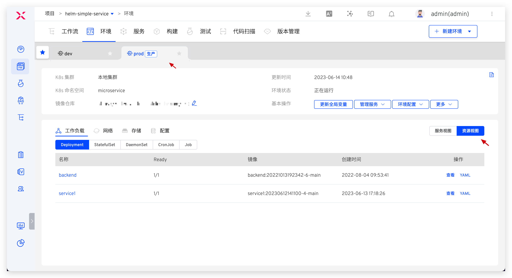

本文主要介绍 K8s Helm Chart 项目中的生产环境相关操作。

## 查看环境

环境创建完成后，点击不同的环境 Tab 即可切换到该环境的详情页面，生产环境右上角会有`生产`标识。点击`资源视图`，可从工作负载/网络/存储/配置等资源视角对该环境所在命名空间下的资源进行查看。

其他信息请参考测试环境中的描述：[查看环境](/ZadigX%20v1.5.0/project/env/helm/chart/#查看环境)。

## 新建环境

参考：[新建环境](/ZadigX%20v1.5.0/project/prod/env/k8s/#新建环境)。

## 更新全局变量

对环境中的全局变量进行更新，具体操作参考测试环境中的描述：[更新全局变量](/ZadigX%20v1.5.0/project/env/helm/chart/#更新全局变量)。

## 管理服务

对环境中的服务进行管理，具体操作参考测试环境中的描述：[管理服务](/ZadigX%20v1.5.0/project/env/helm/chart/#管理服务)。

## 环境配置管理

对环境中的 Ingress、ConfigMap、Secret、PVC 配置进行管理，具体操作参考测试环境中的描述：[环境配置管理](/ZadigX%20v1.5.0/project/env/helm/chart/#环境配置管理)。

## 设置别名

参考：[设置别名](/ZadigX%20v1.5.0/project/prod/env/k8s/#设置别名)。

## 删除环境

点击`基本操作` -> `更多` -> `删除环境`按钮并输入环境名即可删除环境。

::: tip
1. 鉴于生产服务的严肃性，在 ZadigX 中删除生产环境只是将环境记录删除，Kubernetes 集群中相关服务资源并不会删除。
2. 如果需要删除集群中的资源，请在确保没有影响后手动操作。
:::
