本文以容器化微服务为例，帮助新用户快速上手使用 ZadigX 系统的基本能力，包含从 Code 到 Ship 的完整过程。

## 准备工作

- 安装 ZadigX，参考[安装文档](/ZadigX%20v1.6.0/stable/install)
- 集成 GitHub 代码源并 fork [案例源码](https://github.com/koderover/zadig/tree/main)，代码源集成参考文档：[GitHub 集成](/ZadigX%20v1.6.0/settings/codehost/github/)
- 集成镜像仓库，参考文档：[`镜像仓库集成`](/ZadigX%20v1.6.0/settings/image-registry/)

::: tip
如果你使用的不是 GitHub 代码源，也可以将代码下载，上传到自己的代码源后再在 ZadigX 中集成，参考文档：[代码源集成](/ZadigX%20v1.6.0/settings/codehost/overview/)。
:::

## 第 1 步：项目配置

- 访问 ZadigX 系统，点击项目 -> 新建项目按钮，创建项目，选择 K8s YAML 项目，具体内容如下图所示：


点击立即新建按钮，进入项目初始化向导，点击下一步开始创建服务：

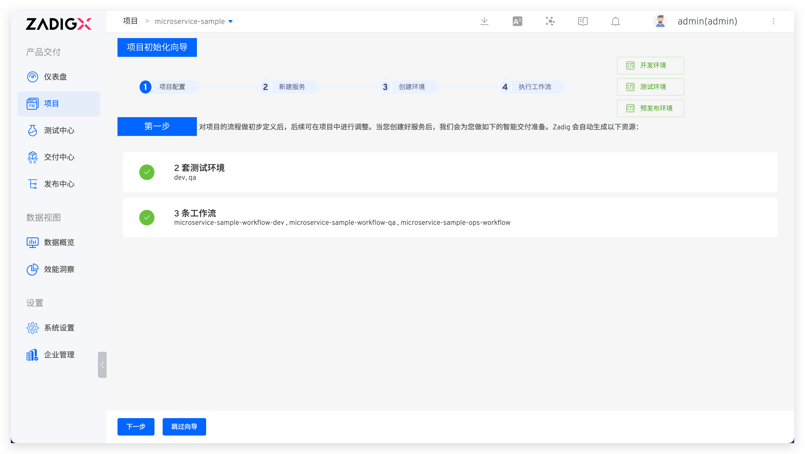

## 第 2 步：新建服务
包括新建服务以及为服务配置构建，后者用于后续使用工作流对服务进行部署更新。

### 新建服务
新建服务步骤：点击从代码库同步 -> 选择服务配置所在的代码库、分支和目录 -> 点击同步，如下图所示：

> 本例中选择 `zadig` 库，`main` 分支，指定文件夹为 `examples/microservice-demo/k8s-yaml/backend` 即可。

<!--  -->
<!-- 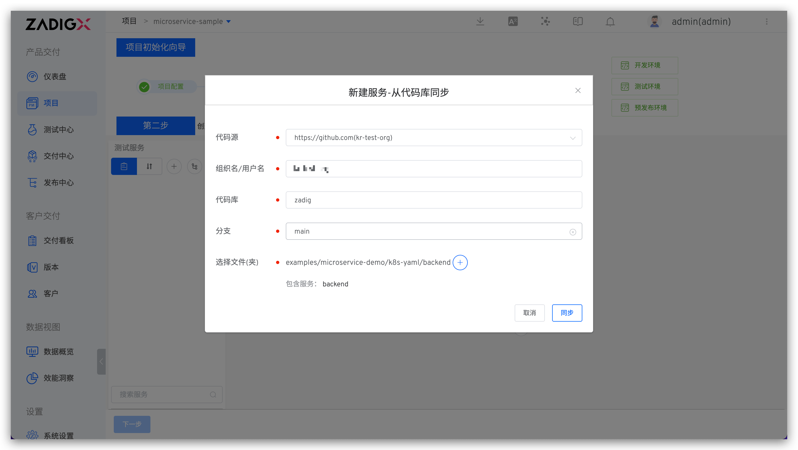 -->


创建服务后，系统会对服务的 YAML 格式做合法性检查，并自动加载出系统变量、YAML 中的自定义变量(可视需求自助添加)以及服务组件。

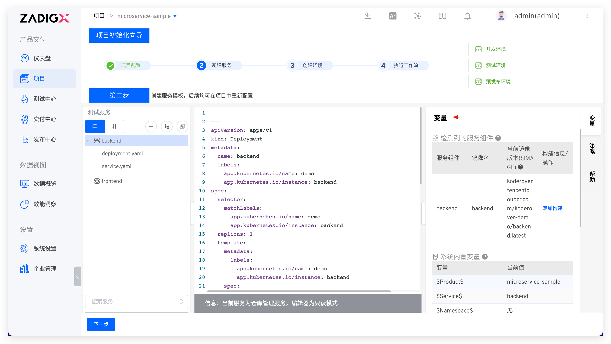

### 配置构建

点击`添加构建`为服务配置构建。


根据构建需要的实际环境安装依赖的软件包，同时依次选择代码托管平台、代码库以及分支，填写通用构建脚本后保存构建。

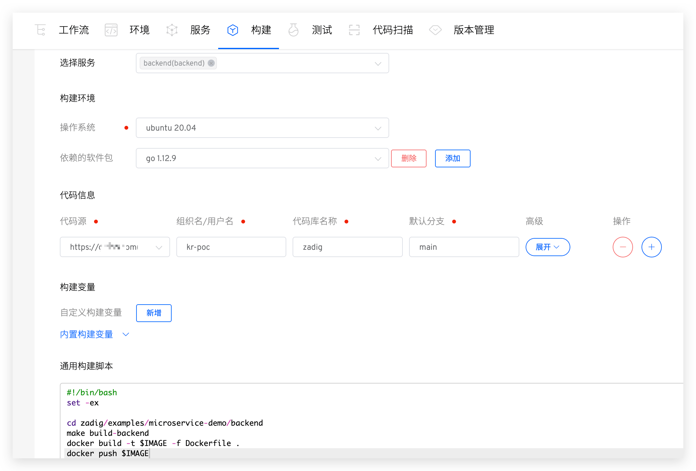

本例中构建配置如下：

- `依赖的软件包`：`go 1.12.9`
- `代码信息`：即准备工作中集成的代码源，选择 `zadig` 代码库，`main` 分支
- `通用构建脚本`：内容如下
``` bash
#!/bin/bash
set -ex

cd zadig/examples/multi-service-demo
make build-service1
chmod +x src/service1/service1

docker build -t $IMAGE -f Dockerfile --build-arg service=service1 .
docker push $IMAGE
```

继续下一步，进入环境准备环节。

## 第 3 步：加入环境

点击`创建环境`，系统会自动创建 2 套环境和 3 条工作流。2 套环境可分别用于日常开发环节和测试验收环节，3 条工作流也会自动绑定对应的环境以达到对不同环境进行持续交付的目的。具体如下图所示：
::: tip
创建环境所需的时间会因为服务的配置和数量而有所不同，请耐心等待创建完成。
:::

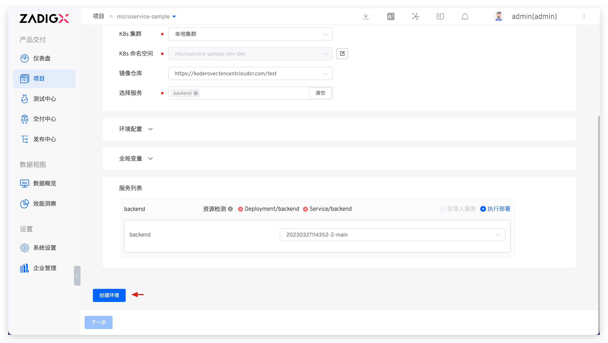

待环境创建完成后点击`下一步`进入工作流交付。

## 第 4 步：工作流交付

点击运行 `microservice-sample-workflow-dev` 工作流，来完成 dev 环境的持续交付。根据实际需求选择要部署的服务、以及对应的构建分支或者 pull request，启动任务：


待工作流运行完毕，环境中的服务版本被自动更新：

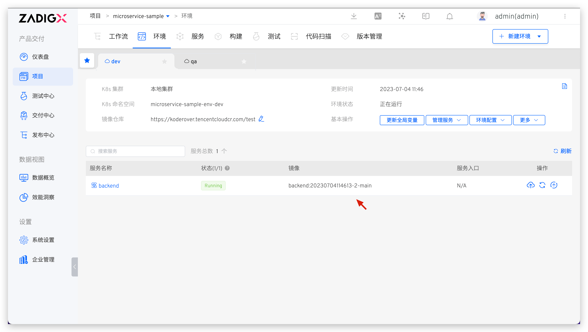

其他环境的服务交付和 dev 环境的类似，此处不再赘述。

到此，ZadigX 的基本功能已经演示完毕，下面将展示如何配置自动触发工作流。

### 配置自动触发工作流（可选）

点击配置 `microservice-sample-workflow-dev` 工作流：

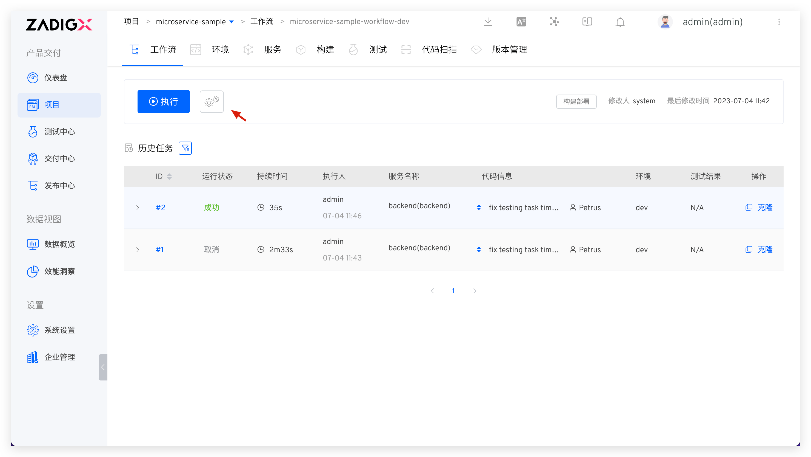

添加触发器，打开 Webhook 开关，填写配置并点击确定，保存触发器配置后，保存对工作流的修改：

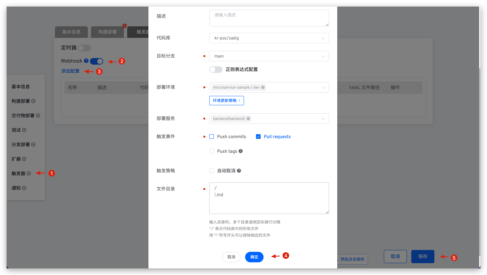

在 GitHub 中提交 pull request 后，在 check list 中会展示对应的工作流状态，效果如下所示：

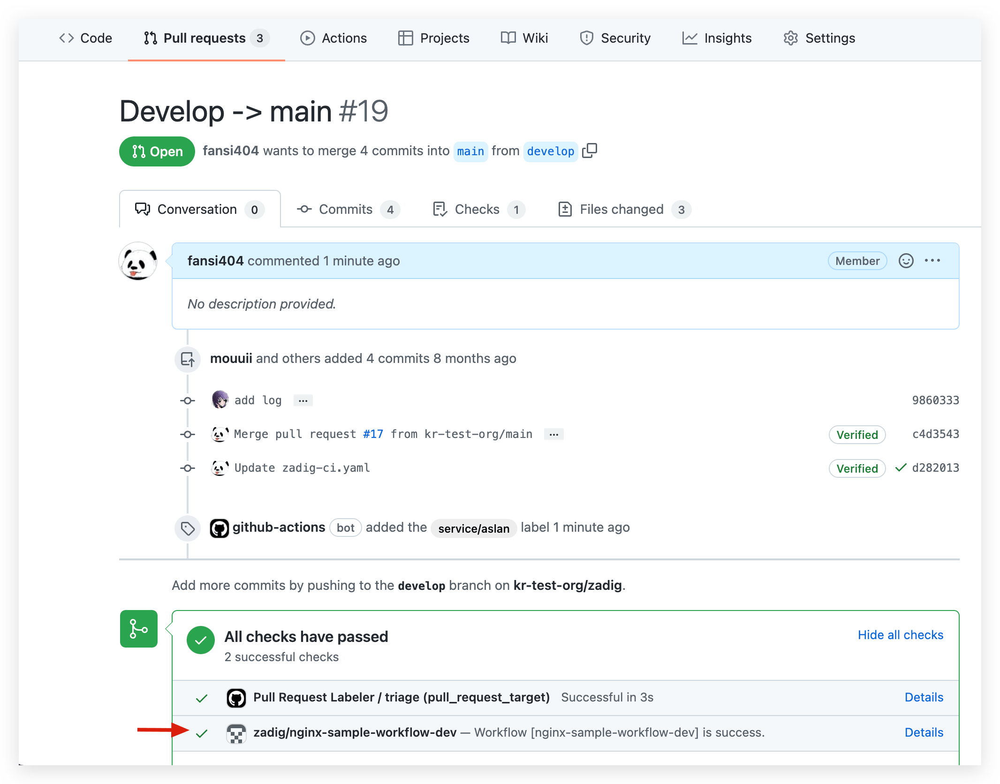

- 点击任务链接可以链接到 ZadigX 系统里查看工作流执行详情，并在工作流中跟踪代码变更：

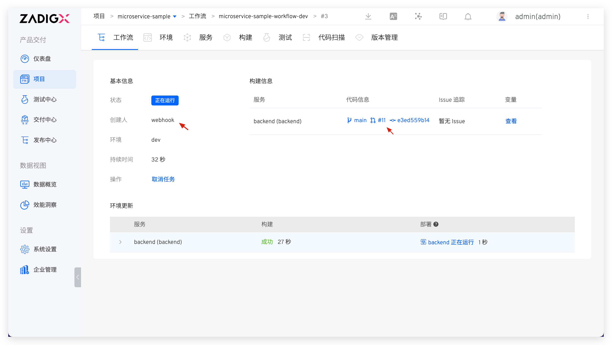

待工作流运行完成后，可以看到环境里面的服务镜像已经被更新：

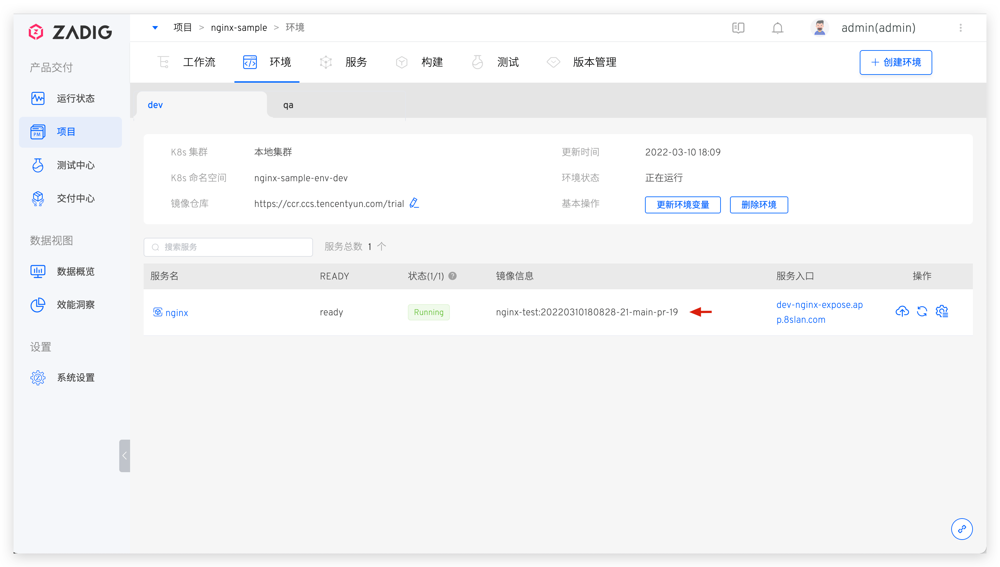

### 配置工作流 IM 状态通知（可选）

工作流提供接入第三方 Webhook 能力，可以为工作流配置状态通知，以便及时得到工作流任务状态反馈，目前支持的 IM 系统有：钉钉/飞书/企业微信。以飞书为例操作如下：

> 钉钉和企业微信的配置请参考文档：[通知配置](/ZadigX%20v1.6.0/project/workflow/#im-状态通知)。

第 1 步：在飞书上添加一个 Bot，获得 Webhook 地址：


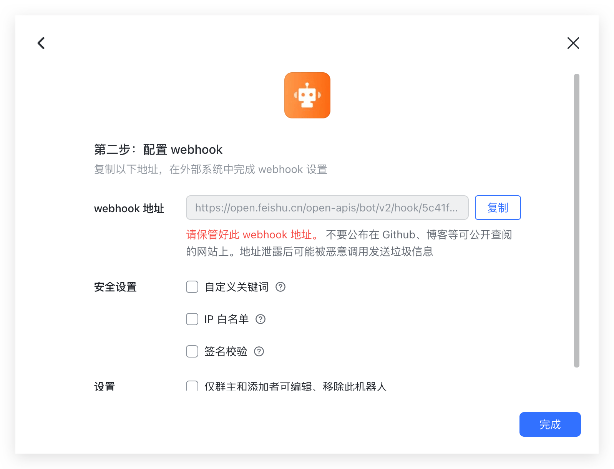

第 2 步：点击配置工作流，添加通知模块，正确填写飞书 Bot 的 Webhook 地址，并选择需要通知的事件：

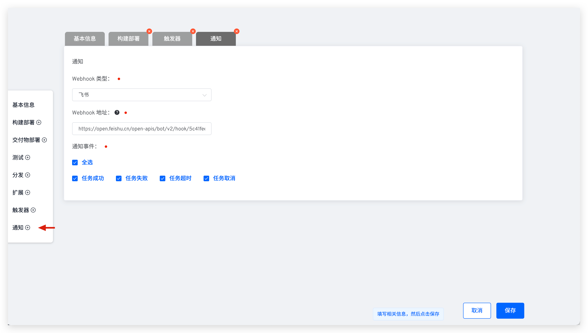

通知效果图示：


更多实战项目和场景案例，请参考 [Zadig 教程](https://www.koderover.com/tutorials/)。
