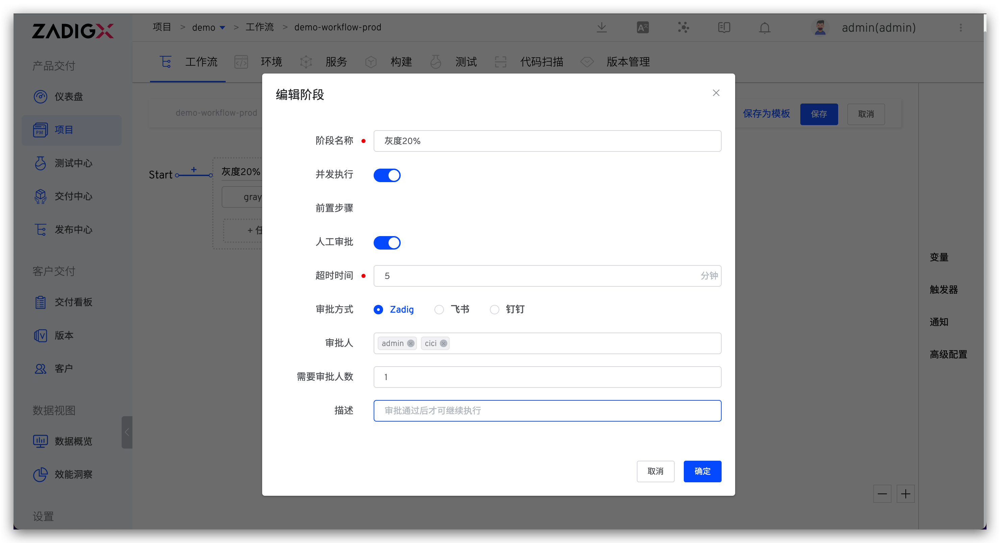
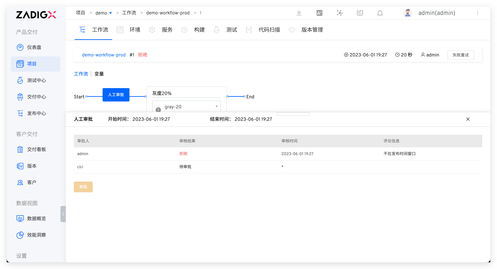
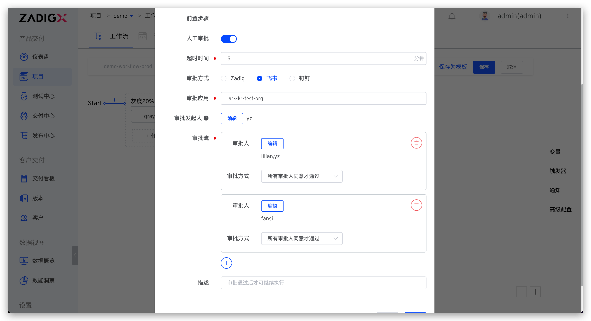
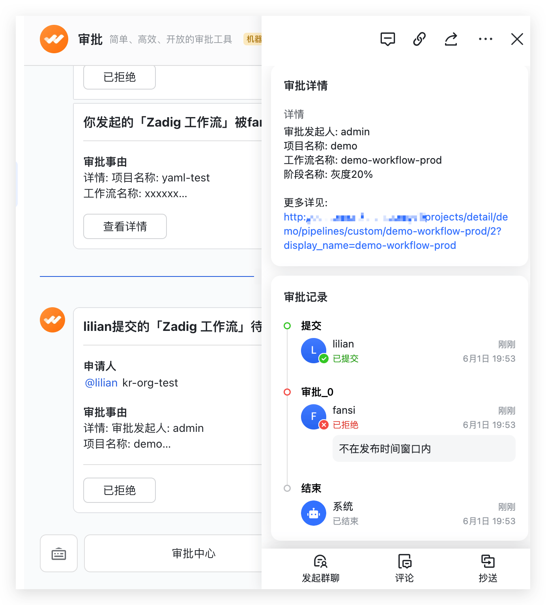
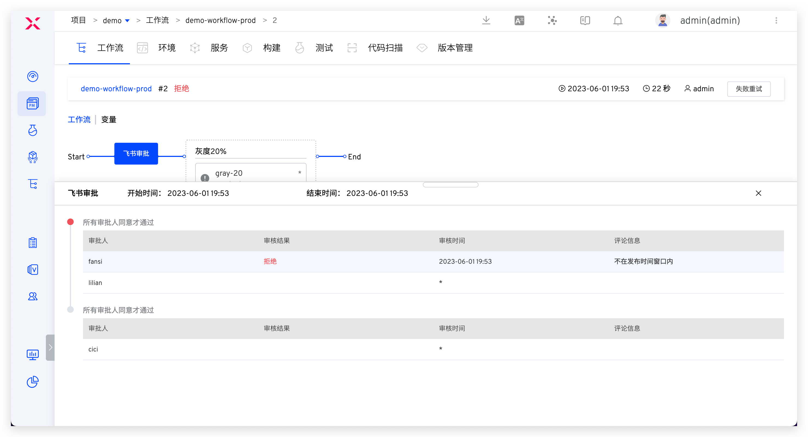
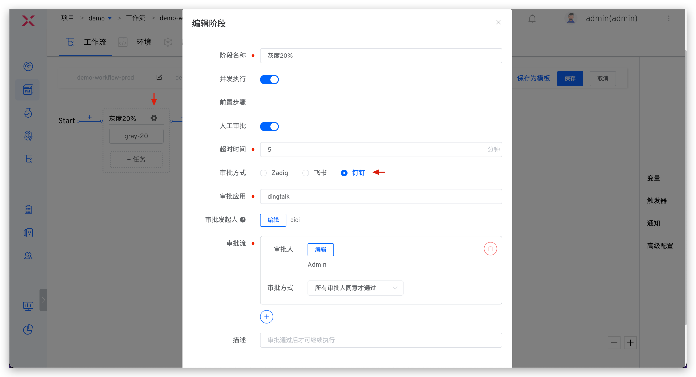
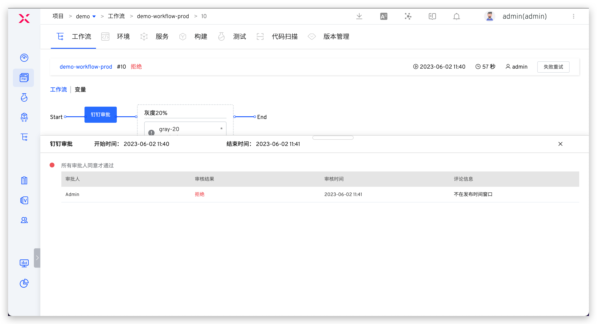

## 简介

本文主要介绍如何使用 ZadigX 工作流的审批功能。

- 自定义工作流和发布工作流支持开启人工审批，审批通过后，工作流才会继续运行
- 支持多人审批，支持设置审批超时时间，支持在一个工作流中设置多次审批

目前支持以下三种审批方式：

- Zadig 审批：在 ZadigX 系统中操作审批
- 飞书审批：在飞书应用中操作审批
- 钉钉审批：在钉钉应用中操作审批

## Zadig 审批

### 如何配置

编辑工作流对阶段进行配置，开启人工审批，审批方式选择 `Zadig`。

参数说明：
- `超时时间`：从触发审批的时间点开始算起，当超过超时时间后视为审批超时失败，后续阶段中的任务将不会被执行
- `审批人`：选择希望参与审批的 ZadigX 用户
- `需要审批人数`：当参与审批的人数满足此处指定的值时，即视为整个审批完成

### 使用效果

## 飞书审批

::: tip
在开启飞书审批之前，需要先在系统中集成飞书审批应用，具体可参考文档：[集成飞书审批](/ZadigX%20v1.6.0/settings/approval/#飞书)。
:::

### 如何配置

编辑工作流对阶段进行配置，开启人工审批，审批方式选择 `飞书`。

参数说明：
- `超时时间`：从触发审批的时间点开始算起，当超过超时时间后视为审批超时失败，后续阶段中的任务将不会被执行
- `审批应用`：在系统中集成的飞书审批应用
- `审批发起人`：若不配置审批发起人，则默认为工作流执行人，请确保其在 ZadigX 中配置了手机号（和飞书账号中的手机号保持一致）
- `审批流`：配置飞书审批流，支持多阶段审批

::: tip 更多信息

1. 配置手机号可参考文档：[账号信息](/ZadigX%20v1.6.0/preferences/#账号设置)。
2. 当一个飞书用户在多个审批流中时，其中一个审批流审批通过后，后续均视为审批通过。
3. 工作流开启了触发器但并未配置审批发起人时，审批功能将无法正确执行。
:::

### 使用效果

审批人在飞书中给出审批意见：

 

审批信息会同步到工作流中：

## 钉钉审批

::: tip
在开启钉钉审批之前，需要先在系统中集成钉钉审批应用，具体可参考文档：[集成钉钉审批](/ZadigX%20v1.6.0/settings/approval/#钉钉)。
:::

### 如何配置

编辑工作流对阶段进行配置，开启人工审批，审批方式选择 `钉钉`。

参数说明：
- `超时时间`：从触发审批的时间点开始算起，当超过超时时间后视为审批超时失败，后续阶段中的任务将不会被执行
- `审批应用`：在系统中集成的钉钉审批应用
- `审批发起人`：若不配置审批发起人，则默认为工作流执行人，请确保其在 ZadigX 中配置了手机号（和钉钉账号中的手机号保持一致）
- `审批流`：配置钉钉审批流，支持多阶段审批

::: tip 更多信息

1. 配置手机号可参考文档：[账号信息](/ZadigX%20v1.6.0/preferences/#账号设置)。
2. 多个审批流中不可包含相同的钉钉用户。
3. 工作流开启了触发器但并未配置审批发起人时，审批功能将无法正确执行。
:::

### 使用效果

审批人在钉钉中给出审批意见：

审批信息会同步到工作流中：

