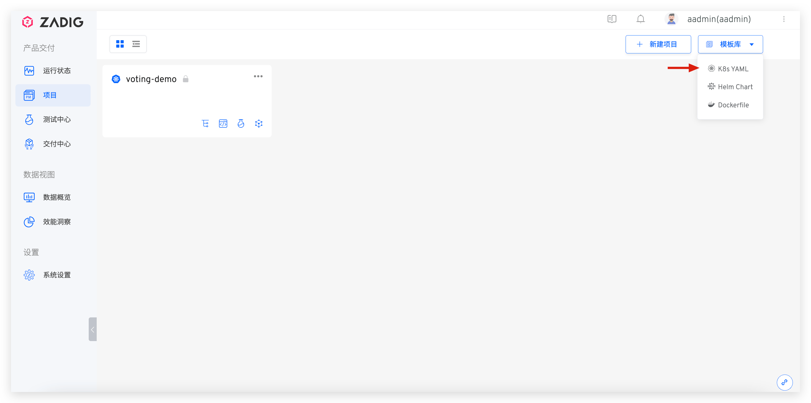
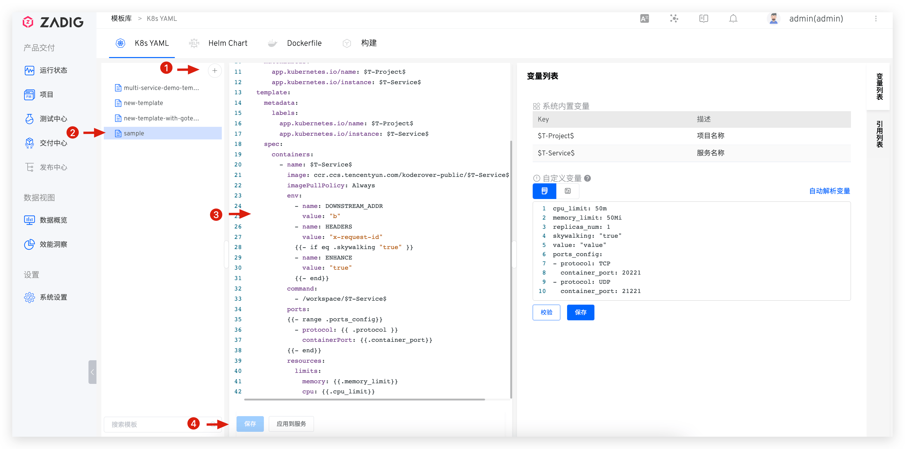
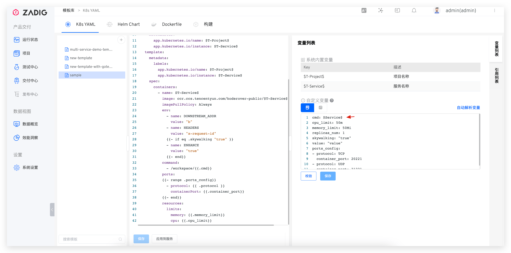
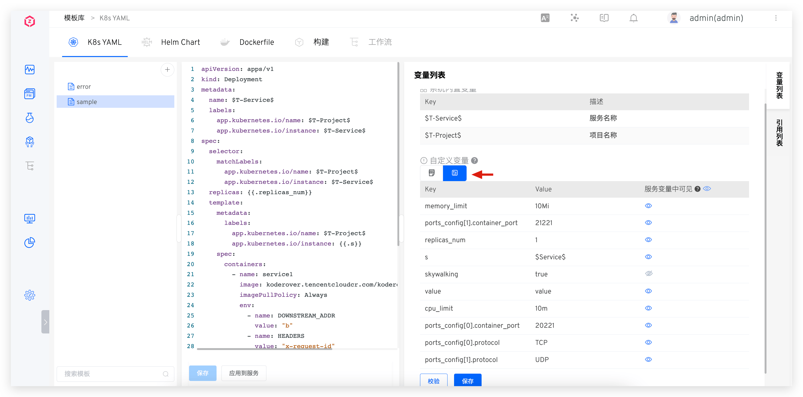
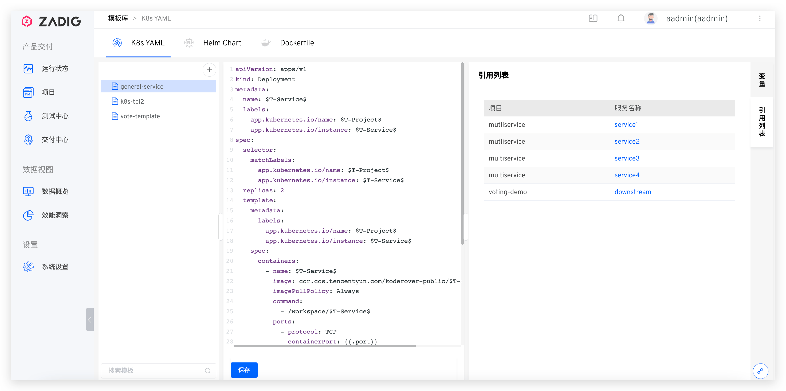
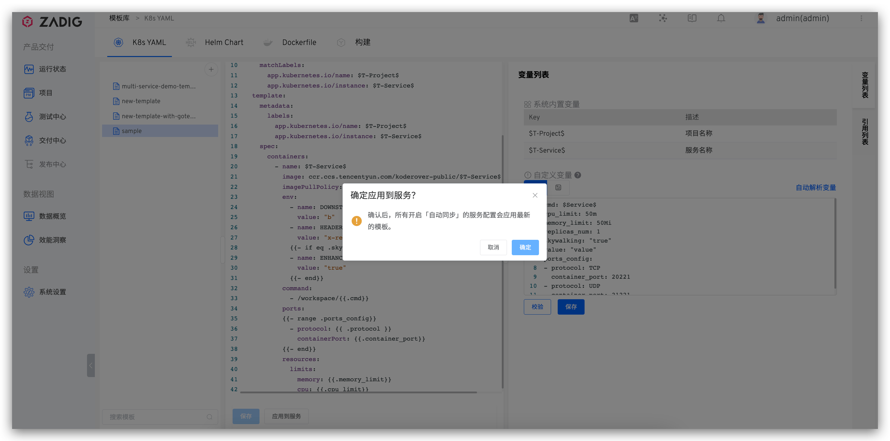

::: tip 背景
</img> K8s YAML 模板适用于使用 K8s YAML 部署的项目。支持用户在通用的模板上创建服务，提供更大的可扩展性。
:::

## 新建模板

> 可将 K8s 资源的 YAML 配置文件抽象，在项目中创建服务时基于 K8s YAML 模板对服务进行定义。

- 依次访问`项目`-`模板库`-`K8s YAML` 进入到 K8s YAML 模板库的管理页面。



- 点击`+`按钮 -> 输入模板名字 -> 填写模板内容 -> 保存模板。

> 如果模板中有使用自定义变量，需在右侧自定义变量区域将变量显示声明出来并按需配置默认值，详细信息请阅读 [变量列表](#变量列表)。


## 变量列表

包括系统内置变量和自定义变量。

- `系统内置变量`：包括 `$T-Project$` 和 `$T-Service$`，可直接在 K8s YAML 模板中使用。在项目中基于模板创建服务后，二者会自动被替换为对应的项目名称和服务名称。
- `自定义变量`：以 YAML 代码段的形式来声明，通过形如 <span v-pre>`{{.key}}`</span> 或者 Go template 的方式在模板中使用。

::: tip
1. 在项目中基于模板创建服务时可修改自定义变量的默认值。
2. 自定义变量的 key 中不支持中划线。
3. Go template 的使用请参考 [官方文档](https://pkg.go.dev/text/template#hdr-Examples)。
:::


除了支持使用常量值，还支持使用 [服务配置](/ZadigX%20v1.6.0/project/service/k8s/#变量配置) 中的内置变量来为模板中的自定义变量赋值，比如下图示例中，使用 `$Service$`给 `cmd` 赋值。




切换列表视图可定义模板变量的可见性。
- 不可见的变量：仅可在环境中的全局变量中使用
- 可见的变量：可在环境中的服务变量和全局变量中使用



::: tip 注意
使用模板新建的服务且开启自动同步的情况下：
1. 服务变量可见性不可修改
2. 服务变量可见性继承模板中变量可见性配置
:::

## 使用模板
在 [K8s YAML 项目](/ZadigX%20v1.6.0/project/k8s-yaml/)中创建服务时可选择从模板导入服务，参考[使用模板新建服务](/ZadigX%20v1.6.0/project/service/k8s/#新建服务)。

## 查看引用列表

点击 K8s YAML 模板右侧的`引用列表`，即可查看引用该模板的项目和服务列表。



## 应用到服务

点击`应用到服务`，即可使用最新的模板内容以及自定义变量更新所有开启了`自动同步`的服务配置。

::: tip
1. 对服务开启`自动同步`操作参考 [使用模板新建服务](/ZadigX%20v1.6.0/project/service/k8s/#新建服务)。
2. 当自定义变量有改动时，对服务配置的更新逻辑参考 [更新服务配置](/ZadigX%20v1.6.0/project/service/k8s/#更新使用模板新建的服务)。
:::



## 示例

### K8s YAML 模板

``` YAML
apiVersion: apps/v1
kind: Deployment
metadata:
  name: $T-Service$
  labels:
    app.kubernetes.io/name: $T-Project$
    app.kubernetes.io/instance: $T-Service$
spec:
  selector:
    matchLabels:
      app.kubernetes.io/name: $T-Project$
      app.kubernetes.io/instance: $T-Service$
  replicas: {{.replicas_num}}
  template:
    metadata:
      labels:
        app.kubernetes.io/name: $T-Project$
        app.kubernetes.io/instance: $T-Service$
    spec:
      containers:
        - name: $T-Service$
          image: ccr.ccs.tencentyun.com/koderover-public/$T-Service$:latest
          imagePullPolicy: Always
          env:
            - name: DOWNSTREAM_ADDR
              value: "b"
            - name: HEADERS
              value: "x-request-id"
            {{- if .skywalking}}
            - name: ENHANCE
              value: "true"
            {{- end}}
          command:
            - /workspace/{{.cmd}}
          ports:
          {{- range .ports_config}}
            - protocol: {{ .protocol }}
              containerPort: {{.container_port}}
          {{- end}}
          resources:
            limits:
              memory: {{.memory_limit}}
              cpu: {{.cpu_limit}}
```

### 自定义变量

``` yaml
cmd: $Service$
cpu_limit: 50m
memory_limit: 50Mi
replicas_num: 1
skywalking: true
value: "value"
ports_config:
- protocol: TCP
  container_port: 20221
- protocol: UDP
  container_port: 21221
```