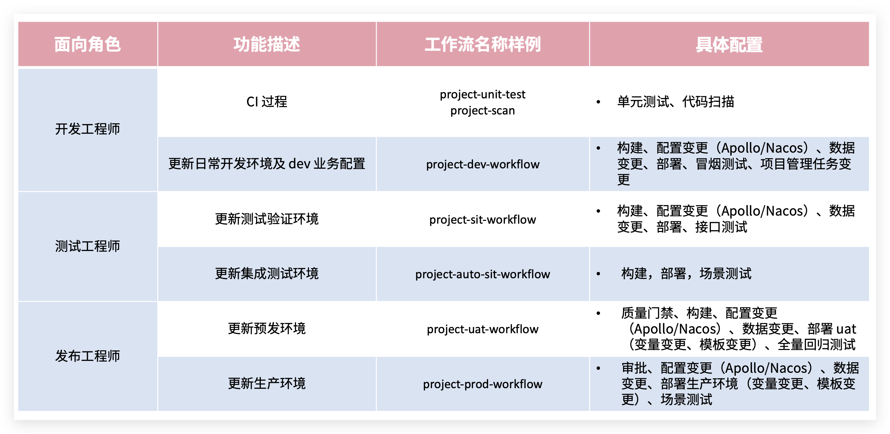
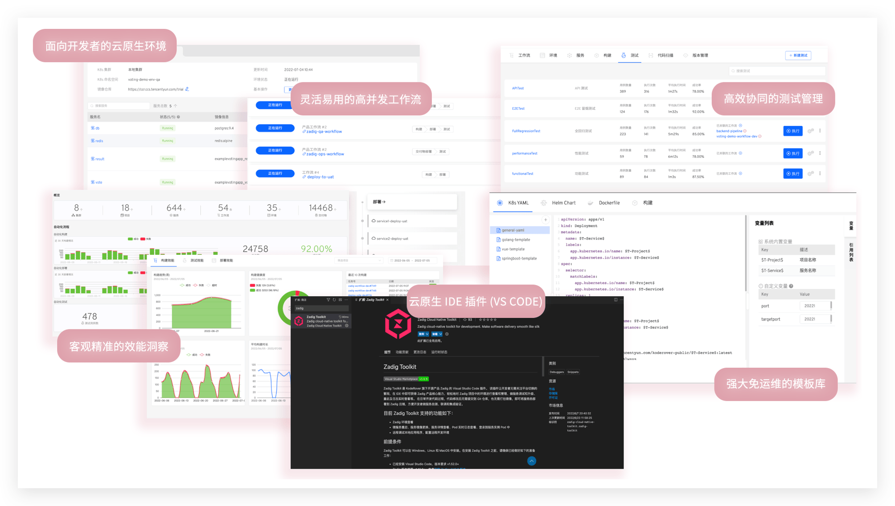

## 软件交付面临的问题

软件交付是复杂且具有挑战性的过程，涉及到人员、技术、流程和工具等要素。在这个过程中，企业常常遇到以下问题：
- 开发环境模拟困难，多业务联调困难，研发效率低下。
- 大量手工测试效率低，环境不稳定，自动化建设困难。
- 运维负担重，手工操作繁重，交付效率低。
- 跨部门沟通困难，流程制定耗时，各方面临能力限制。

为了解决这些问题，ZadigX 应运而生。它通过平台工程和技术升级提升组织效能，建立全流程一体化工程协同基线，释放团队生产力。ZadigX 旨在帮助企业更高效地进行软件交付，解决流程挑战，提升组织效能。

## 与开源 Zadig 有什么不同

Zadig 是一款开源 CI/CD 产品，ZadigX 则是一款面向企业级场景的云原生 DevOps 价值链平台。在能力上，Zadig 提供的是代码到可靠部署物的最佳路径，而 ZadigX 在此基础上额外提供了可靠部署物到稳定运行时的最安全路径。

在功能层面上，ZadigX 包含开源 Zadig 的一切，额外支持发布管理能力，编排组织、流程、内外部系统，管理代码、配置、数据变更流程，支持灰度组合策略。用一个简单的公式可以表示为：

<strong>`ZadigX = Zadig ➕ 发布上线管理 ➕ 集成企业现有的工具（项目管理、配置管理、代码管理、商用系统、自建系统、OpenAPI...)`</strong>

更多比对可点击[链接](https://www.koderover.com/zadigx)查看。

## 与传统 DevOps 方案比对

现存做法大多以「单点工具 + 写脚本」或运管类平台为主，ZadigX 则是面向开发者视角，中立，云原生一体化价值链平台。

## ZadigX 产研敏捷协同方案介绍

ZadigX 提供工程底座，产研团队可统一协作实现敏捷交付，完成需求从开发到测试到发布的全生命周期。并且支持自定义流程，扩展工具，编排测试服务、IT 服务、安全服务等能力，通过 ZadigX 可以自动化一切，让工程师专注在创造上。

## 核心场景使用介绍

开发、测试、运维工程师基于 ZadigX 统一协作平面，使用自动化工作流和云原生环境进行交付。此外，业务负责人/企业管理人员可以在效能看板中分析项目整体运行情况，分析项目各个过程中的效能短板。以下面向不同角色展开介绍。

### 管理员准备

管理员（比如：运维工程师）在 ZadigX 中配置团队日常协同合作所需的工程基础：包括研发、测试、运维不同角色所需要的环境和工作流。

**工作流示例**

**环境示例**

### 开发工程师

#### 本地自测

IDE 热部署，本地编写完代码热部署到远端环境，具体参考：[VSCode 插件使用指南](/ZadigX%20v1.7.0/zadig-toolkit/overview/)。

#### 提交代码及 CI 过程

1. 在本地编写代码后，提交代码变更 PR/MR（Pull Request/Merge Request）
	- 本地基于 develop 分支新建分支，在新建的分支上编写代码
	- 代码编写完毕，推送代码到自己账号下的代码仓库
	- 创建代码变更 PR/MR
2. 自动触发 CI 过程，包括单元测试、代码风格检查、代码扫描
3. CI 过程执行完毕后，在 PR/MR 上获得结果反馈

#### 单个工程师自测

手动或自动触发 dev 工作流执行，包含步骤：构建 > 部署 dev 环境 > 冒烟测试 > IM 通知。

#### 多人集成联调

执行 dev 工作流，选择多个服务和对应的代码变更执行。

#### 更新同一个服务

执行 dev 工作流，选择服务以及其对应的多个代码变更执行。

#### 更新业务配置

> 适用场景：改动涉及到配置变更

以 Nacos 配置示例，执行对应环境的工作流，选择 Nacos 配置并按需修改。

#### 更新项目管理任务状态

> 适用场景：功能实现完毕后一键修改跟踪任务的状态

以 Jira 进行示例，执行工作流，选择对应的 Jira 任务。

#### 更新数据库

> 适用场景：改动涉及到数据变更（比如表结构变更、表字段变更...）

以 MySQL 数据库进行示例，执行工作流，输入 SQL 语句执行数据更新。

#### 服务调试

查看环境和服务状态：

查看服务实时日志：

进入容器调试：

临时替换服务镜像：

调整副本数量/重启实例：

### 测试工程师
#### 管理测试用例

1. 本地编写测试用例脚本并针对 sit 环境本地自测。
2. 自测通过后提交到代码仓库中。

#### sit 发布验证

执行 sit 工作流更新环境进行集成验证，包括步骤：构建 -> 部署 sit 环境 -> 接口测试 -> IM 通知。

#### uat 发布验证

执行 uat 工作流做预发布验证，步骤包含：质量门禁 -> 构建 -> Nacos 配置变更 -> 部署 uat 环境 -> 回归测试 -> IM 通知。

#### 自动化测试结果分析
分析自动化测试结果，基于覆盖情况持续迭代自动化测试套件。

### 发布工程师

#### 生产环境发布

> 支持多种发布策略。

**滚动发布**

执行 prod 工作流更新生产环境，步骤包含：发布审批 -> Nacos 配置变更-> 部署。

**蓝绿发布**

执行工作流更新生产环境，步骤包含：部署蓝环境 -> 审批 -> 切换生产版本。

**金丝雀发布**

执行工作流更新生产环境，步骤包含：部署金丝雀 -> 随机测试-> 审批 -> 新版本全量发布。

**分批次灰度发布**

执行工作流更新生产环境，步骤包含：灰度 20% ->  审批 -> 灰度 60% -> 审批 -> 新版本全量发布。

**Istio 发布**

执行工作流更新生产环境，步骤包含：部署新版本 20% 流量导入新版本 -> 审批 -> 100% 流量导入新版本。

### 项目/企业管理人员
查看企业项目整体运行状况。

分析项目各个环境的变化过程及效能短板。

## 更多产品特性

### 开源 Zadig 的一切

云原生 CI/CD、产研高效工程化协作、快速应对业务迭代。

参考文档：

- [Zadig 最佳实践](https://mp.weixin.qq.com/mp/appmsgalbum?action=getalbum&__biz=Mzg4NDY0NTMyNw==&scene=1&album_id=2315406414233927682&count=3#wechat_redirect)
- [Zadig 企业案例](https://mp.weixin.qq.com/mp/appmsgalbum?action=getalbum&__biz=Mzg4NDY0NTMyNw==&scene=1&album_id=2408445357925269505&count=3#wechat_redirect)

### 发布中心

可灵活编排多种发布策略，支持蓝绿、金丝雀、分批次灰度、Istio 等发布策略，以及 APISIX + MSE 等灰度发布方案。配合人工审批可以打通组织、流程、内外系统，实现一键自动化、安全可靠发布。

参考文档：

- [ZadigX 发布策略](/ZadigX%20v1.7.0/project/release-workflow/)
- [ZadigX 工作流审批](/ZadigX%20v1.7.0/project/workflow-approval/)

### 客户交付

面向大客户全天候响应、全地域升级部署，提供自运维和专用服务通道，实现稳定高效交付和服务保障。

参考文档：

- [客户交付](/ZadigX%20v1.7.0/plutus/overview/)

