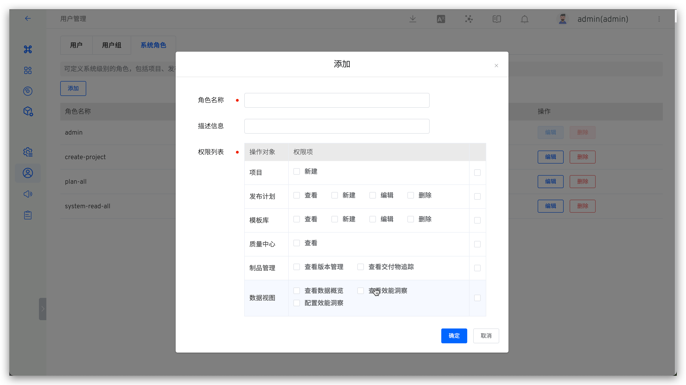
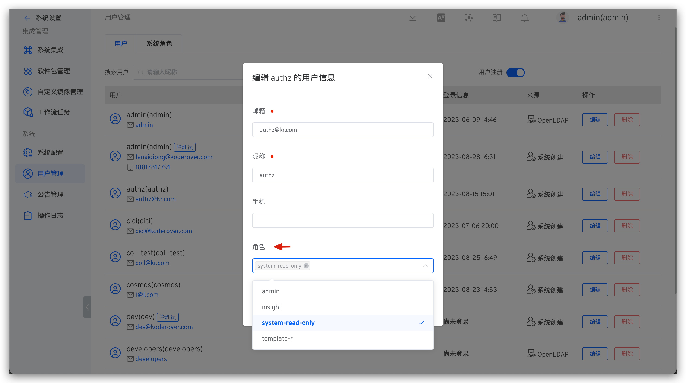
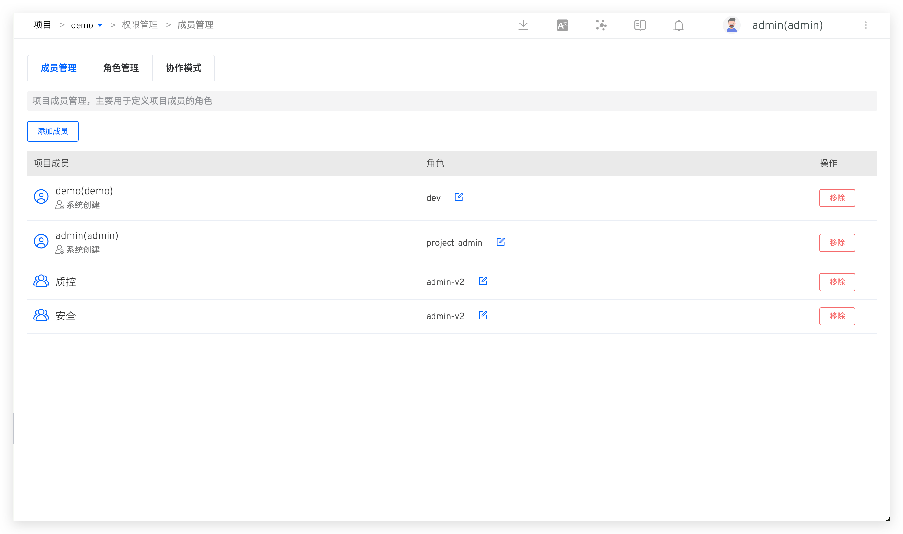
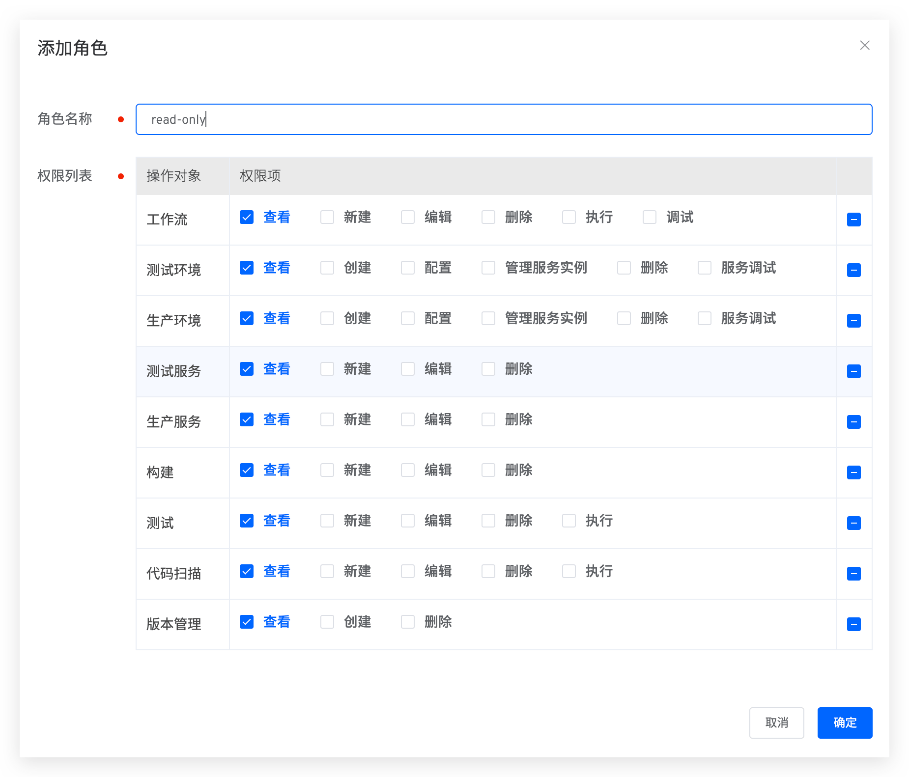
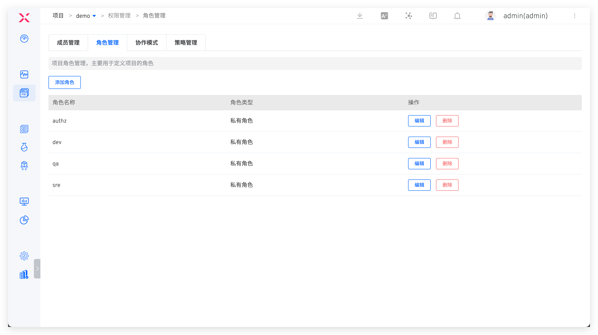

ZadigX 支持灵活的权限配置实现团队成员安全、高效协作，包括：

- 系统角色：系统级权限配置，详情：[系统角色](#系统角色)
- 权限配置：项目级权限配置，详情：[权限配置](#权限配置)
- 项目访问权限：定义项目的公开/私有属性，详情：[项目访问权限](#项目访问权限)
- 协作模式：项目内指定工作流、环境资源粒度的权限配置，详情：[协作模式](#协作模式)

## 系统角色

::: tip
仅系统管理员可配置系统角色。
:::

点击右上角头像 > 用户管理 > 系统角色进行配置。

在用户信息中可指定系统角色。

## 项目访问权限
::: tip
仅系统管理员和项目管理员可配置项目访问权限。
:::
点击配置 > 修改 > 编辑访问权限，可设置项目的公开/私有属性。公开、私有项目的区别如下：
- 对于私有项目，所有用户默认没有任何权限。
- 对于公开项目，所有用户默认拥有只读权限，可以查看项目中的环境、工作流、服务、构建、测试、版本、代码扫描。

## 权限配置
::: tip
仅项目管理员可配置。
:::

> 定义项目成员以及成员对项目中所有环境、工作流、服务、测试、版本管理、代码扫描等资源的权限。

在项目详情页点击`配置`→`权限`，对项目成员及成员权限进行配置。

### 成员管理

在`成员管理`中，查看该项目的用户成员列表及对应角色，可按需对用户角色进行配置。

- 角色是一系列权限的集合，在[角色管理](/ZadigX%20v1.7.0/project/permission/#角色管理)中可查看角色中的权限细节
- 支持添加用户组到项目成员中，实现批量用户的权限配置

### 角色管理
包括系统内置角色和项目管理员自定义角色。

#### 内置角色
- `project-admin`：项目管理员，可操作所辖项目中的所有资源，可对项目配置进行修改。
- `read-project-only`：拥有此角色的成员可在项目列表中看到对应的项目，但没有权限操作项目中的资源。
- `read-only`：只读角色，在公开项目中，所有用户默认拥有此角色。对应的权限项组合如下：

#### 自定义角色

在`角色管理`中，可自定义角色并赋予权限。

### 权限清单

陈述各个权限项和功能的对应关系，各功能模块中完整的功能文档分别参见：[工作流](/ZadigX%20v1.7.0/project/workflow/)/[环境](/ZadigX%20v1.7.0/project/env/k8s)/[服务](/ZadigX%20v1.7.0/project/service/k8s/)/[构建](/ZadigX%20v1.7.0/project/build/)/[测试](/ZadigX%20v1.7.0/project/test/)/[版本管理](/ZadigX%20v1.7.0/project/version/)/[代码扫描](/ZadigX%20v1.7.0/project/scan/)。

::: tip
K8s YAML 项目中的版本是通过执行交付物部署工作流创建的，若需要新建版本的权限，配置工作流执行权限即可。
:::

<table>
	<tr>
		<th colspan="3"><b>权限与功能清单</b></th>
	</tr>
	<tr>
		<td><b>功能模块</b></td>
		<td><b>权限项</b></td>
		<td><b>功能清单</b></td>
	</tr>
	<tr>
		<td rowspan="5">工作流</td>
		<td>查看</td>
		<td>- 查看工作流列表、基本信息、任务列表、任务详情 - 查看工作流任务运行的日志(构建日志、测试日志..)</td>
	</tr>
	<tr>
		<td>编辑</td>
		<td>- 修改工作流 - 快速打开/关闭工作流定时器 - 将测试任务关联在工作流上 - 编辑自定义工作流任务列表中的字段</td>
	</tr>
	<tr>
		<td>新建</td>
		<td>- 新建工作流 - 复制工作流</td>
	</tr>
	<tr>
		<td>删除</td>
		<td>- 删除工作流</td>
	</tr>
	<tr>
		<td>执行</td>
		<td>- 启动工作流 - 重试/取消/克隆工作流任务</td>
	</tr>
	<tr>
		<td rowspan="7">环境</td>
		<td>查看</td>
		<td>- 查看环境列表、环境基本信息 - 查看环境中的服务列表、服务详情 - 查看环境配置(Ingress/ConfigMap/Secret/PVC)的内容、比较不同版本差异 - 查看服务实例的实时日志、事件、配置管理、Yaml 导出(K8s YAML 项目)</td>
	</tr>
	<tr>
		<td>创建</td>
		<td>- 新建环境 - 新建子环境</td>
	</tr>
	<tr>
		<td>配置</td>
		<td>- 更新环境变量(K8s YAML 项目)、更新全局变量(K8s Helm Chart 项目) - 配置托管(K8s 托管项目) - 开启/关闭自测模式 - 环境睡眠与唤醒 - 添加/更新/删除服务实例 - 编辑环境配置(Ingress/ConfigMap/Secret/PVC)、删除环境配置、回滚其版本 - 查看环境变更记录</td>
	</tr>
	<tr>
		<td>删除</td>
		<td>- 删除环境 - 取消环境托管(K8s 托管项目)</td>
	</tr>
	<tr>
		<td>管理服务实例</td>
		<td>- 更换服务实例的镜像、重启服务实例、调整服务实例副本数量、启动容器调试 - 更新服务实例</td>
	</tr>
	<tr>
		<td>服务调试</td>
		<td>- 进入服务实例容器里调试(K8s YAML/K8s Helm Chart/K8s 托管项目)</td>
	</tr>
	<tr>
		<td>主机登录</td>
		<td>- 登录到环境所部署的主机中(主机项目)</td>
	</tr>
	<tr>
		<td rowspan="4">服务</td>
		<td>查看</td>
		<td>- 查看服务配置</td>
	</tr>
	<tr>
		<td>编辑</td>
		<td>- 更新服务配置</td>
	</tr>
	<tr>
		<td>新建</td>
		<td>- 新建服务配置</td>
	</tr>
	<tr>
		<td>删除</td>
		<td>- 删除服务配置</td>
	</tr>
	<tr>
		<td rowspan="4">构建</td>
		<td>查看</td>
		<td>- 查看构建配置</td>
	</tr>
	<tr>
		<td>编辑</td>
		<td>- 更新构建配置</td>
	</tr>
	<tr>
		<td>新建</td>
		<td>- 新建构建配置</td>
	</tr>
	<tr>
		<td>删除</td>
		<td>- 删除构建配置</td>
	</tr>
	<tr>
		<td rowspan="4">测试</td>
		<td>查看</td>
		<td>- 查看测试配置</td>
	</tr>
	<tr>
		<td>编辑</td>
		<td>- 更新测试配置</td>
	</tr>
	<tr>
		<td>新建</td>
		<td>- 新建测试配置</td>
	</tr>
	<tr>
		<td>删除</td>
		<td>- 删除测试配置</td>
	</tr>
	<tr>
		<td rowspan="3">版本管理</td>
		<td>查看</td>
		<td>- 查看版本</td>
	</tr>
	<tr>
		<td>编辑</td>
		<td>- 更新版本</td>
	</tr>
	<tr>
		<td>新建</td>
		<td>- 新建版本</td>
	</tr>
	<tr>
		<td rowspan="5">代码扫描</td>
		<td>查看</td>
		<td>- 查看代码扫描配置</td>
	</tr>
	<tr>
		<td>编辑</td>
		<td>- 更新代码扫描配置</td>
	</tr>
	<tr>
		<td>新建</td>
		<td>- 新建代码扫描配置</td>
	</tr>
	<tr>
		<td>删除</td>
		<td>- 删除代码扫描配置</td>
	</tr>
	<tr>
		<td>执行</td>
		<td>- 执行/取消代码扫描任务</td>
	</tr>
</table>

## 协作模式
::: tip
仅项目管理员可配置。
:::

适用于访问权限为`私有`的 K8s YAML/K8s Helm Chart/托管项目，对项目中指定的工作流、环境资源做权限控制。

### 配置协作模式
在项目权限管理中切换到`协作模式`，配置项目的各个成员在协作过程中使用的功能模块和权限。

配置说明：

- 填写协作模式名称，比如 `developer`。
- 选择参与成员，只有项目成员才可以被选择，若需要添加的用户不在成员列表中，可在[成员管理](/ZadigX%20v1.7.0/project/permission/#成员管理)中添加。
- 配置协作规则，根据需要为协作成员配置工作流和环境资源，并配置操作权限及回收规则，其中：
    - 独享：基于基准工作流/基准环境，为每一个协作成员创建一份新的工作流/环境供其独享使用，新资源的名称规则为 `协作模式名称-基准资源名称-用户来源-用户名称`，适用于 K8s YAML/K8s Helm Chart 项目
    - 共享：协作成员共享使用基准工作流/基准环境资源，不为其新建资源。
    - 资源回收策略：如果成员在配置的时间内没有访问项目，那么该成员的资源将会被回收。当成员重新访问项目时，会再次获得资源。

### 如何协作使用
当协作模式中的成员登录 ZadigX 系统进入指定项目后，对协作模式中分配的工作流和环境资源进行确认。

稍等片刻待系统将资源准备就绪，该成员即可获得对应资源的操作权限，在日常工作中使用。

