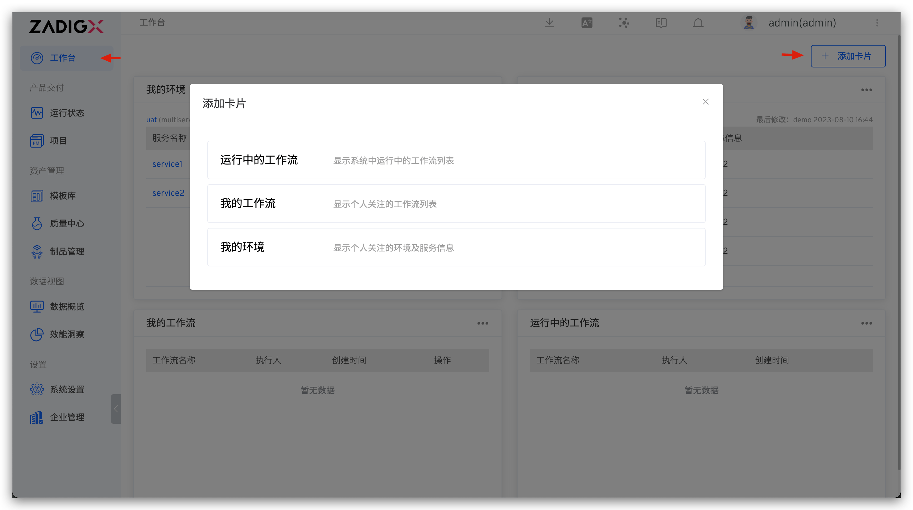
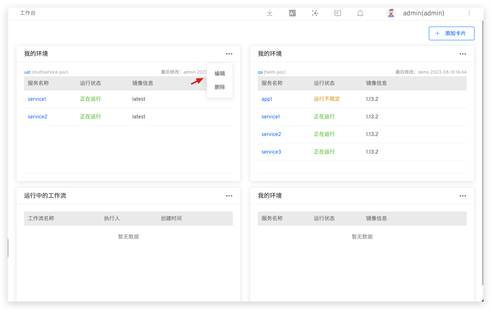
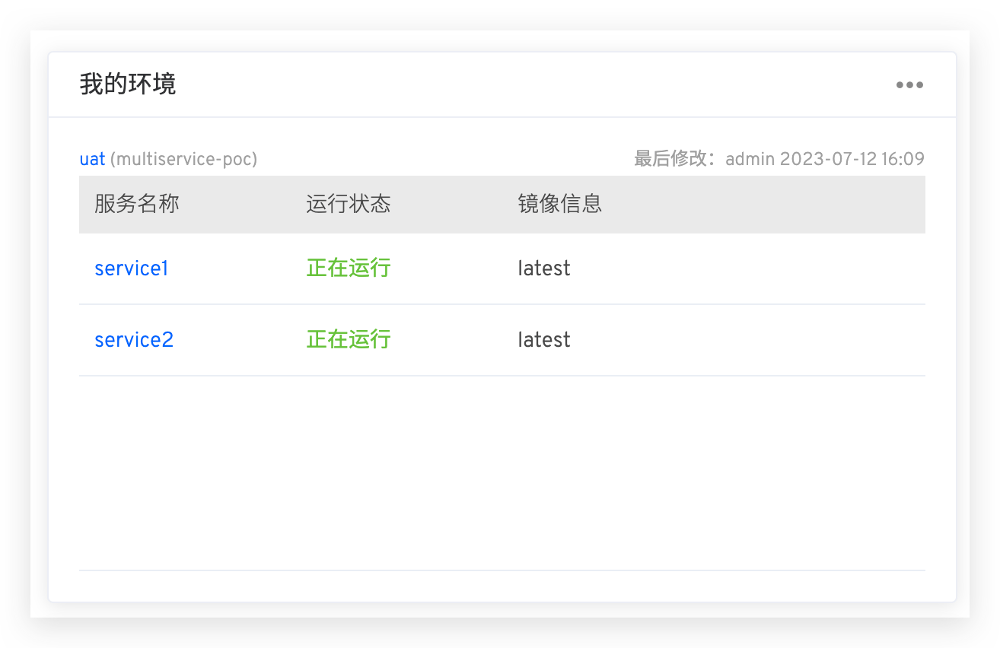

ZadigX 工作台提供运行中的工作流、我的工作流和我的环境等视图。开发者通过自定义个人的工作台查看关注的工作流和环境的状态。

## 添加卡片

1. 进入「工作台」页面
2. 点击「添加卡片」
3. 选择需要添加的卡片

下面简单介绍 ZadigX 支持的卡片类型。

### 运行中的工作流

显示系统中运行中的工作流列表。

### 我的工作流

通过配置可以查看个人关注的工作流相关信息。点击我的工作流卡片右上角 -> 点击「编辑」按钮，选择关注的工作流。

完成配置后，卡片显示个人关注的工作流名称、状态、最近任务执行人和最近任务创建时间信息。

### 我的环境

通过配置可以查看个人关注的环境及服务信息。点击我的环境卡片右上角 -> 点击「编辑」按钮，选择关注的环境和服务。

完成配置后，卡片显示个人关注的环境、环境的最近更新信息、服务的状态及对应的镜像信息。

