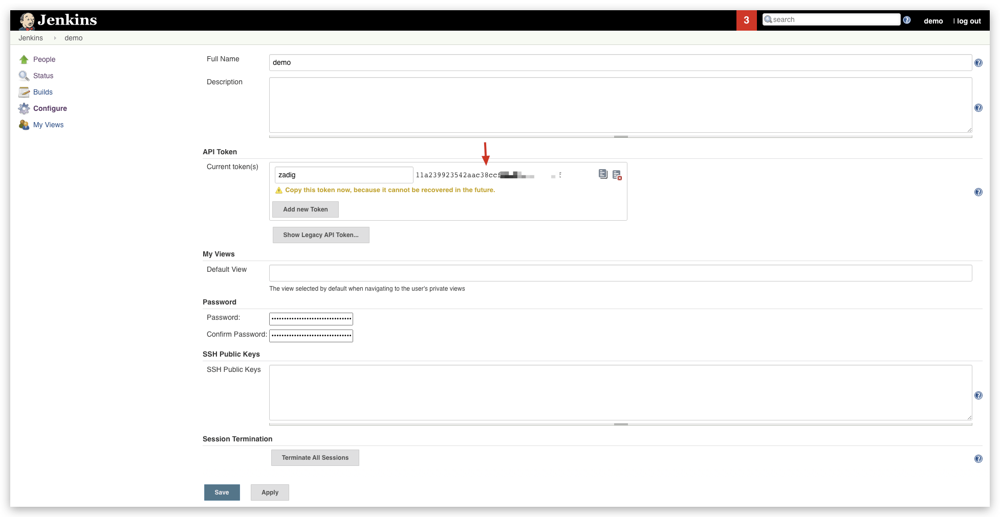
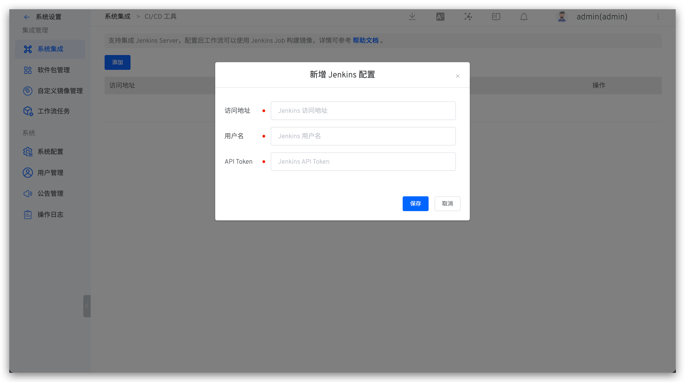

支持集成 Jenkins Server，集成后可在 ZadigX 中使用 Jenkins Job 构建镜像。

## 如何集成 Jenkins Server

### 第一步：在 Jenkins 中生成 API Token

登录 Jenkins，在用户配置中，生成一个 API Token，如下图所示。

### 第二步：在 ZadigX 中集成 Jenkins Server

访问 ZadigX，点击 `系统设置` ->  `系统集成` -> `CI/CD 工具` ，添加 Jenkins 服务相关信息，如下图所示。

## 如何使用 Jenkins 构建

为服务配置构建时使用 Jenkins 构建即可，具体可参考文档：[Jenkins 构建](/ZadigX%20v1.7.0/project/build/#jenkins-构建)。
