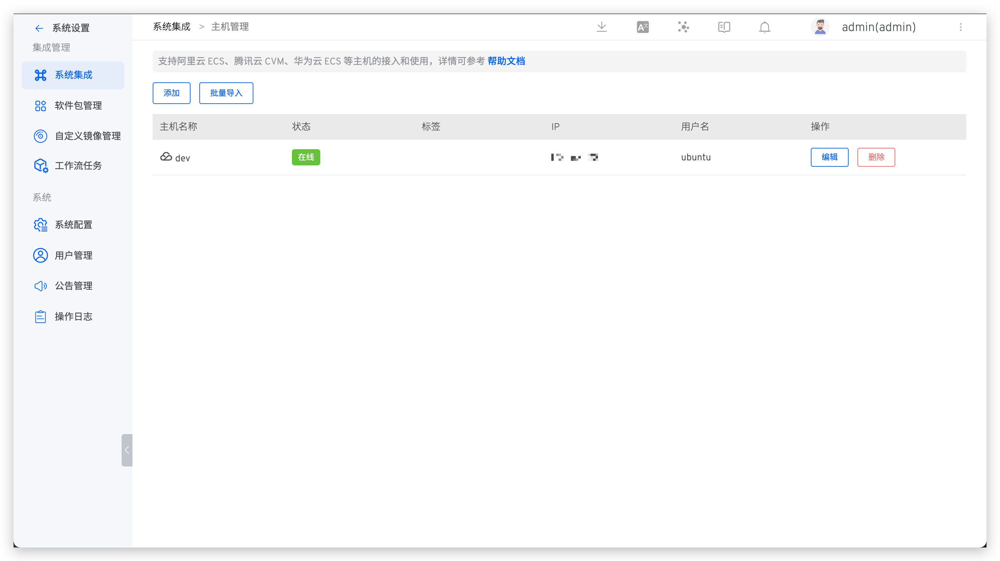
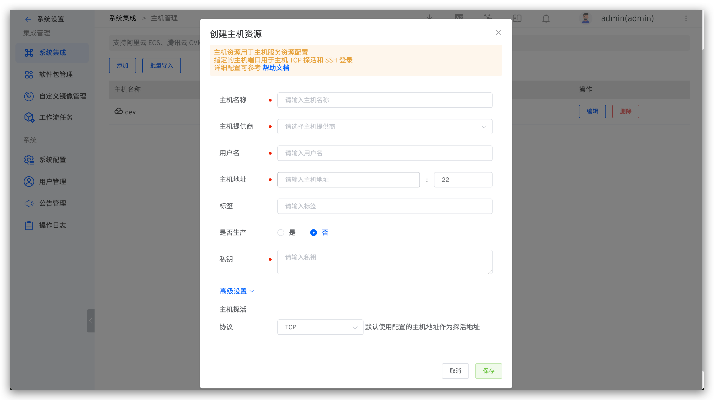
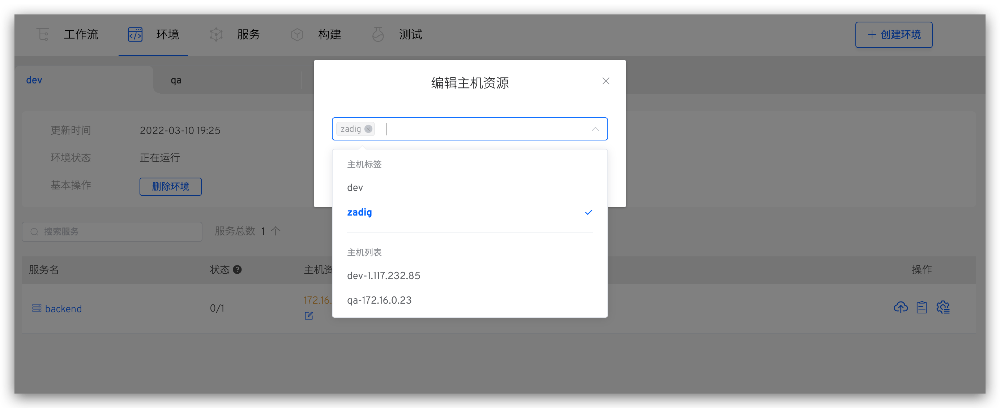

本文介绍如何在 ZadigX 系统上进行主机管理。

## 查看主机

管理员登录 ZadigX，在`系统设置` -> `系统集成` -> `主机管理`中可查看所有主机资源，系统会基于高级设置中的探活配置，定时（每 10 秒）检测主机在线状态。



## 添加主机

### 添加单个主机

管理员登录 ZadigX, 进入 `系统设置` -> `主机管理`，点击`新建`



参数说明：
- `主机名称`：自定义，用于标识主机的名称
- `用户名`：主机的 username
- `主机地址`：主机的访问地址及端口，端口值默认为 22
- `标签`：自定义，主机标签
- `私钥`：SSH 访问私钥。通过 `ssh-keygen -t rsa -C "your_email@example.com"` 方式生成
- `高级设置`：配置主机探活，系统每 10 秒会基于该配置对主机发起请求进行检测
    - TCP 协议：将会使用主机配置中的地址和端口作为探活地址
    - HTTP/HTTPS 协议：按需自定义探活配置

### 批量导入主机 


管理员登录，进入 `系统设置` -> `主机管理`，点击`新建`


参数说明：

- `下载模板`：导入的主机文件内容需符合 ZadigX 给出的模板文件中定义结构。
- `上传文件`：根据模板文件修改，上传修改后的主机列表文件。
- `导入选项`：
    1. 增量：主机管理列表中已有条目不会重新导入，仅添加文件中新增的主机信息。
    2. 覆盖已有主机：主机管理列表中的已有条目重新导入且添加文件中新增的主机信息。

模板中`主机探活`字段的配置说明如下：

``` json

{
    "probe_type": "http",                                                  // 探活协议 可选值：http、tcp、https
    "http_probe": {                                                        // 探活协议为 http/https 时需配置
        "path": "/api/v1/hello",                                           // 探活路径
        "port": 8084,                                                      // 探活端口
        "http_headers": [{"name": "Authorization", "value": "Bearer **"}], // 探活请求头部，格式为 [{"name": "", "value": ""}]
        "timeout_second": 5,                                               // 探活超时时间，单位为秒
        "response_success_flag": "Success"                                 // 探活响应成功标识，响应结构体包含 response_success_flag 时，判断探活成功
    }
}

```

## 主机使用

主机服务添加资源配置，支持两种选择方式：“主机标签” 和 “主机名称”。



可通过 `环境`，点击服务，查看服务部署详情。


