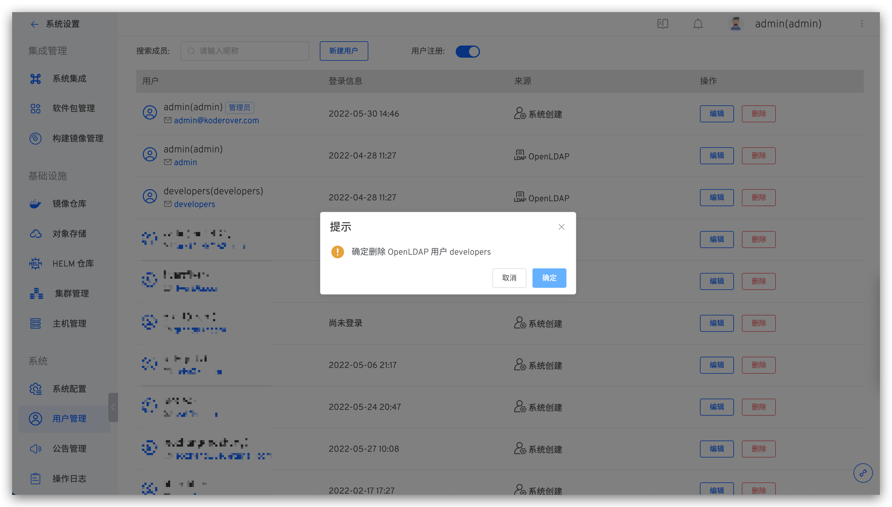
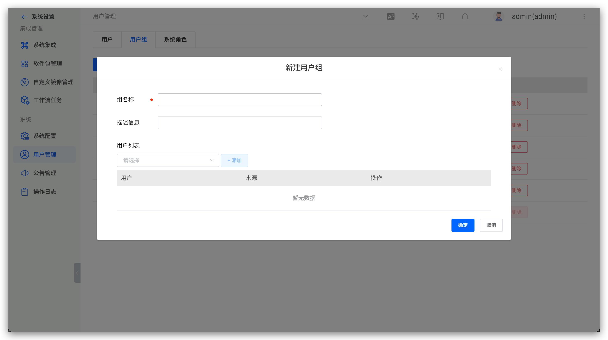
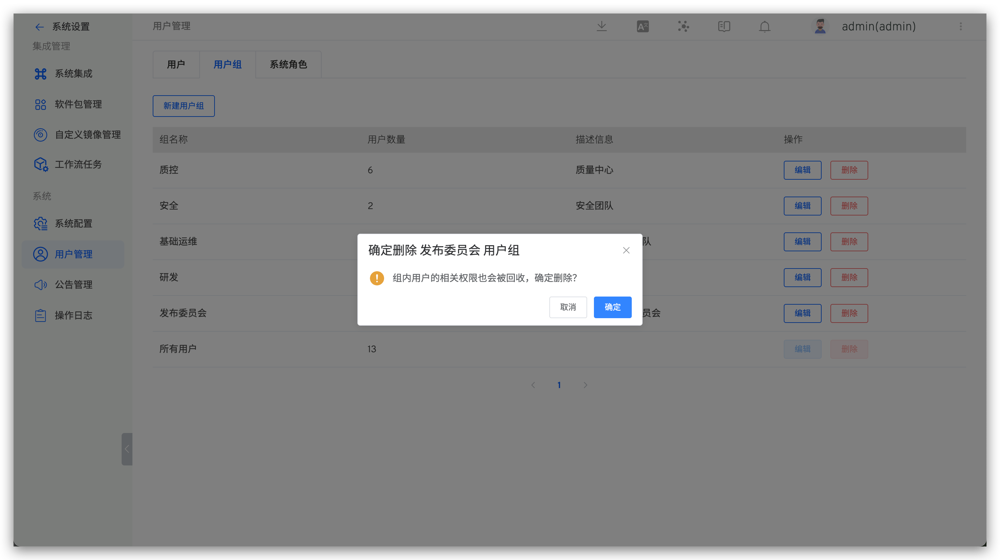
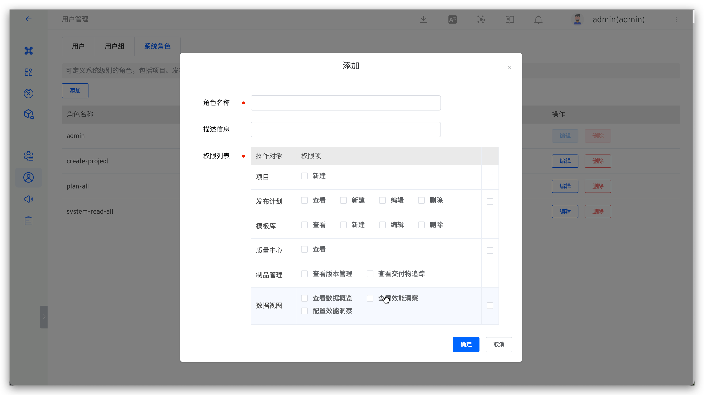
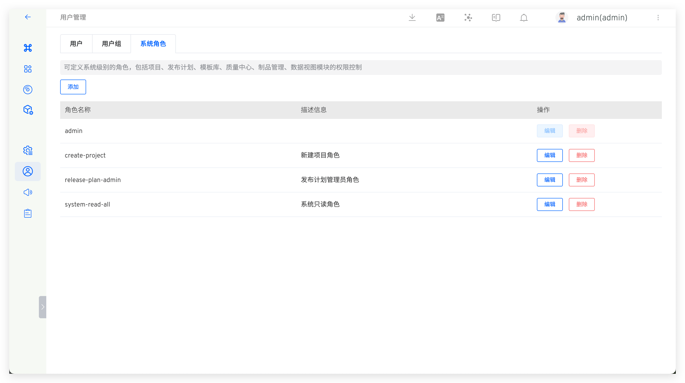

本文介绍 ZadigX 用户管理的基本功能。包括：用户管理、用户组管理和系统角色管理。

## 用户管理

### 新建用户

系统管理员访问系统设置 → 用户管理 → 用户 → 新建用户，填写用户信息。

说明：
- 用户名及用户来源唯一标识一个用户
- 角色信息来源于[系统角色](#系统角色)，若创建用户时不赋予任何角色，则该用户为系统普通用户，仅具有查看公开项目的权限

### 删除用户

说明：

- 删除用户操作会同步删除该用户的权限，再次创建同名账号时并不会默认拥有原来的权限
- 删除来源是 OpenLDAP/OAuth/GitHub/自定义账号系统的用户时，只会删除 ZadigX 系统中的账号数据，不会同步删除原始账号系统中的数据

## 用户组管理

### 新建用户组

系统管理员访问系统设置 → 用户管理 → 用户组，配置用户组信息。

### 删除用户组

选择用户组删除即可，其中内置`所有用户`组中包含 ZadigX 系统中的全部用户，不支持删除。

::: tip
删除用户组后，组内用户的相关权限也会被回收，请确认无误后操作。
:::

## 系统角色

定义系统级别的角色，包括项目资源、发布计划、模板库、质量中心、制品管理、数据视图模块的权限控制。

### 新建角色

系统管理员访问系统设置 → 用户管理 → 系统角色 → 新建系统角色，填写角色信息并配置权限。  

### 角色列表

查看系统的所有角色，点击`编辑`可查看该角色包括的权限。其中 `admin` 是内置的系统管理员角色。

