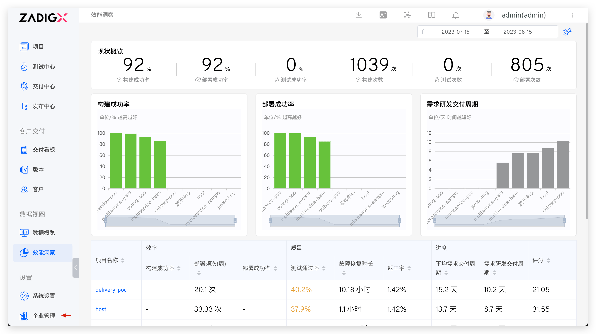
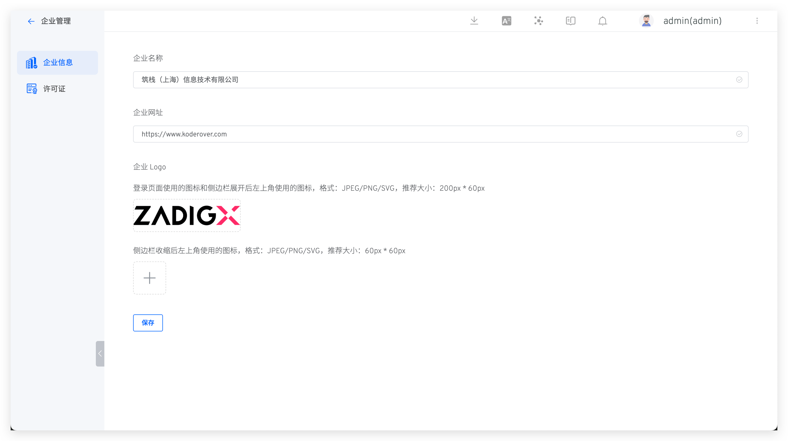
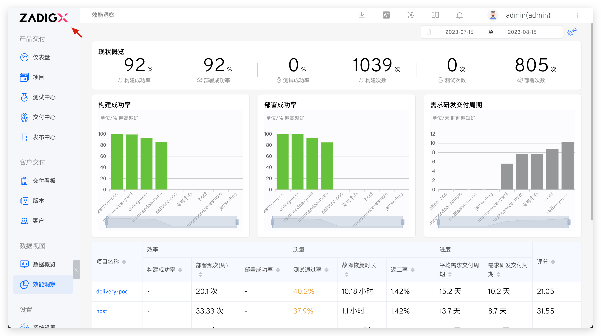
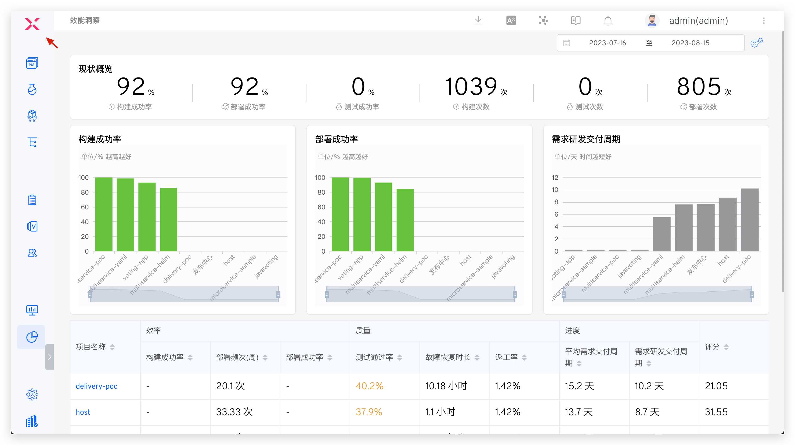
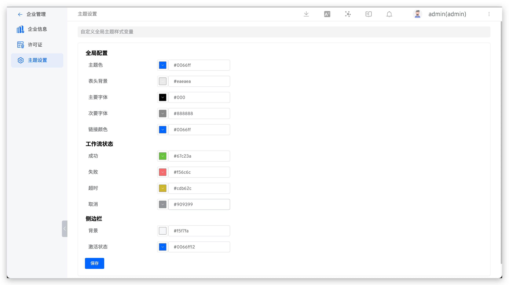

本文主要介绍如何在 ZadigX 中管理企业信息，包括：

- 企业名称、网址、Logo 等基本信息
- 许可证信息
- 系统主题设置

## 企业信息

系统管理员访问`企业管理` → `企业信息`，可修改企业名称、网址和企业 Logo 信息。

1. 支持设置登录页/侧边栏展开后、侧边栏收缩后的图标
2. 图片格式需要满足：JPEG/PNG/SVG，推荐大小 200px * 60px

侧边栏展开和收缩的效果图示如下：

## 许可证

系统管理员访问`企业管理` → `许可证`，按需对许可证进行更新。

## 系统主题

系统管理员访问 `企业管理` → `主题设置`，可自定义系统主题配色。

> 提示：系统主题一旦设置后，对所有用户都生效。

