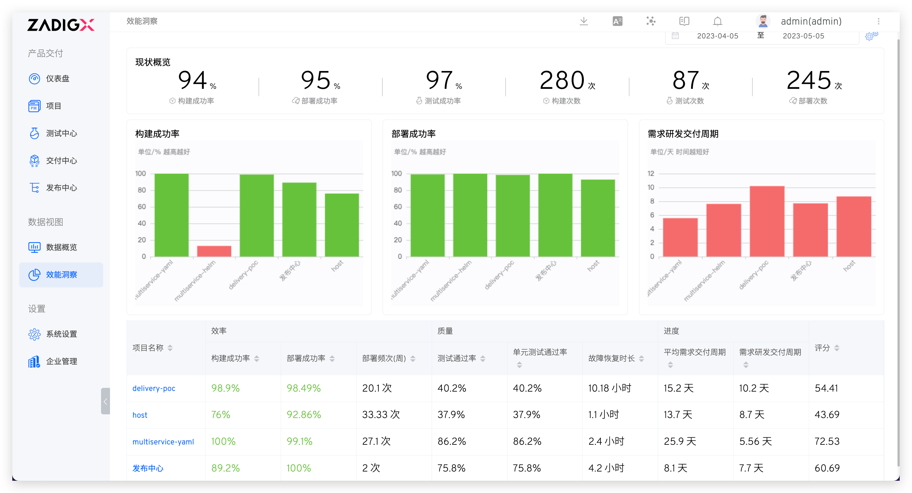
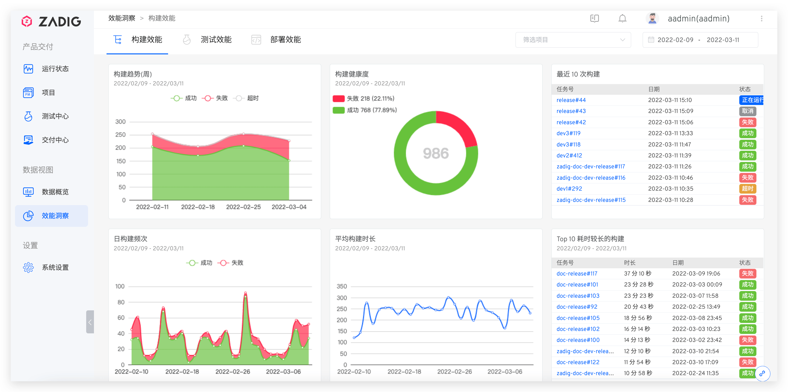
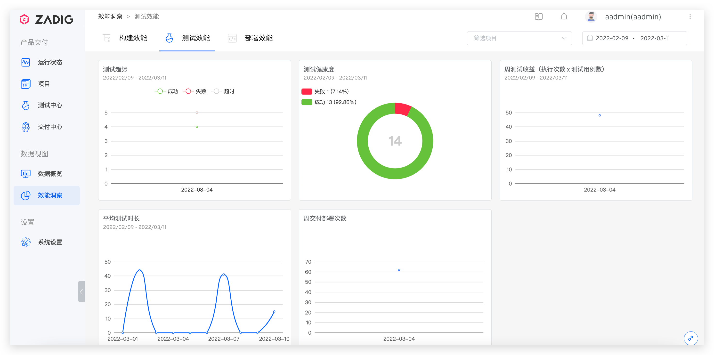
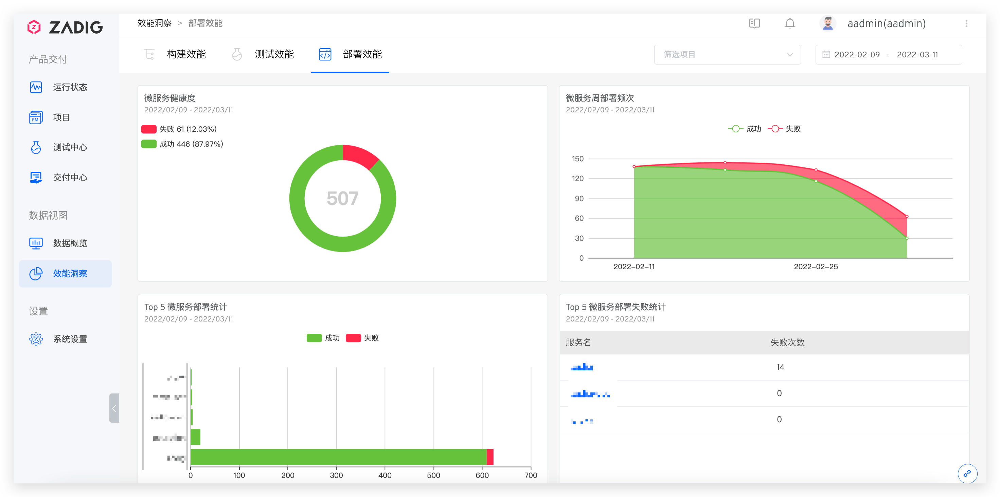
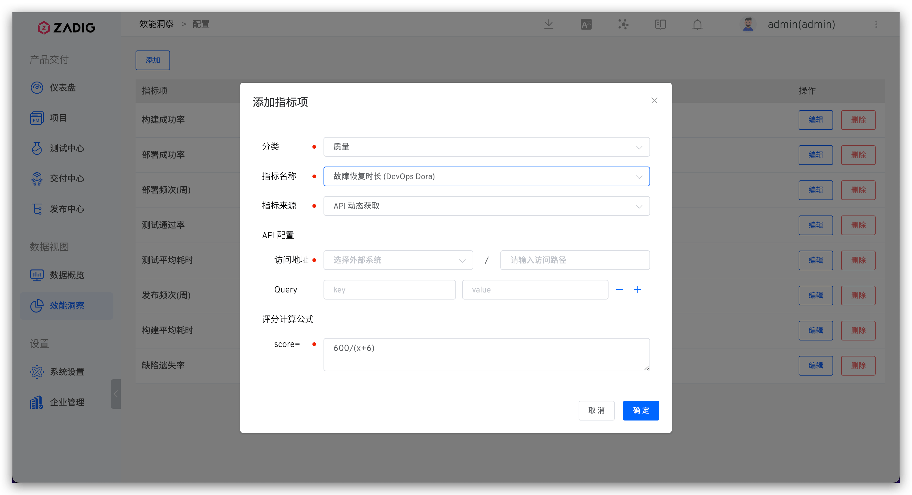
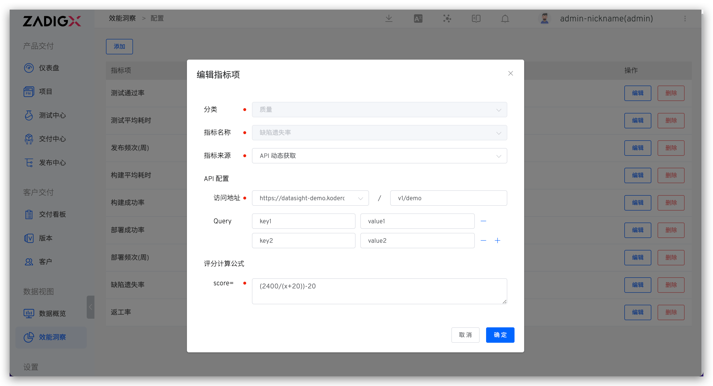

## 概览

访问数据视图 -> 效能洞察，可以从效率、质量和进度对项目进行预览。点击项目名称，可查看服务的构建、部署、测试数据，帮助分析各个环节的变化过程以及效能短板。



### 构建效能

展示可选时间可选项目的构建数据，包括周构建趋势、构建健康度、日构建频次、平均构建时长、最近 10 次构建以及 Top 10 耗时较长的构建。



### 测试效能

关于测试的趋势、健康度、平均测试时长、周交付部署次数以及周测试收益。



### 部署效能

关于微服务的健康度、周部署频次、部署统计以及微服务部署失败统计。



## 配置

在概览页点击右上角的配置图标，自定义效能指标，以及每一项指标的评分权重。



说明：

- `分类`：可配置质量/效率/进度类别的指标。
- `指标来源`：包括 `Zadig 采集`和 `API 动态获取`。
    - `Zadig 采集`：可用于配置构建/部署/发布/测试的成功率以及平均耗时，数据来源于工作流中的构建/部署/发布/测试执行情况。
    - `API 动态获取`：从外部系统获取并自定义获取数据 API 配置。
- `API 配置`：配置 API，用于获取数据，外部系统集成参考文档：[外部系统](/ZadigX%20v1.8.0/settings/others/)。
- `评分计算公式`：计算该指标分数的公式，对各个指标分数求权后相加，即为项目的总评分。

对于使用 API 动态获取数据，ZadigX 获取数据的请求示例如下：

``` bash
GET <外部系统>?start_time=<Unix 时间戳>&end_time=<Unix 时间戳>&project_name=<项目标识>&key1=value1&key2=value2...
```


说明：

- 获取数据的请求为 GET 请求
- 相关查询参数以 query string 的方式实现
- start_time、end_time、project_name 三个参数无需在指标项中配置
- 外部系统返回 JSON 数据，且需要包含 data 信息，示例如下

``` json
{
    "data": 92
}
```
