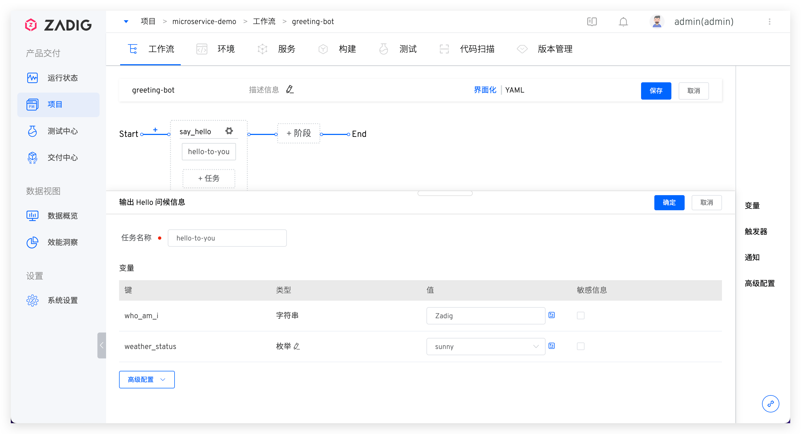
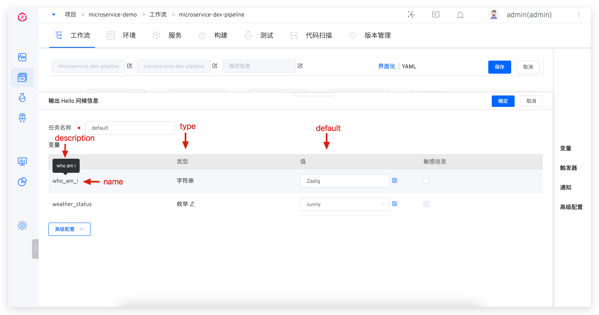

本文介绍如何在 ZadigX 系统中使用自定义任务来实现工作流的开放能力，以下内容包括：如何实现自定义任务、如何使用自定义任务。

## 实现自定义任务

编码实现自定义工作流任务，并将代码和配置入库，下面以打印 `Hello Zadig` 任务为例说明。

> 支持的代码源清请参考文档：[代码源信息](/ZadigX%20v1.8.0/settings/codehost/overview/)。

**第一步**：编码实现自定义任务的逻辑并保存，本例的源码 main.go 内容如下：
``` go
package main

import (
    "fmt"
    "github.com/spf13/viper"
)

const (
	WhoAmI        = "WHO_AM_I"
	WeatherStatus = "WEATHER_STATUS"
)

func main() {
    viper.AutomaticEnv()

    who_am_i := viper.GetString(WhoAmI)
    weather_status := viper.GetString(WeatherStatus)
    fmt.Printf("Hello %s, today is %s", who_am_i, weather_status)
}
```
**第二步**：编译源代码，构建出镜像并 push 到镜像仓库中，相关命令及 Dockerfile 参考如下：
> 编译源码命令
``` bash
CGO_ENABLED=0 GOOS=linux GOARCH=amd64 go build -v -o greeting-bot main.go
```
> Dockerfile 内容：
``` dockerfile
FROM alpine/git:v2.30.2

# https://wiki.alpinelinux.org/wiki/Setting_the_timezone
RUN sed -i 's/dl-cdn.alpinelinux.org/mirrors.aliyun.com/g' /etc/apk/repositories && apk add tzdata && \
    cp /usr/share/zoneinfo/Asia/Shanghai /etc/localtime && \
    echo Asia/Shanghai  > /etc/timezone && apk del tzdata

WORKDIR /app
ADD greeting-bot .
ENTRYPOINT ["/app/greeting-bot"]
```
> 镜像构建及 push 命令：
```
docker build -f Dockerfile --tag koderover.tencentcloudcr.com/koderover-public/greeting-bot:amd64
docker push koderover.tencentcloudcr.com/koderover-public/greeting-bot:amd64
```
**第三步**：编写 YAML 格式的任务配置文件，并将该 YAML 文件提交到代码库中。本例的 YAML 配置文件 `greeting-bot.yaml` 如下：
``` yaml
name: "输出 Hello 问候信息"           # 任务名称
category: "build"                   # 任务类型
version: "v0.0.1"                   # 任务版本
description: "问候指定用户"           # 任务描述
image: koderover.tencentcloudcr.com/koderover-public/greeting-bot:amd64 # 上一步中构建出来的镜像

inputs:                             # 配置在 ZadigX 中可填写的变量
  - name: who_am_i                  # 变量名称
    description: "who am i"         # 变量描述
    type: string                    # 变量类型，支持 string（单行文本）、text（多行文本）以及 choice（枚举）三种类型
    default: "Zadig"                # 变量的默认值
  - name: weather_status
    description: "what's the weather like today"
    type: choice                    # choice 类型的变量
    choice_option:                  # choice 类型变量的可选值
    - "sunny"
    - "cloudy"
    - "rainy"
    default: "sunny"               # choice 类型变量的默认值

envs:                               # 环境变量，启动上述镜像容器时会自动注入为环境变量，除了 envs，还支持使用 cmds 和 args
  - name: WHO_AM_I                  # 环境变量名称
    value: $(inputs.who_am_i)       # 环境变量的值，使用 $(inputs.who_am_i) 形式表示使用 ZadigX 中的输入
  - name: WEATHER_STATUS
    value: $(inputs.weather_status)

```

> 代码库中目录结构组织满足如下形式：
``` bash
path/to/your/repo                # 代码库根目录
├── greeting-bot                 # 任务目录，当有多个任务时，分别组织在单独的目录中
│   └── v0.0.1                   # 版本号
│       └── greeting-bot.yaml    # 任务的 YAML 文件，文件名称和任务目录名称保持一致
```
至此，一个完整的自定义工作流任务开发完毕，接下来我们看如何使用该任务。

## 使用自定义任务
在使用任务之前，需要先在系统中集成代码源和镜像仓库，配置工作流任务来源：
1. 参考 [代码源集成](/ZadigX%20v1.8.0/settings/codehost/overview/)，将上述代码库在 ZadigX 中集成。
2. 参考 [镜像仓库集成](/ZadigX%20v1.8.0/settings/image-registry/)，将构建镜像对应的镜像仓库在 ZadigX 中集成。
3. 系统管理员访问 `系统设置` -> `集成管理` -> `工作流任务`，配置代码仓库、分支等信息后保存（即：YAML 配置文件所在的代码库和分支）。

> 若集成来源成功后，代码库中任务实现有改动，点击 `同步` 即可。


配置完毕后，在自定义工作流中添加任务，选择任务后保存工作流即可，更多进阶功能可参考 [自定义工作流](/ZadigX%20v1.8.0/project/common-workflow/)。





## 任务配置 YAML 语法
### 基本信息

举例：
```yaml
name: "输出 Hello 问候信息"      
category: "build"   
version: "v0.0.1"                   
description: "问候指定用户"           
image: koderover.tencentcloudcr.com/koderover-public/greeting-bot:amd64 
```

参数说明：
- `name`：任务名称，如下图所示。
- `category`：任务类型，包含build（构建）、deploy（部署）、test（测试）、project-manager（项目管理）、config-change（配置变更）、data-change（数据变更）、release（发布策略）。其他字段可在双引号内自行输入：`"这是一个自定义的字段"`
- `version`：任务的版本号
- `description`：任务描述信息，如下图所示
- `image`：任务的镜像地址


### inputs

inputs 用于定义配置工作流时可传入容器的变量值。

举例：
```yaml
inputs:                             
  - name: who_am_i                 
    description: "who am i"         
    type: string                    
    default: "Zadig"                
  - name: weather_status
    description: "what's the weather like today"
    type: choice                    
    choice_option:                  
    - "sunny"
    - "cloudy"
    - "rainy"
    default: "sunny"            
```

参数说明：
- `name`： 变量名称
- `description`：描述信息
- `type`：变量类型， string（单行文本）、text（多行文本）以及 choice（枚举）三种类型
- `choice_option`：type 为 choice 类型时，可选的变量值
- `default`：变量默认值

参数与系统字段对应关系，如下图所示



### envs

执行工作流时输入的变量信息可以通过 envs 传入容器内部。任务容器启动时，envs 中配置的内容自动注入。

举例：
```yaml
envs:                              
  - name: WHO_AM_I                  
    value: $(inputs.who_am_i)       
  - name: WEATHER_STATUS
    value: $(inputs.weather_status)
```
参数说明：
- `name`：环境变量名称
- `value`：环境变量值，使用 $(inputs.who_am_i) 形式表示使用 ZadigX 中的输入

### cmds 和 args

如果有需要修改容器的启动命令，可以配置 cmds 和 args 参数。

举例
```yaml
cmds: 
- "/bin/sh"
- "-c"
args:
- "echo $(inputs.CONTENT)" # 配置内容支持使用 $(inputs.who_am_i) 形式参数
```
## 更多 Demo

官方内置了以下自定义任务可直接使用：

- `Jira Issue 状态变更`：结合 ZadigX 工作流阶段来变更 Jira Issue 状态，打通与项目管理的联动。源码位于 [jira-updater](https://github.com/koderover/zadig/tree/release-1.14.0/pkg/microservice/aslan/core/workflow/service/workflow/plugins/jira-updater)。
- `执行 Jenkins Job`：传入 Jenkins 构建参数，触发指定的 Jenkins Job 执行，源码位于 [jenkins-runner](https://github.com/koderover/zadig/tree/release-1.14.0/pkg/microservice/aslan/core/workflow/service/workflow/plugins/jenkins-runner)。
- `MySQL 数据库变更`：对 MySQL 数据库执行 SQL 语句，实现数据和代码变更联动变更，源码位于 [mysql-runner](https://github.com/koderover/zadig/tree/release-1.14.0/pkg/microservice/aslan/core/workflow/service/workflow/plugins/mysql-runner)。

此外，还开放了工作流任务共享代码库：[koderover/zadig-jobs](https://github.com/koderover/zadig-jobs)，其中包含若干 demo 实现和场景描述，供开发者使用和参考。
