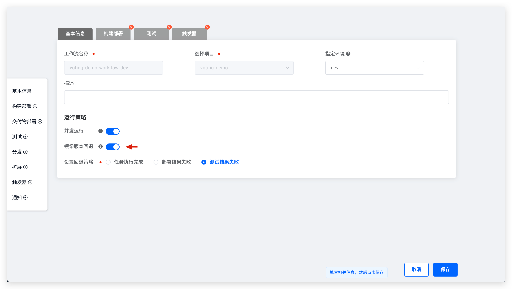

本文主要介绍工作流支持的镜像版本回退能力：在按照流程运行工作流完毕后，根据工作流任务实际运行结果和设置的回退策略来回退集成环境中被更新服务的镜像，恢复为工作流运行之前的镜像版本。

> [K8s YAML 部署的项目](/v1.11.0/project/k8s-yaml/)和 [Helm Chart 部署的项目](/v1.11.0/project/helm-chart/)中支持镜像版本回退功能。

## 镜像版本回退

> 镜像版本回退功能对部署阶段使用`构建部署`的工作流有效。

编辑工作流，开启镜像版本回退功能并保存，即可开启此功能。

## 适用场景

镜像版本回退功能的适用场景包括但不限于：

1. 多人协作共同使用一套集成环境。开发者希望验证代码变更是否能正常构建部署、通过测试，且验证完毕后，不论工作流运行结果如何，不希望改变集成环境中的服务镜像版本，避免对其他使用者造成不预期，此时设置回退策略为`任务执行完成`即可。
2. 使用工作流部署更新服务且部署失败，不希望集成环境中服务的镜像版本受该次失败影响，此时设置回退策略为`部署结果失败`即可。
3. 工作流中包含构建部署和测试步骤，如果测试步骤运行失败则回滚被更新的服务镜像，此时设置回退策略为`测试结果失败`即可。
