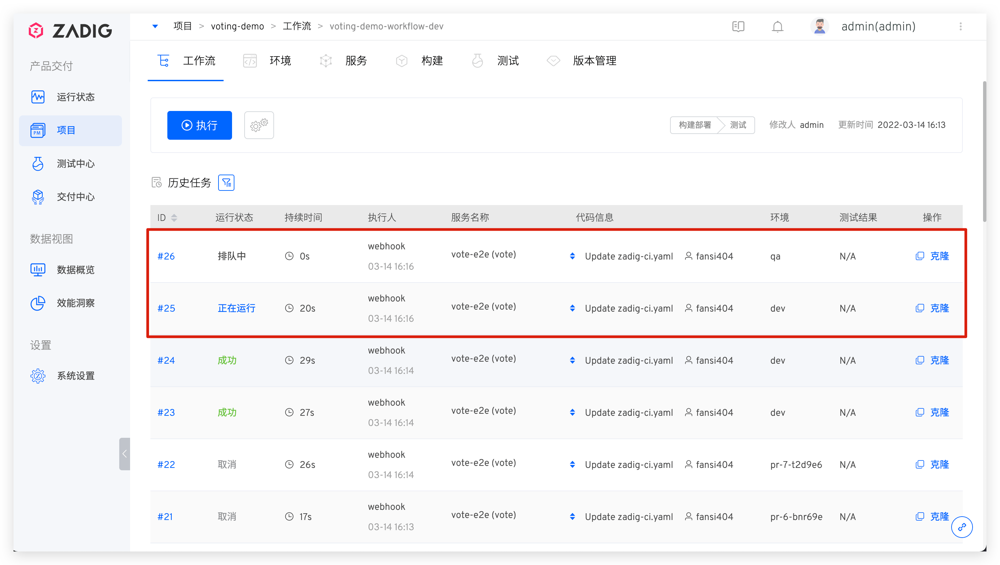

本文主要介绍 Zadig 环境的负载均衡能力。在高峰使用时间段， 代码变更触发工作流执行服务更新会因为环境资源的限制，导致工作流任务长时间的等待，大大影响交付效率，Zadig 的环境负载均衡能力可以缓解并发工作流任务使用环境资源的压力。

经过简单配置，减少代码变更触发的工作流任务排队数量，实现资源的最大化利用。配置步骤如下：

1. 配置多套环境
2. 配置工作流 Webhook 触发器
3. 开启工作流并发

## 第 1 步：配置多套环境
Zadig 系统支持使用一套服务配置，创建多套同构的环境，详细配置过程参考[配置多套环境](/v1.11.0/env/multi-env/)

## 第 2 步：配置工作流 Webhook 触发器
准备好多套环境后，配置工作流的触发器，如下图所示。

说明：
1. `部署环境`：选择多套用于部署的环境
2. `环境更新策略`：选择`动态选择空闲环境更新`
3. 完成其他的 Webhook 基本配置项

至此，我们已经配置完成，下面我们看看最终执行效果。

## 第 3 步：开启工作流并发
同一工作流的多个任务，默认是串行执行，为了减少任务排队时间，需开启工作流的并发执行能力。

配置方式：修改工作流 -> `运行策略` -> 选择`并发运行`。

## 执行效果
同时提交两个 pull request，触发两个工作流任务，这两个任务会将服务部署到相对空闲的环境中，在工作流并发数允许的情况下，这两个任务将被并发执行以提高交付效率。

