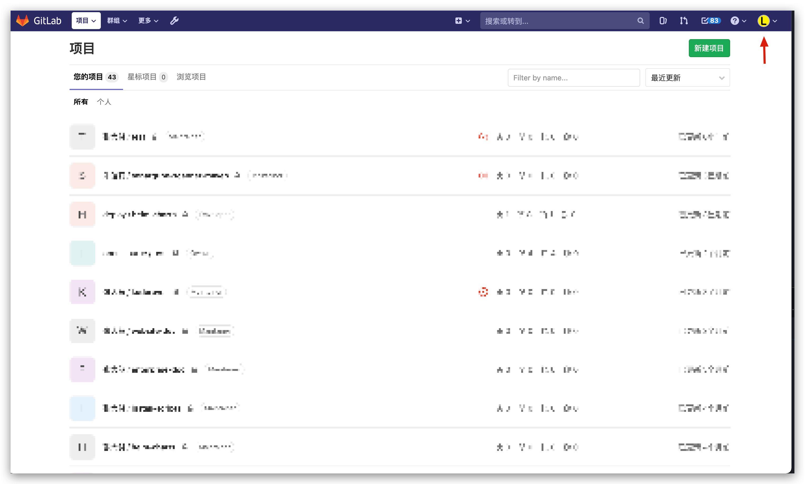
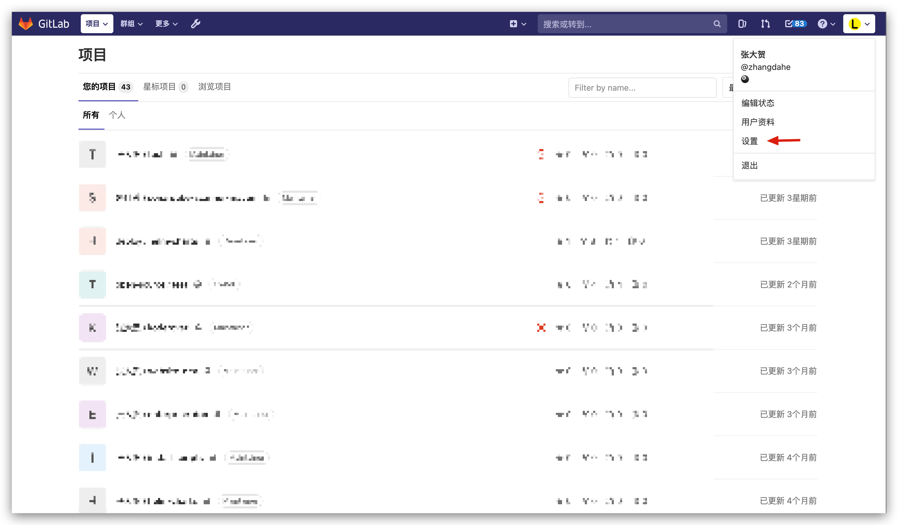
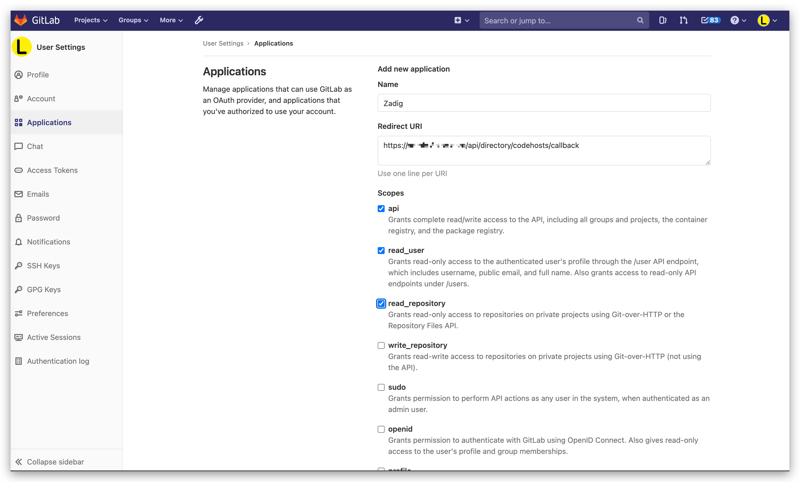
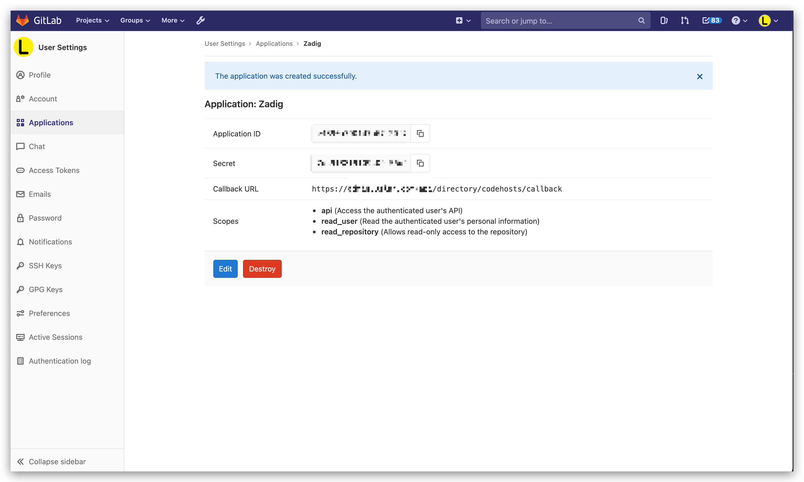
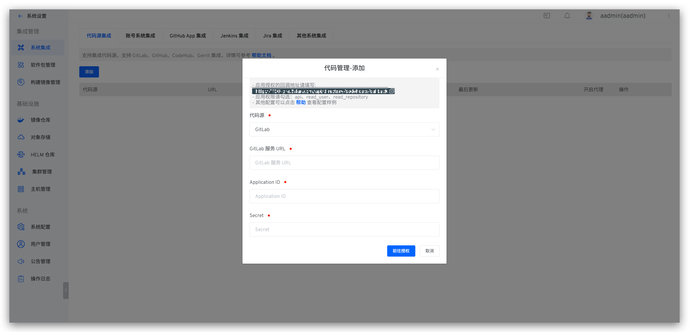
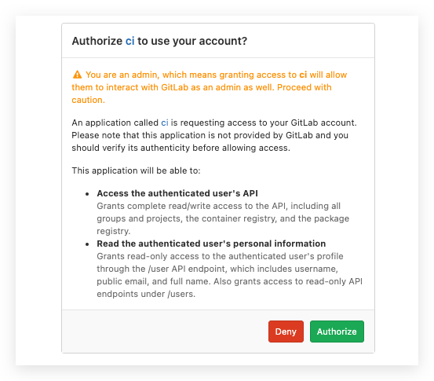
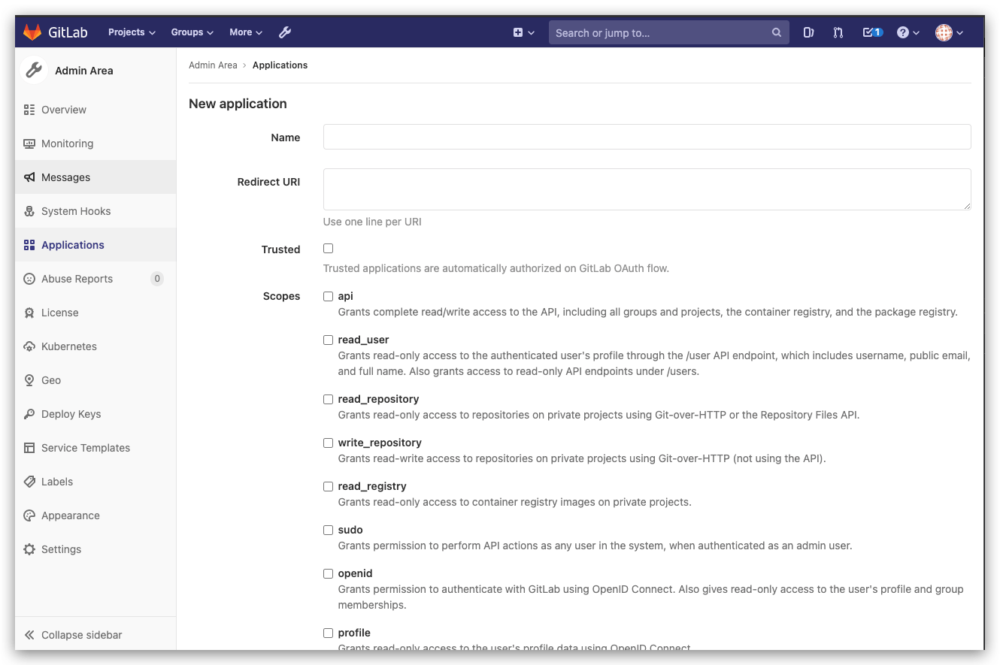
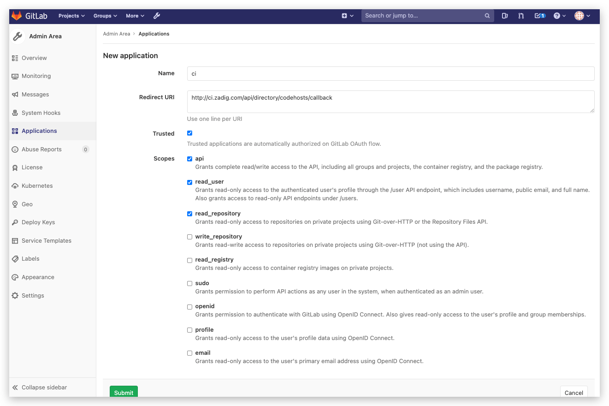
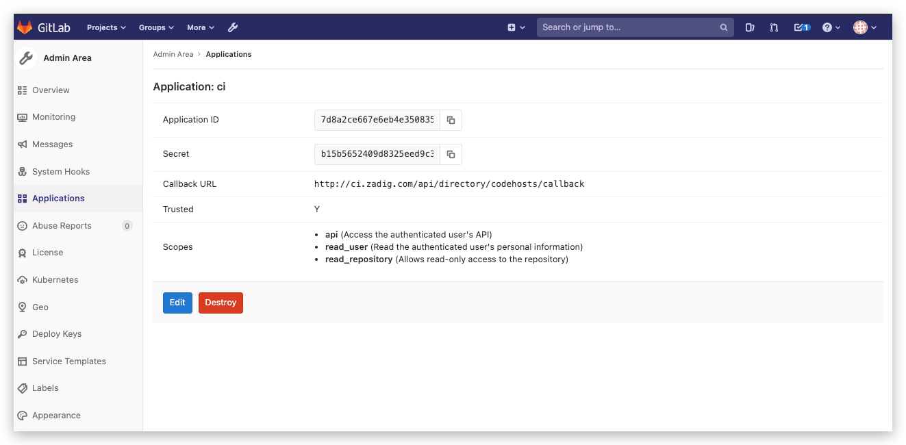

本文主要介绍如何集成 GitLab 代码源。

> 1. 目前 Zadig 系统采用 OAuth2 的方式与 GitLab 进行代码的授权认证
> 2. 请确保 GitLab API 是 v4 版本，推荐使用 GitLab 11.0+ 版本进行集成

如需集成 GitLab，可以按照以下流程配置：

- GitLab 用户或者管理员新建 OAuth 应用程序
- 配置 OAuth 应用程序，填写基本信息以及回调地址
- 获取 OAuth 应用程序的 `Application ID`、`Secret` 信息
- 配置 GitLab 集成，将获取到的 `Application ID`、`Secret` 信息填写到 Zadig 系统
- 跳转到 GitLab 进行认证授权
## 个人用户集成

### 步骤 1：新建 GitLab OAuth 应用程序

> `要启用 GitLab OAuth2，你必须在 GitLab 中注册一个应用程序。`

GitLab 用户可以通过右上角的个人设置通过 `Setting` -> `Applications` 来新建应用程序。

### 步骤 2：配置 GitLab OAuth 应用程序

在新建应用程序页面，你需要进行如下步骤

- 填写应用的名称
- 回调地址请填写 `http://[zadig.yours.com]/api/directory/codehosts/callback`
- 赋予权限 `api` 、`read_user` 、`read_repository`
- 点击创建

:::tip 注意
回调地址中 `zadig.yours.com` 需要替换为 Zadig 系统部署的实际地址
:::

### 步骤 3：获取 Application ID、Secret 信息

应用创建成功后，GitLab 会返回应用的相关信息，其中包括 `Application ID` 、`Secret` 信息。

### 步骤 4：将 Application ID、Secret 集成到系统

切换到 Zadig 系统，管理员依次点击 `系统设置` -> `集成管理` -> `代码源集成` -> 添加按钮。

依次填入如下已知信息：

- `代码源`：此处选择 GitLab
- `GitLab 服务 URL`：GitLab 地址
- `Application ID`：步骤 3 应用创建成功后返回的 Application ID
- `Secret`：步骤 3 应用创建成功后返回的 Secret

信息确认无误后点击 `前往授权`，耐心等待，此时会系统会跳转到 GitLab 进行授权。

点击授权按钮，同意授权后，GitLab 会跳转到 Zadig 系统，至此 GitLab 集成完毕。

## 组织用户集成

### 步骤 1：新建 GitLab OAuth 应用程序

> `要启用 GitLab OAuth2，你必须在 GitLab 中注册一个应用程序。`

GitLab 管理者可以通过 `Admin Area` -> `Applications` 来新建应用程序。

### 步骤 2：配置 GitLab OAuth 应用程序

在新建应用程序页面，你需要进行如下步骤

- 填写应用的名称
- 回调地址请填写 `http://[zadig.yours.com]/api/directory/codehosts/callback`
- 赋予权限 `api` 、`read_user` 、`read_repository`
- 点击创建

:::tip 注意
回调地址中 `zadig.yours.com` 需要替换为 Zadig 系统部署的实际地址
:::

### 步骤 3：获取 Application ID、Secret 信息

应用创建成功后，GitLab 会返回应用的相关信息，其中包括 `Application ID` 、`Secret` 信息。

### 步骤 4：将 Application ID、Secret 集成到系统

切换到 Zadig 系统，管理员依次点击 `系统设置` -> `集成管理` -> `代码源集成` -> 点击添加按钮。

依次填入如下已知信息：

- `代码源`：此处选择 GitLab
- `GitLab 服务 URL`：GitLab 地址
- `Application ID`：步骤 3 应用创建成功后返回的 Application ID
- `Secret`：步骤 3 应用创建成功后返回的 Secret

信息确认无误后点击 `前往授权`，耐心等待，此时会系统会跳转到 GitLab 进行授权。

点击授权按钮，同意授权后，GitLab 会跳转到 Zadig 系统，至此 GitLab 集成完毕。