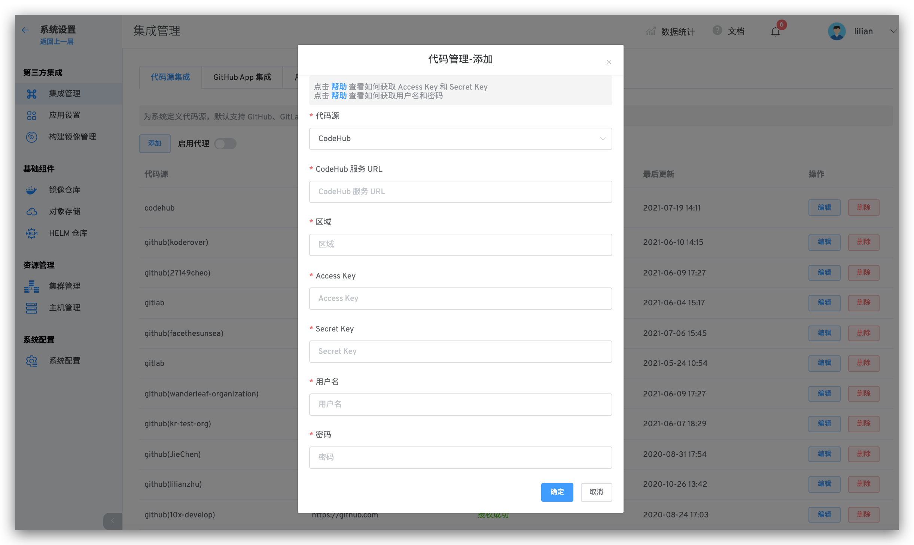

本文主要介绍在 Zadig 上如何集成 CodeHub 代码源。

> 目前系统采用 Access Key / Secret Key 的方式调用 CodeHub 的 API，以及使用 Username / Password 的方式拉取 CodeHub 的代码

如需配置 CodeHub 支持，可以按照以下流程配置：

### 步骤 1：获取 CodeHub 的 Access Key / Secret Key 以及 Username / Password

- 首先登录 CodeHub
- 获取 Access Key / Secret Key (参考[如何获取 Access Key / Secret Key](https://support.huaweicloud.com/devg-apisign/api-sign-provide-aksk.html))  
- 获取 Username / Password (参考[如何获取 Username / Password](https://support.huaweicloud.com/usermanual-codehub/codehub_ug_8003.html))

### 步骤 2：将配置填入 Zadig

切换到 Zadig 系统，管理员依次点击 `系统设置` -> `集成管理` -> `代码源集成` -> 点击添加按钮。

依次填入如下已知信息：

- `代码源`：此处选择 CodeHub
- `CodeHub 服务 URL`： CodeHub 地址，比如 https://codehub.devcloud.cn-north-4.huaweicloud.com
- `region`：区域 不同的区域看到的代码库信息是不同的
- `Access Key`： 上一个步骤中获取到的 Access Key
- `Secret Key`： 上一个步骤中获取到的 Secret Key 
- `用户名`： 上一个步骤中获取到的 Username
- `密码`： 上一个步骤中复制的密码 Password
