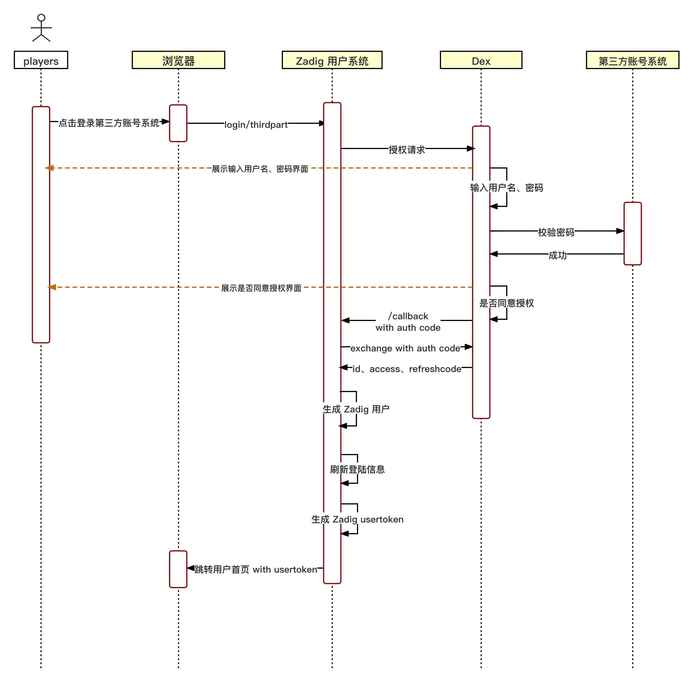
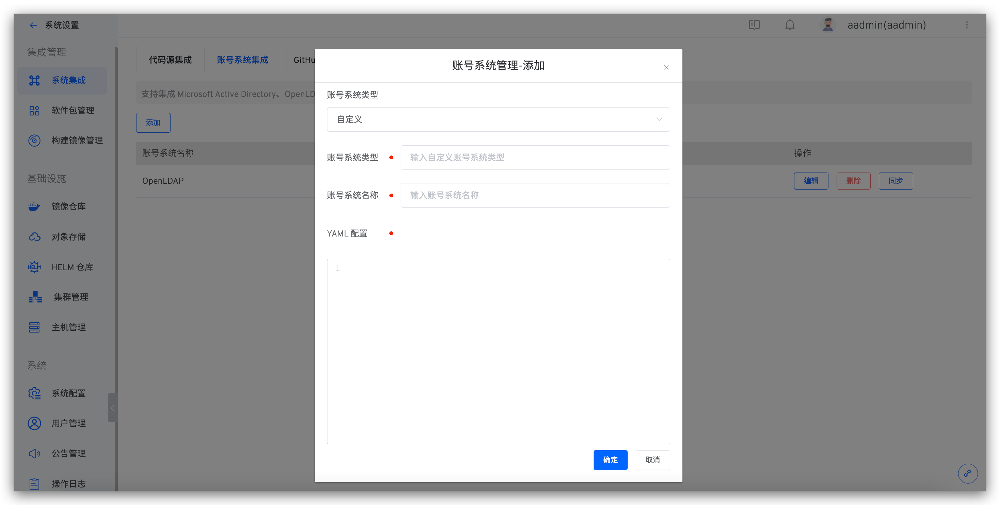
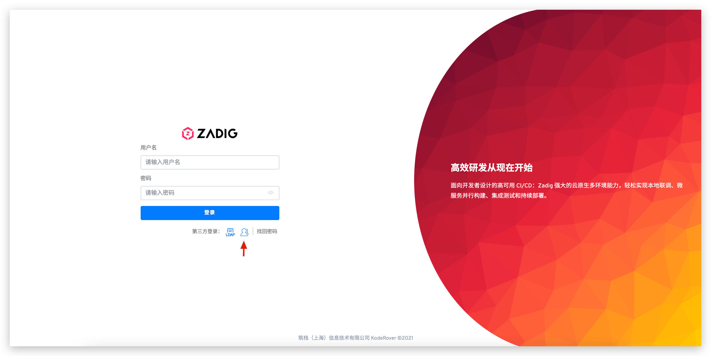

目前 Zadig 用户系统采用了开源项目 [Dex](https://github.com/dexidp/dex) 作为身份连接器，但 Dex 支持的协议列表（[Dex 支持的协议](https://dexidp.io/docs/connectors/)）有限，Zadig 则基于 Dex 官方库实现了一些标准的扩展，如 OAuth 协议等。如果用户自身的账号系统在 Zadig 官方支持之外，可以通过 Fork [koderover/dex](https://github.com/koderover/dex) 编写 Connector 实现自定义账号系统的集成。

## 自定义账号系统登录流程图


## 自定义账号系统集成流程

### 步骤 1 ：编写自定义 Dex Connector 

1. fork [koderover/dex](https://github.com/koderover/dex)
2. 编写 Dex 自定义 Connector （基于最新 Branch release-1.10.0）
- 目前 Dex Connector 接口定义于 [dex/connector/connector.go](https://github.com/koderover/dex/blob/release-1.10.0/connector/connector.go) 中，官方抽象了`PasswordConnector`、`CallbackConnector`、`RefreshConnector`、`SAMLConnector` 四种接口，用户可以根据自己账号系统情况实现自己的 Connector，参考 dex/connector 的各种 Connector 组合实现这四种接口。

以下是对各个接口的简要说明，根据账号系统登录的具体交互方式需要实现对应的接口：
|接口名|使用说明|目前可参考已有实现|
|-----|-----|-----|
|PasswordConnector|1. 简单使用用户名密码方式登录授权获取用户信息的情况。<br>2. Dex 和账号系统的交互是同步的情况|keystone、atlassiancrowed、ldap、mock/passwordConnector、passwordDB(位于 [dex/server/server.go](https://github.com/koderover/dex/blob/release-1.10.0/server/server.go))|
|CallbackConnector|1. 通过重定向获取用户信息的情况<br>2. Dex 和账号系统的交互是异步的情况|mock/Callback、bitbucketcloud、authproxy、gitea、github、gitlab、google、linkedin、microsoft、oauth、oidc、openshift|
|SAMLConnector|实现 HTTP POST 绑定的 SAML 连接器。RelayState 由服务器处理 |saml|
|RefreshConnector|实现后可以更新客户端 claims|mock/Callback、bitbucketcloud、atlassiancrowed、gitea、github、gitlab、google、ldap、linkedin、microsoft、mock/passwordConnector、oidc、passwordDB(位于dex/server/server.go)|

- 将添加的自定义 connector type 和名称加入 dex/server/server.go 的 ConnectorsConfig 中。

#### 参考例子
以 dex/connector 目录下的 OAuth connector 为例讲解。
1. 实现 connector interface

此 connector 实现了 CallbackConnector interface。

<h5 id="connector">以下为 OAuth connector 代码</h5>

::: details
``` Go
package oauth

import (
   "context"
   "crypto/tls"
   "crypto/x509"
   "encoding/base64"
   "encoding/json"
   "errors"
   "fmt"
   "io/ioutil"
   "net"
   "net/http"
   "strings"
   "time"

   "golang.org/x/oauth2"

   "github.com/dexidp/dex/connector"
   "github.com/dexidp/dex/pkg/log"
)

type oauthConnector struct {
   clientID             string
   clientSecret         string
   redirectURI          string
   tokenURL             string
   authorizationURL     string
   userInfoURL          string
   scopes               []string
   userIDKey            string
   userNameKey          string
   preferredUsernameKey string
   emailKey             string
   emailVerifiedKey     string
   groupsKey            string
   httpClient           *http.Client
   logger               log.Logger
}

type connectorData struct {
   AccessToken string
}

type Config struct {
   ClientID           string   `json:"clientID"`
   ClientSecret       string   `json:"clientSecret"`
   RedirectURI        string   `json:"redirectURI"`
   TokenURL           string   `json:"tokenURL"`
   AuthorizationURL   string   `json:"authorizationURL"`
   UserInfoURL        string   `json:"userInfoURL"`
   Scopes             []string `json:"scopes"`
   RootCAs            []string `json:"rootCAs"`
   InsecureSkipVerify bool     `json:"insecureSkipVerify"`
   UserIDKey          string   `json:"userIDKey"` // defaults to "id"
   ClaimMapping       struct {
      UserNameKey          string `json:"userNameKey"`          // defaults to "user_name"
      PreferredUsernameKey string `json:"preferredUsernameKey"` // defaults to "preferred_username"
      GroupsKey            string `json:"groupsKey"`            // defaults to "groups"
      EmailKey             string `json:"emailKey"`             // defaults to "email"
      EmailVerifiedKey     string `json:"emailVerifiedKey"`     // defaults to "email_verified"
   } `json:"claimMapping"`
}

func (c *Config) Open(id string, logger log.Logger) (connector.Connector, error) {
   var err error

   if c.UserIDKey == "" {
      c.UserIDKey = "id"
   }

   if c.ClaimMapping.UserNameKey == "" {
      c.ClaimMapping.UserNameKey = "user_name"
   }

   if c.ClaimMapping.PreferredUsernameKey == "" {
      c.ClaimMapping.PreferredUsernameKey = "preferred_username"
   }

   if c.ClaimMapping.GroupsKey == "" {
      c.ClaimMapping.GroupsKey = "groups"
   }

   if c.ClaimMapping.EmailKey == "" {
      c.ClaimMapping.EmailKey = "email"
   }

   if c.ClaimMapping.EmailVerifiedKey == "" {
      c.ClaimMapping.EmailVerifiedKey = "email_verified"
   }
   oauthConn := &oauthConnector{
      clientID:             c.ClientID,
      clientSecret:         c.ClientSecret,
      tokenURL:             c.TokenURL,
      authorizationURL:     c.AuthorizationURL,
      userInfoURL:          c.UserInfoURL,
      scopes:               c.Scopes,
      redirectURI:          c.RedirectURI,
      logger:               logger,
      userIDKey:            c.UserIDKey,
      userNameKey:          c.ClaimMapping.UserNameKey,
      preferredUsernameKey: c.ClaimMapping.PreferredUsernameKey,
      groupsKey:            c.ClaimMapping.GroupsKey,
      emailKey:             c.ClaimMapping.EmailKey,
      emailVerifiedKey:     c.ClaimMapping.EmailVerifiedKey,
   }

   oauthConn.httpClient, err = newHTTPClient(c.RootCAs, c.InsecureSkipVerify)
   if err != nil {
      return nil, err
   }

   return oauthConn, err
}

func newHTTPClient(rootCAs []string, insecureSkipVerify bool) (*http.Client, error) {
   pool, err := x509.SystemCertPool()
   if err != nil {
      return nil, err
   }

   tlsConfig := tls.Config{RootCAs: pool, InsecureSkipVerify: insecureSkipVerify}
   for _, rootCA := range rootCAs {
      rootCABytes, err := ioutil.ReadFile(rootCA)
      if err != nil {
         return nil, fmt.Errorf("failed to read root-ca: %v", err)
      }
      if !tlsConfig.RootCAs.AppendCertsFromPEM(rootCABytes) {
         return nil, fmt.Errorf("no certs found in root CA file %q", rootCA)
      }
   }

   return &http.Client{
      Transport: &http.Transport{
         TLSClientConfig: &tlsConfig,
         Proxy:           http.ProxyFromEnvironment,
         DialContext: (&net.Dialer{
            Timeout:   30 * time.Second,
            KeepAlive: 30 * time.Second,
            DualStack: true,
         }).DialContext,
         MaxIdleConns:          100,
         IdleConnTimeout:       90 * time.Second,
         TLSHandshakeTimeout:   10 * time.Second,
         ExpectContinueTimeout: 1 * time.Second,
      },
   }, nil
}

func (c *oauthConnector) LoginURL(scopes connector.Scopes, callbackURL, state string) (string, error) {
   if c.redirectURI != callbackURL {
      c.logger.Errorf("expected callback URL %q did not match the URL in the config %q", callbackURL, c.redirectURI)
      return "", fmt.Errorf("expected callback URL %q did not match the URL in the config %q", callbackURL, c.redirectURI)
   }

   oauth2Config := &oauth2.Config{
      ClientID:     c.clientID,
      ClientSecret: c.clientSecret,
      Endpoint:     oauth2.Endpoint{TokenURL: c.tokenURL, AuthURL: c.authorizationURL},
      RedirectURL:  c.redirectURI,
      Scopes:       c.scopes,
   }

   return oauth2Config.AuthCodeURL(state), nil
}

func (c *oauthConnector) HandleCallback(s connector.Scopes, r *http.Request) (identity connector.Identity, err error) {
   q := r.URL.Query()
   if errType := q.Get("error"); errType != "" {
      c.logger.Errorf("get error:%s", q.Get("error_description"))
      return identity, errors.New(q.Get("error_description"))
   }

   oauth2Config := &oauth2.Config{
      ClientID:     c.clientID,
      ClientSecret: c.clientSecret,
      Endpoint:     oauth2.Endpoint{TokenURL: c.tokenURL, AuthURL: c.authorizationURL},
      RedirectURL:  c.redirectURI,
      Scopes:       c.scopes,
   }

   ctx := context.WithValue(r.Context(), oauth2.HTTPClient, c.httpClient)

   token, err := oauth2Config.Exchange(ctx, q.Get("code"))
   if err != nil {
      c.logger.Errorf("OAuth connector: failed to get token: %v", err)
      return identity, fmt.Errorf("OAuth connector: failed to get token: %v", err)
   }

   client := oauth2.NewClient(ctx, oauth2.StaticTokenSource(token))

   userInfoResp, err := client.Get(c.userInfoURL)
   if err != nil {
      c.logger.Errorf("OAuth Connector: failed to execute request to userinfo: %v", err)
      return identity, fmt.Errorf("OAuth Connector: failed to execute request to userinfo: %v", err)
   }
   defer userInfoResp.Body.Close()

   if userInfoResp.StatusCode != http.StatusOK {
      c.logger.Errorf("OAuth Connector: failed to execute request to userinfo: status %d", userInfoResp.StatusCode)
      return identity, fmt.Errorf("OAuth Connector: failed to execute request to userinfo: status %d", userInfoResp.StatusCode)
   }

   var userInfoResult map[string]interface{}
   err = json.NewDecoder(userInfoResp.Body).Decode(&userInfoResult)
   if err != nil {
      c.logger.Errorf("OAuth Connector: failed to parse userinfo: %v", err)
      return identity, fmt.Errorf("OAuth Connector: failed to parse userinfo: %v", err)
   }

   userID, found := userInfoResult[c.userIDKey].(string)
   if !found {
      c.logger.Errorf("OAuth Connector: not found %v claim", c.userIDKey)
      return identity, fmt.Errorf("OAuth Connector: not found %v claim", c.userIDKey)
   }

   identity.UserID = userID
   identity.Username, _ = userInfoResult[c.userNameKey].(string)
   identity.PreferredUsername, _ = userInfoResult[c.preferredUsernameKey].(string)
   identity.Email, _ = userInfoResult[c.emailKey].(string)
   identity.EmailVerified, _ = userInfoResult[c.emailVerifiedKey].(bool)

   if s.Groups {
      groups := map[string]struct{}{}

      c.addGroupsFromMap(groups, userInfoResult)
      c.addGroupsFromToken(groups, token.AccessToken)

      for groupName := range groups {
         identity.Groups = append(identity.Groups, groupName)
      }
   }

   if s.OfflineAccess {
      data := connectorData{AccessToken: token.AccessToken}
      connData, err := json.Marshal(data)
      if err != nil {
         c.logger.Errorf("OAuth Connector: failed to parse connector data for offline access: %v", err)
         return identity, fmt.Errorf("OAuth Connector: failed to parse connector data for offline access: %v", err)
      }
      identity.ConnectorData = connData
   }
   return identity, nil
}

func (c *oauthConnector) addGroupsFromMap(groups map[string]struct{}, result map[string]interface{}) error {
   groupsClaim, ok := result[c.groupsKey].([]interface{})
   if !ok {
      return errors.New("cannot convert to slice")
   }

   for _, group := range groupsClaim {
      if groupString, ok := group.(string); ok {
         groups[groupString] = struct{}{}
      }
   }

   return nil
}

func (c *oauthConnector) addGroupsFromToken(groups map[string]struct{}, token string) error {
   parts := strings.Split(token, ".")
   if len(parts) < 2 {
      return errors.New("invalid token")
   }

   decoded, err := decode(parts[1])
   if err != nil {
      return err
   }

   var claimsMap map[string]interface{}
   err = json.Unmarshal(decoded, &claimsMap)
   if err != nil {
      return err
   }

   return c.addGroupsFromMap(groups, claimsMap)
}

func decode(seg string) ([]byte, error) {
   if l := len(seg) % 4; l > 0 {
      seg += strings.Repeat("=", 4-l)
   }

   return base64.URLEncoding.DecodeString(seg)
}
```
::: 

2. 将添加的自定义 connector type 和名称加入 dex/server/server.go 的 ConnectorsConfig 中，如下所示。
::: details
``` Go
// ConnectorsConfig variable provides an easy way to return a config struct
// depending on the connector type.
var ConnectorsConfig = map[string]func() ConnectorConfig{
   "keystone":        func() ConnectorConfig { return new(keystone.Config) },
   "mockCallback":    func() ConnectorConfig { return new(mock.CallbackConfig) },
   "mockPassword":    func() ConnectorConfig { return new(mock.PasswordConfig) },
   "ldap":            func() ConnectorConfig { return new(ldap.Config) },
   "gitea":           func() ConnectorConfig { return new(gitea.Config) },
   "github":          func() ConnectorConfig { return new(github.Config) },
   "gitlab":          func() ConnectorConfig { return new(gitlab.Config) },
   "google":          func() ConnectorConfig { return new(google.Config) },
   "oidc":            func() ConnectorConfig { return new(oidc.Config) },
   // 这个位置需要加自定义 connector type
   "oauth":           func() ConnectorConfig { return new(oauth.Config) },
   "saml":            func() ConnectorConfig { return new(saml.Config) },
   "authproxy":       func() ConnectorConfig { return new(authproxy.Config) },
   "linkedin":        func() ConnectorConfig { return new(linkedin.Config) },
   "microsoft":       func() ConnectorConfig { return new(microsoft.Config) },
   "bitbucket-cloud": func() ConnectorConfig { return new(bitbucketcloud.Config) },
   "openshift":       func() ConnectorConfig { return new(openshift.Config) },
   "atlassian-crowd": func() ConnectorConfig { return new(atlassiancrowd.Config) },
   // Keep around for backwards compatibility.
   "samlExperimental": func() ConnectorConfig { return new(saml.Config) },
}
```
:::

### 步骤 2：构建自定义的 Dex 镜像
1. 更改根目录下 [Makefile](https://github.com/koderover/dex/blob/release-1.10.0/Makefile) 中的 `DOCKER_REPO` 变量为自己的公开镜像仓库
2. 运行 `make docker-image` 构建镜像，并上传镜像至自己的公开镜像仓库
3. 用自定义的镜像覆盖 Dex 的原始镜像
```bash
kubectl get deployment -n <Zadig Namespace> | grep dex # 获得 Dex 的 deployment
kubectl set image deployment/<Dex 的 deployment> dex=<新生成的 Dex 镜像> --record -n <Zadig Namespace> # 替换 Dex 镜像
```

### 步骤 3：在 Zadig 平台中录入配置
登录 Zadig 平台后，在`系统设置` -> `账号系统集成`-> `自定义`账户类型录入 YAML 配置，如下图所示。
> YAML 配置由 Connector 中的 [`Config` 结构体](#connector)生成。




### 步骤 4：使用自定义账号系统登录 Zadig
访问 Zadig 登录页面，点击第三方登录，如下图所示。跳转到对应的登录页面，输入用户名密码即可登录 Zadig 系统。

