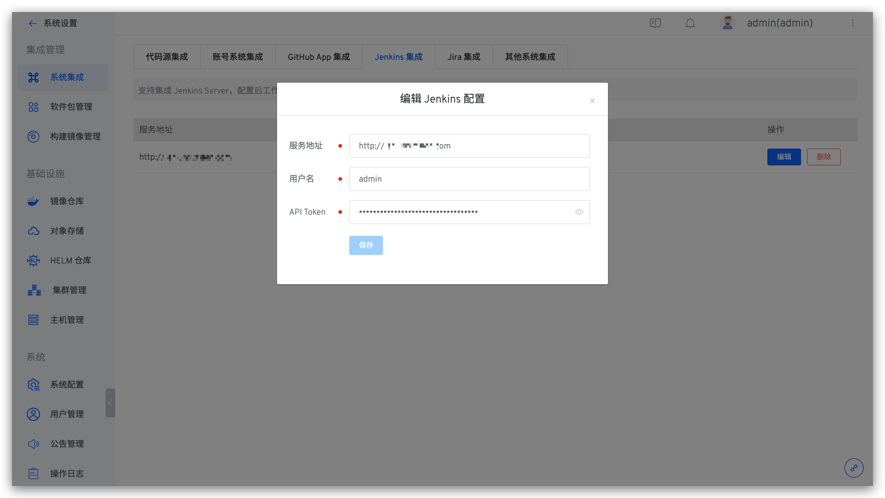

本文介绍在 Zadig 系统上集成 Jenkins Server。

## Jenkins Server 生成 API Token

登录 Jenkins，在用户配置中，生成一个 API Token，如下图所示。

## 集成 Jenkins Server

访问 Zadig，点击 `系统设置` ->  `集成管理` -> `Jenkins 集成` ，添加 Jenkins 服务相关信息，如下图所示。

