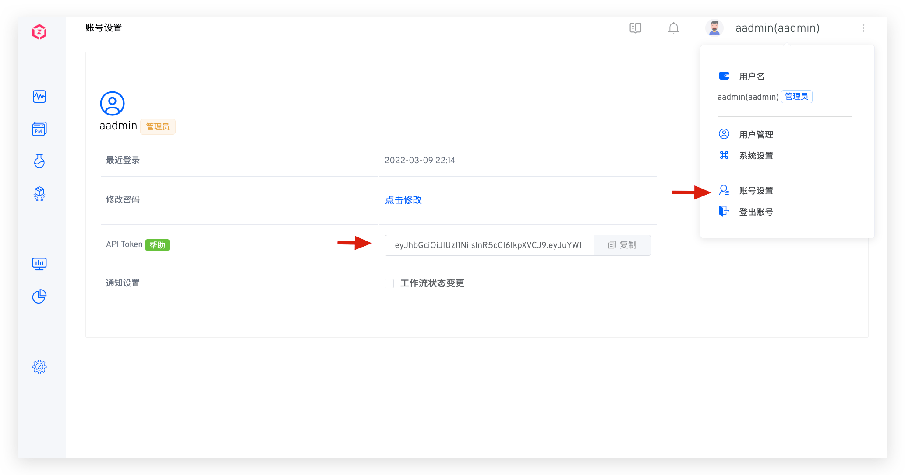

本文介绍 Zadig API 调用方式和如何获取 Zadig API Token

## API 调用方式

在请求的 HTTP Header 中，加入指定的 Authorization 信息，即可在 HTTP Client 中调用 Zadig API，示例如下：

::: tip 请求示例
> 提示：示例中的 `yours.zadig.com` 是 Zadig 系统访问地址，请求前请视实际情况替换。

curl -H 'Authorization: Bearer your-token' http://yours.zadig.com/api/aslan/system/notification/subscribe
:::

## 获取 API Token

点击右上角用户，在菜单中选择 `账号设置`，复制 API Token。

