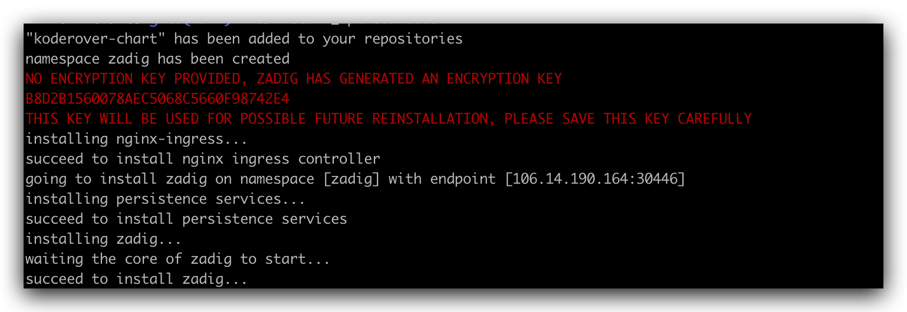
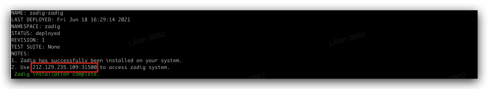

::: warning
 在现有 Kubernetes 集群上安装 Zadig。可生产使用。
:::

## 步骤 1：准备 Kubernetes 集群

- Kubernetes  <Badge text="v1.12.0 +" /> 版本 <br>
- Helm  <Badge text="v3.0.0 +" /> 版本<br>

> 自建集群需要确保一下配置：<br>
> 在安装之前，需要配置 Kubernetes `默认`的 StorageClass，以支持创建 PVC 用于数据持久化 <br>
> 配置 kube-dns 服务，以支持服务和 Pod 之间的按名称寻址 <br>

## 步骤 2：准备安装环境

- 需要一台可以正常连通该集群的机器用于执行安装脚本。
- 确保该机器已经安装了 [kubectl 客户端](https://kubernetes.io/docs/tasks/tools/) 并且可以使用管理员的权限操作该集群。

## 步骤 3：准备集群资源

- 需要准备两个至少 20Gi 的 [PV](https://kubernetes.io/docs/concepts/storage/persistent-volumes/)
    - 如果自己没有创建 PV 的经验，可以使用我们提供的可选安装方式来安装一个试用版的 PV
    ```bash
    curl -LO https://resources.koderover.com/dist/pv-tmp.yaml && kubectl create -f pv-tmp.yaml
    ```

## 步骤 4：下载安装脚本

下载安装脚本并添加可执行权限。

```bash
curl -LO https://github.com/koderover/zadig/releases/download/v1.6.0/install.sh
chmod +x ./install.sh
```

::: tip 提示
下表为安装脚本支持配置的环境变量，安装时会使用默认值进行安装，如果有配置的需求，可以在执行安装脚本之前通过环境变量进行配置。
:::

```bash
#例如：配置 IP 访问地址
export IP=<node external ip>
export PORT=< 30000 - 32767 任一端口>
#  如果出现端口占用情况，换一个端口再尝试
```

| 变量名称           | 默认值   | 是否必填         | 说明                                                                                                                                                  |
|--------------------|----------|------------------|-------------------------------------------------------------------------------------------------------------------------------------------------------|
| NAMESPACE          | zadig    | 否               | Kubernetes 命名空间                                                                                                                                   |
| IP                 |          | 和 DOMAIN 二选一 | Kubernetes 集群任一节点的外网 IP 地址，用于访问 Zadig 系统                                                                                            |
| PORT               |          | 使用 IP 访问必填 | 30000 - 32767 任一端口                                                                                                                                |
| DOMAIN             |          | 和 IP 二选一     | 访问 Zadig 系统域名                                                                                                                                   |
| NGINX_SERVICE_TYPE | NodePort | 否               | 安装脚本自动安装的 Ingress Controller Service 类型为 NodePort， 可配置为： LoadBalancer                                                               |
| INGRESS_CLASS      |          | 否               | 若集群内已经配置了 Nginx Ingress 控制器，则设置这个变量为该控制器的名称                                                                               |
| STORAGE_SIZE       | 20G      | 否               | 内置数据库和对象存储各自的数据存储大小                                                                                                                |
| INSECURE_REGISTRY  |          | 否               | 若需要使用一个 HTTP 协议的 Registry，则设置该变量为 Registry 的地址 ，如 10.0.0.1:5000                                                                |
| STORAGE_CLASS      |          | 否               | 若集群内支持持久存储卷，可以设置该变量，避免 Zadig 的数据库服务重启后数据丢失                                                                         |
| MONGO_URI          |          | 否               | Zadig 业务数据存储，若不配置，使用安装脚本中内置的单节点 MongoDB                                                                                      |
| MONGO_DB           | zadig    | 否               | 数据库名称                                                                                                                                            |
| ENCRYPTION_KEY     |          | 否               | 用于数据加密解密，由安装过程生成 ENCRYPTION_KEY，第一次安装后请保存 ENCRYPTION_KEY，重装系统时需设置 ENCRYPTION_KEY，才能保证之前的数据可以被正确解密 |


## 步骤 5：开始安装

执行安装脚本

```bash
export IP=<IP>
# Kubernetes 集群任一节点的外网 IP 地址，用于访问 Zadig 系统
# 如果你有自己的域名，可以配置你可用的域名 export DOMAIN = <DOMAIN>
export PORT=<30000~32767 任一端口>
#  如果出现端口占用情况，换一个端口再尝试
./install.sh
```

## 步骤 6：验证安装结果



安装过程预计持续 10 分钟左右，受硬件配置和网络情况影响，不同环境下的时间可能不同，
当看到如图的输出时，说明安装已经完成，届时可以通过命令查看服务启动状态。

```bash
kubectl -n zadig get po
```
## 步骤 7：访问系统



在安装结果输出中，你可以获得系统的访问地址。


## Zadig 卸载

支持使用脚本来一键卸载当前安装的 Zadig 系统，只需执行卸载脚本即可：

```bash
#根据实际安装的 namespace 修改
export NAMESPACE=zadig
curl -SsL https://github.com/koderover/zadig/releases/download/v1.6.0/uninstall.sh |bash
```
