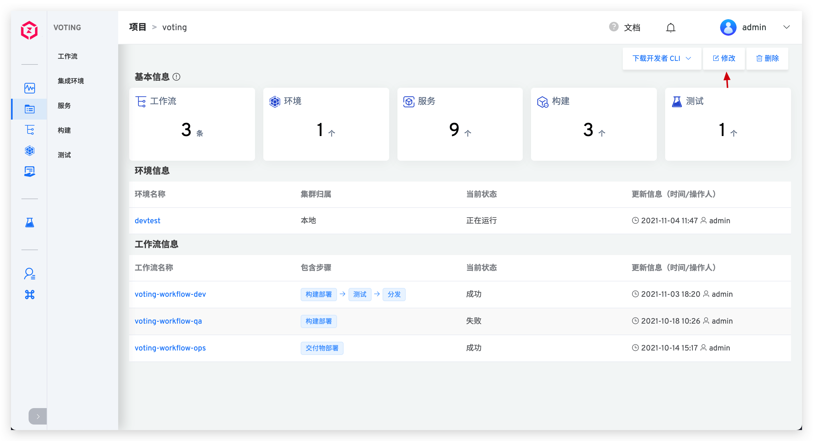
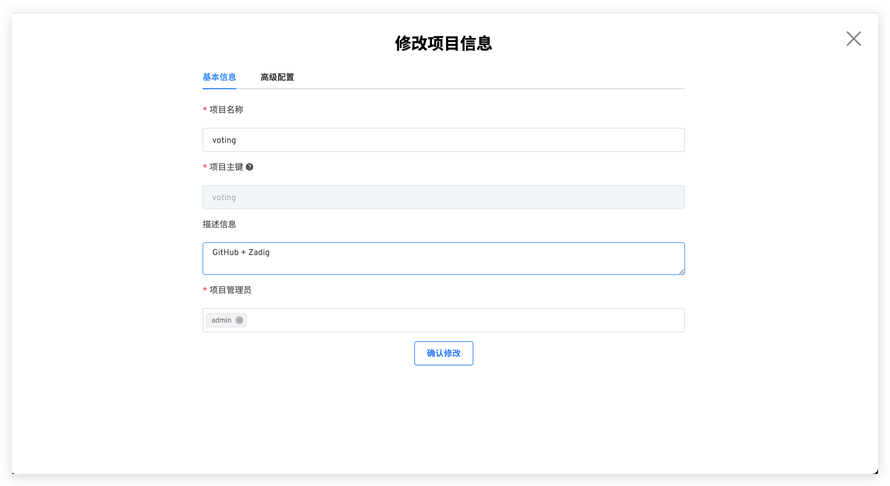
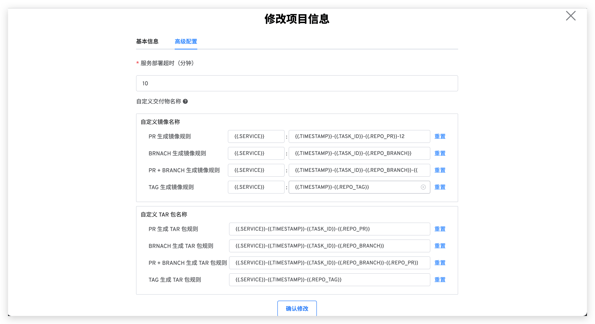

## 修改项目信息

进入项目详情页，点击`修改`按钮进入项目的配置页面，可对项目的基本信息和高级配置进行修改。

### 基本信息

- `项目名称`：该项目的名称，可修改，不允许存在同名的项目。
- `项目主键`：创建项目时可指定，默认值为项目名称，一旦项目创建后，项目主键不可再更改。
- `描述信息`：对该项目的简要描述，非必填。
- `项目管理员`：该项目的管理员，可配置多个用户。

### 高级配置

切换到`高级配置`，可对项目的高级配置进行修改。

- `服务部署超时`：部署服务的超时时间，默认值为 10 分钟。若超出该阈值服务仍未处于 `Running` 状态，则视为部署超时。
- `自定义交付物名称`：可自定义该项目中工作流构建产物的命名规则，系统内置规则请参考[构建交付物生成规则](/v1.6.0/project/build/#构建交付物生成规则)。

## 权限管理
Coming soon，敬请期待...
