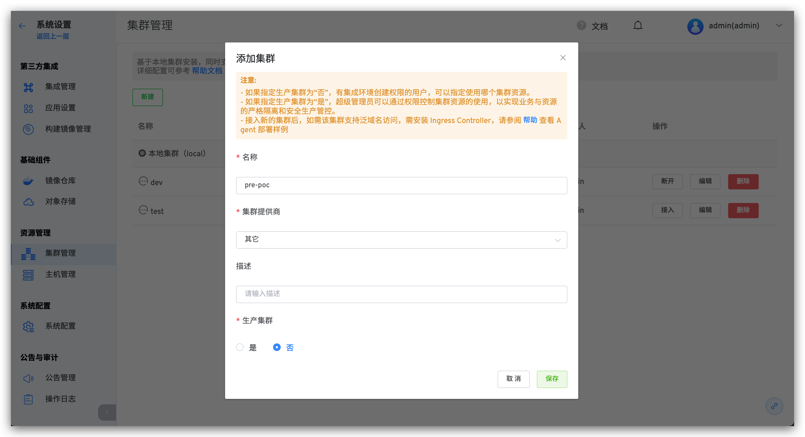
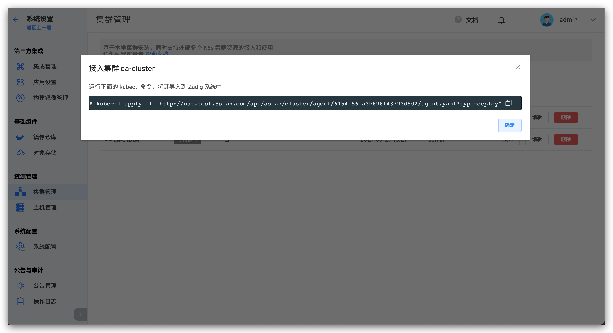

本文介绍如何在 Zadig系统上进行多集群管理。Zadig 基于本地集群安装，同时支持外部多个 K8s 集群资源的接入和使用。其中，测试集群一般用于自测、开发、测试用途，生产集群一般用于预发布和生产发布用途。

## 添加集群

:::warning
需要保证添加的集群可以访问到 Zadig 所在的集群
:::

第 1 步：点击 `系统设置` -> `集群管理` -> `新建`：

参数说明：

- `名称`：集群名称只支持小写字母、数字和中划线
- `描述`： 该集群的用途描述信息
- `生产集群`：
  - 如果指定生产集群为“否”，有集成环境创建权限的用户，可以指定使用哪个集群资源。
  - 如果指定生产集群为“是”，超级管理员可以通过权限控制集群资源的使用，以实现业务与资源的严格隔离和安全生产管控。

第 2 步：执行 Agent 安装脚本，如图所示：

第 3 步：执行脚本完成部署，刷新查看集群状态。

## 集群使用

外部集群接入 Zadig 系统后，使用 Zadig 系统可以在该集群上创建新环境，并可以使用工作流对新环境进行更新操作。

- `测试集群`：[创建集成环境](/v1.6.0/project/build/)

- `类生产（生产）集群`：[发布管理 -> 生产环境](/v1.6.0/project/build/) 「类生产（生产）集群，安全级别较高，可以单独控制权限」。
