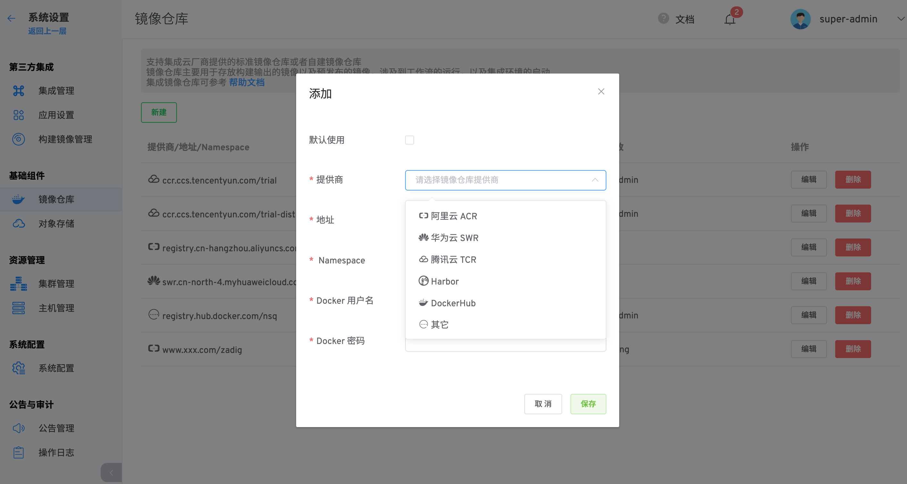

本文介绍如何在 Zadig 系统上集成镜像仓库。Zadig 支持集成云厂商提供的标准镜像仓库或者自建镜像仓库。镜像仓库主要用于存放构建输出的镜像以及预发布的镜像，涉及到工作流的运行，以及集成环境的启动。

## 添加镜像仓库

点击 `系统设置` -> `镜像仓库` -> `新建`

参数说明：

- `默认使用`：指定默认镜像仓库，工作流的构建、部署和集成环境中更新镜像都会默认使用该镜像仓库
- `提供商`：选择阿里云 ACR、华为云 SWR、腾讯云 TCR、Harbor、DockerHub、其他 Registry 标准对接
- `地址`：镜像仓库地址
- `Namespace`：空间名称
- `Docker 用户名`：镜像仓库 `Docker 用户名`
- `Docker 密码`：镜像仓库 `Docker 密码`

## 使用镜像仓库

- 工作流 - 构建

工作流执行构建步骤时，将构建产物推送到默认镜像仓库

- 工作流 - 部署

工作流执行部署步骤时，从默认镜像仓库中拉取镜像

- 工作流 - 分发

工作流执行分发步骤时，将产物推送到工作流分发配置中所选的镜像仓库

- 集成环境 - 镜像更新

集成环境中，更新服务镜像时，从默认镜像仓库中拉取镜像