本文主要介绍 K8s YAML 项目、Helm Chart 项目中的集成环境相关操作。
<!--
本文主要介绍 K8s YAML 项目、Helm Chart 项目、主机项目及托管 Kubernetes 项目中的集成环境相关操作。
-->

## K8s YAML 集成环境

### 创建环境
在项目中，点击`新建环境`按钮进入创建集成环境页面。

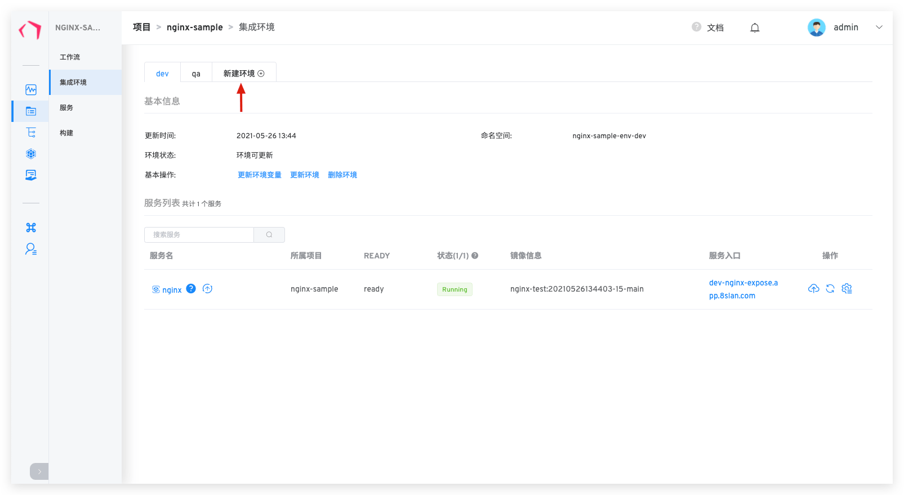
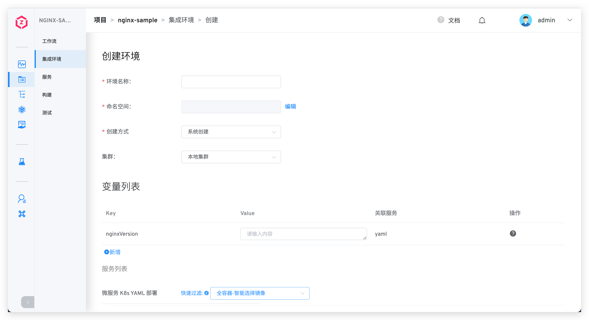

#### 命名空间
K8s YAML 项目中不同的集成环境会使用独立的 Kubernetes 命名空间实现环境和资源的隔离。
> Zadig 系统默认使用 `项目名-env-环境名` 作为创建集成环境时的命名空间规则，用户也可自定义命名空间。

#### 变量列表

在创建项目时可以给环境中相关服务的变量赋值以区分不同的环境。

#### 服务列表

该部分可以让用户自定义服务所使用的镜像，与此同时，平台提供 2 个快捷选项：

- `全容器-智能选择镜像`：给每个容器自动选择镜像仓库中最新的镜像版本。
- `全容器-全部默认镜像`：给每个容器选择服务 YAML 中配置的镜像版本。

#### 开始创建
输入环境名称等必要信息后，点击`确定`按钮即可开始创建环境。

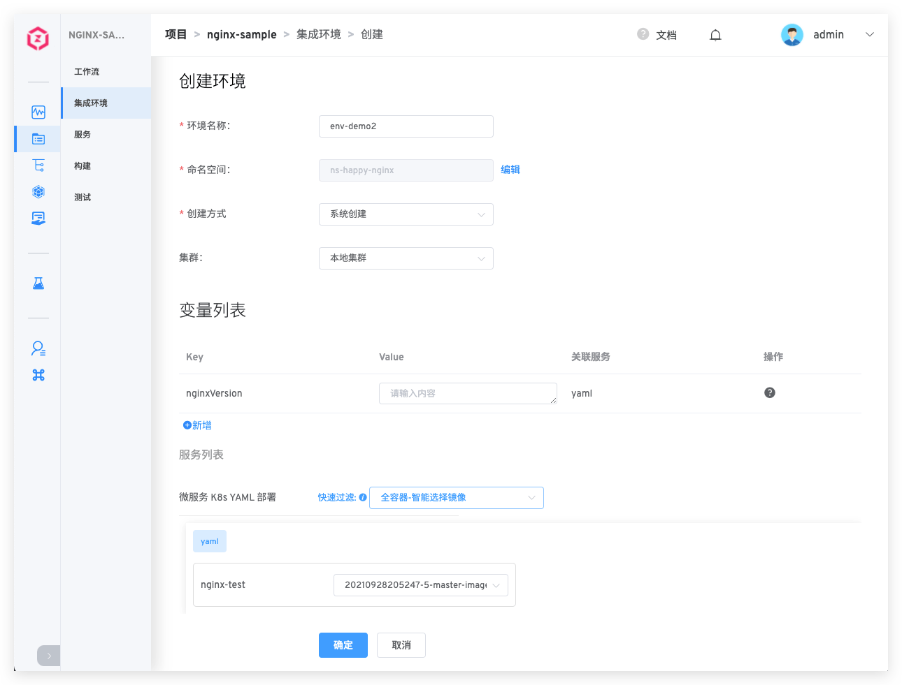

::: tip
服务数量以及启动服务所需的资源会影响环境的创建时间，请耐心等待。
:::

### 查看环境

环境创建完成后，点击不同的环境 Tab 即可切换到该环境的详情页面。

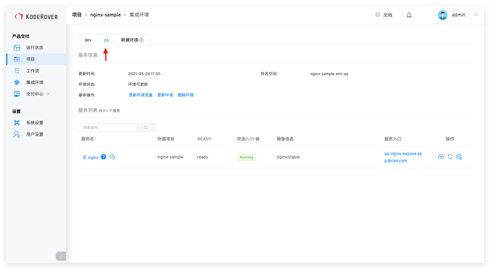

#### 基本信息
基本信息包括更新时间，部署环境名，环境状态。

环境状态有以下几种情况：
- `创建中`：正在创建。
- `更新中`：正在更新。
- `删除中`：正在删除。
- `正在运行`：环境中所有服务都是正常的 Running 状态。
- `运行不稳定`：环境中一部分服务处于 Unstable 状态，可能的情况有两种：
	- 容器服务出现了问题。
	- 容器服务正在进行更新操作，例如更新镜像，会出现短时间的服务 Unstable，当更新过程完成之后，服务状态会恢复为 Running。
- `环境可更新`：当已创建的环境对应的环境模板有更新之后，环境处于可更新状态，有读写权限的用户可以看到`更新环境`按钮，点击按钮可对环境进行模板和配置的更新。

#### 基本操作

环境操作包括：

- `更新环境变量`：对环境中的引用变量进行更新。
- `更新环境`：当新增服务配置、删除服务配置、服务的 YAML 配置内容有变更时，集成环境中会自动出现更新环境按钮。
- `删除环境`：删除当前创建的环境，环境删除后不可恢复。
- `环境回收`：按设定的时间，定时删除环境，删除后不可恢复。

### 更新环境

当环境可更新时，点击基本操作中的`更新环境`即可对环境进行更新。

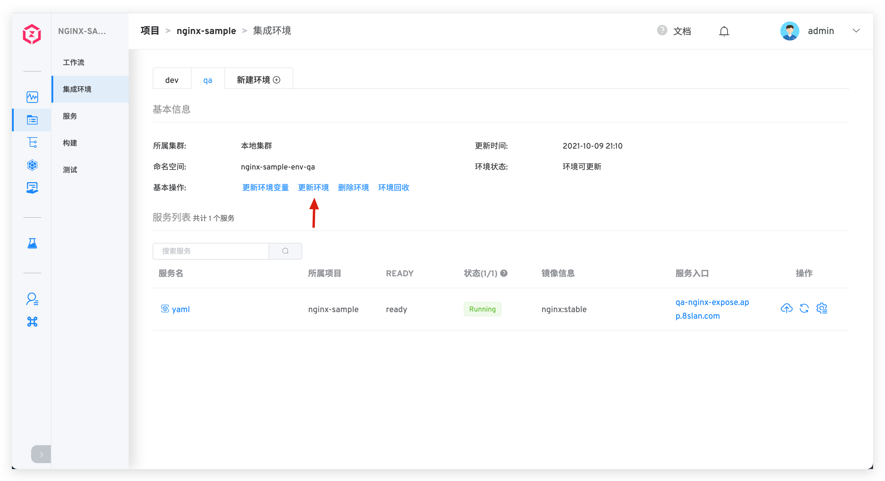

::: tip
当系统检测到当前项目下的服务和集成环境中不一致时，该集成环境即会处于可更新状态。导致不一致的原因包括但不限于：
1. 服务配置发生变化。
2. 服务编排发生变化，比如服务从项目中删除，或者给项目新加了服务。
:::

### 删除环境

点击基本操作中的`删除环境`按钮并输入环境名即可删除环境。

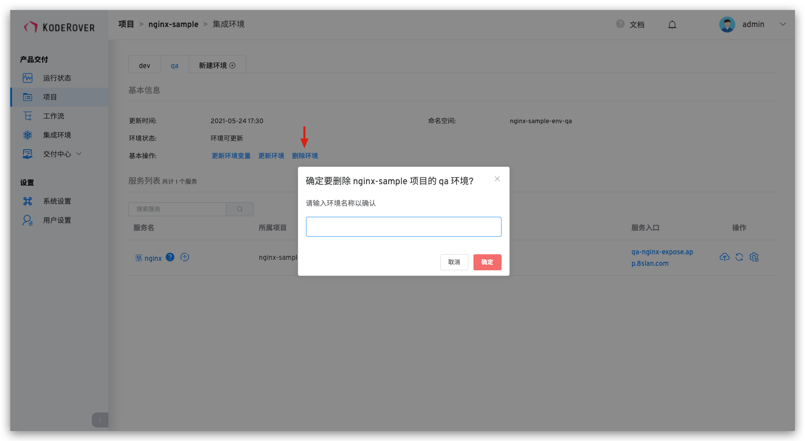

## Helm Chart 集成环境
### 创建环境

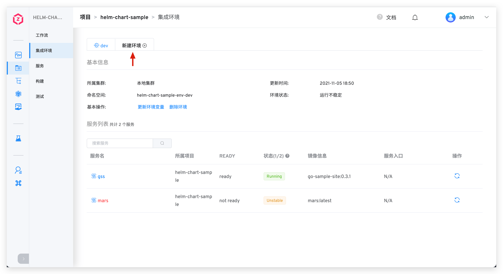

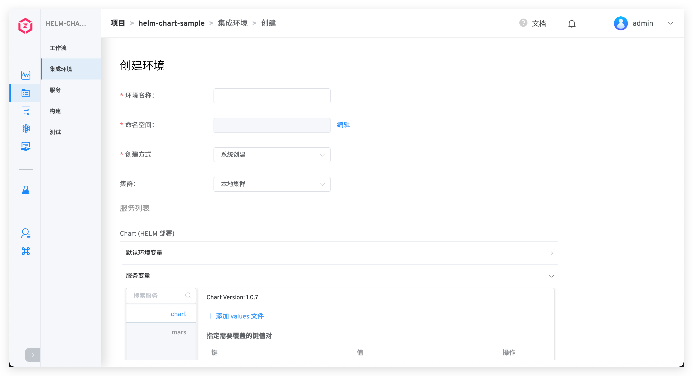

#### 命名空间
Helm Chart 项目中不同的集成环境会使用独立的 Kubernetes 命名空间实现环境和资源的隔离。
> Zadig 系统默认使用 `项目名-env-环境名` 作为创建集成环境时的命名空间规则，用户也可自定义命名空间。

#### 服务列表
> 指定义、安装和升级复杂 K8s 应用的 Helm Chart 列表。在服务列表中可进行环境级别和服务级别的配置变更设置。

1. 默认环境变量：点击展开`默认环境变量`，可修改 values.yaml 文件内容设置环境级别的变量值。Zadig 系统支持 2 种方式设置默认环境变量：
	- 手动输入 YAML 格式文件的内容，内容详情即为要设置的默认变量信息。
	- 从指定 Git 代码仓库导入 values.yaml。

2. 服务变量：用户可选择修改指定 Helm Chart 的 values.yaml 文件内容。Zadig 系统支持 3 种方式修改服务变量方式：
	- 从指定 Git 代码仓库导入 values.yaml 文件。
	- 手动输入 values.yaml 文件内容。
	- 手动输入 key/value 键值对，覆盖在创建 Helm Chart 服务时导入的 values.yaml 文件内容。

::: tip 扩展知识
1. 服务变量的设置只对单一 Helm Chart 生效。
2. 默认环境变量的设置对当前环境的所有 Helm Chart 都生效。
2. 当对同一个 Helm Chart 既设置了默认环境变量，又设置服务变量时，服务变量的优先级高于默认环境变量。
:::

#### 开始创建
输入环境名称等必要信息后，点击`确定`按钮即可开始创建环境。

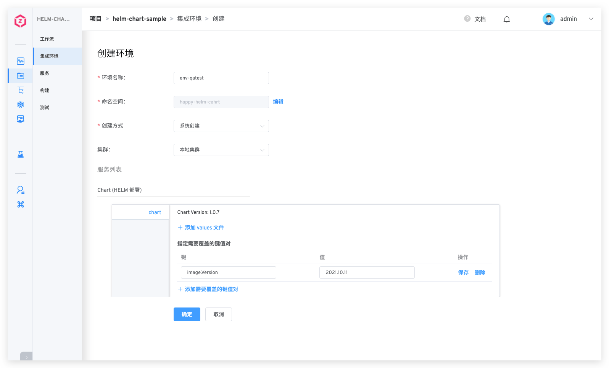

::: tip
服务数量以及启动服务所需的资源会影响环境的创建时间，请耐心等待。
:::

### 查看环境
环境创建完成后，点击不同的环境 Tab 即可切换到该环境的详情页面。

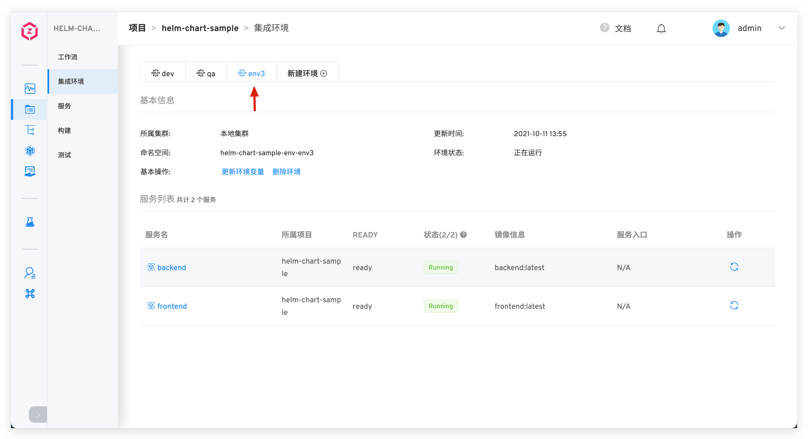

#### 基本信息
基本信息包括更新时间，部署环境名，命名空间、环境状态。

环境状态有以下几种情况：
- `创建中`：正在创建。
- `更新中`：正在更新。
- `删除中`：正在删除。
- `正在运行`：环境中所有服务都是正常的 Running 状态。
- `运行不稳定`：环境中一部分服务处于 Unstable 状态，可能的情况有两种：
	- 容器服务出现了问题。
	- 容器服务正在进行更新操作，例如更新镜像，会出现短时间的服务 Unstable，当更新过程完成之后，服务状态会恢复为 Running。
- `环境可更新`：当已创建的环境对应的环境模板有更新之后，环境处于可更新状态，有读写权限的用户可以看到`更新环境`按钮，点击按钮可对环境进行模板和配置的更新。

#### 基本操作

环境操作包括：

- `更新环境变量`：对环境中的引用变量进行更新。
- `更新环境`：当前项目-服务中的 Helm Chart 有增/删/内容变更时，集成环境中会自动出现更新环境按钮
- `删除环境`：删除当前创建的环境，环境删除后不可恢复。
- `环境回收`：按设定的时间，定时删除环境，删除后不可恢复。

### 更新环境
当环境可更新时，点击基本操作中的`更新环境`即可对环境进行更新。

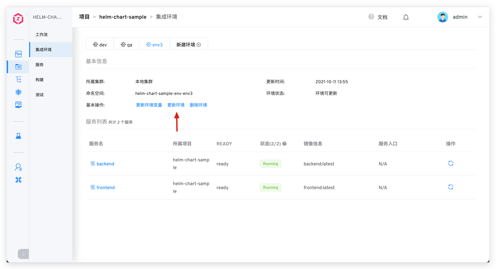

### 删除环境
点击基本操作中的`删除环境`按钮并输入环境名即可删除环境。

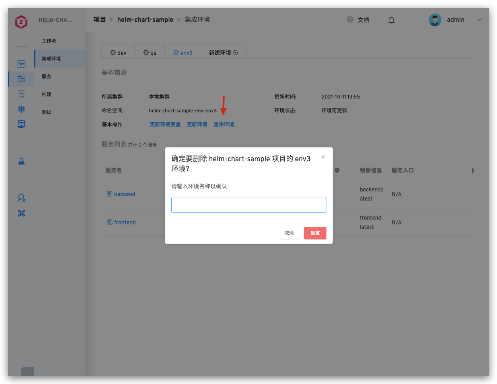

<!--
TODO
## 托管 Kubernetes 集成环境
-->
