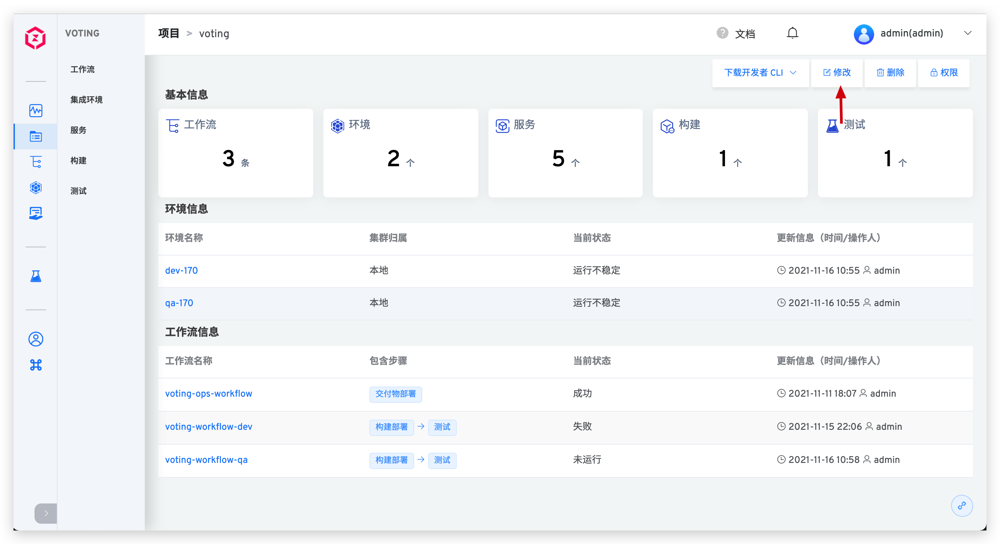
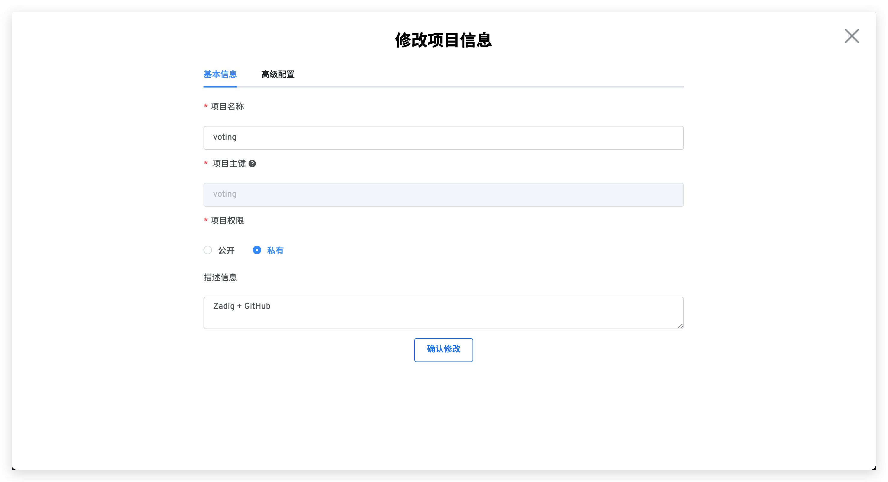
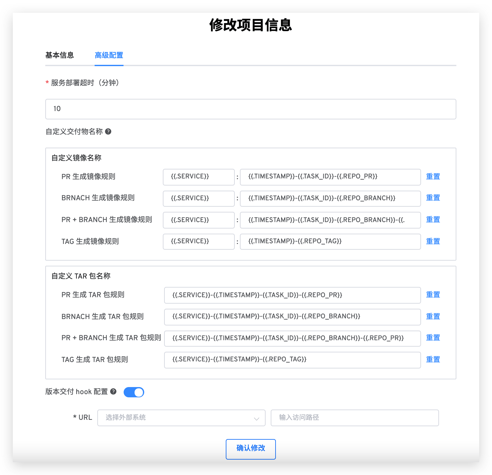
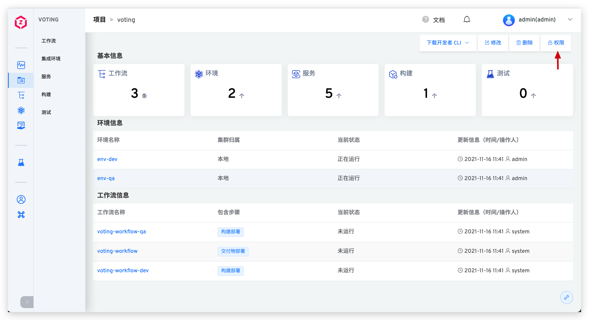
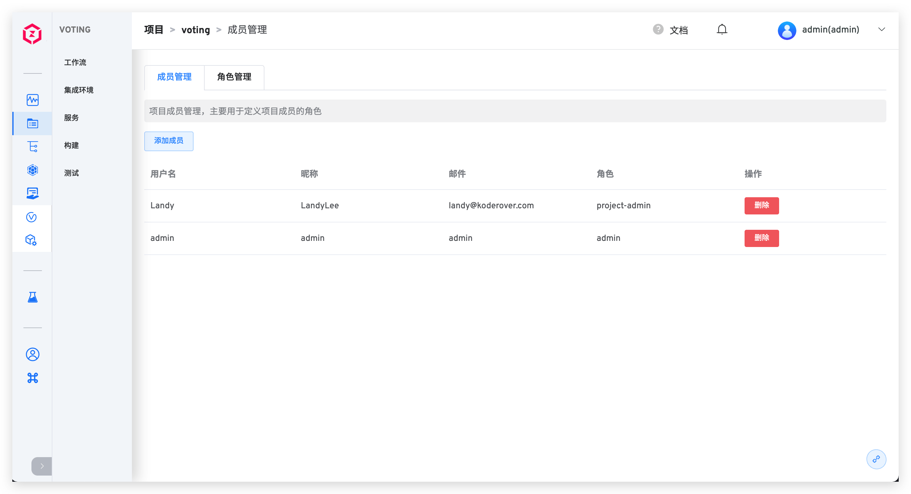
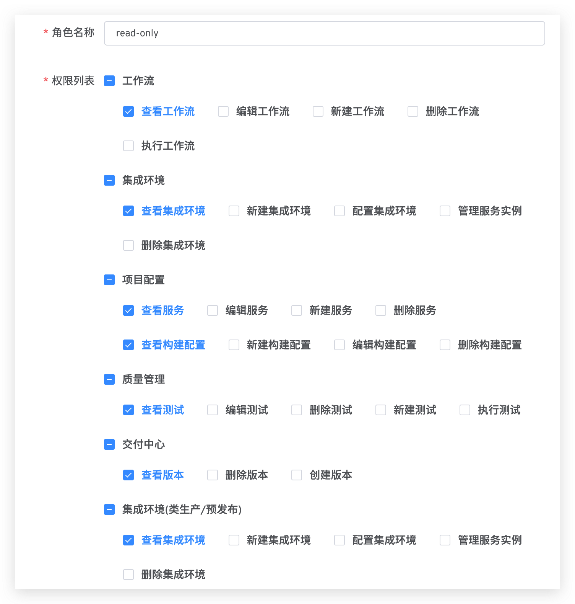

::: tip 前提
仅系统管理员及项目管理员，可以对项目角色、及权限进行配置和管理。
:::

## 修改项目信息

进入项目详情页，点击`修改`按钮进入项目的配置页面，可对项目的基本信息和高级配置进行修改。

### 基本信息

- `项目名称`：该项目的名称。项目创建后可修改。
- `项目主键`：创建项目时可指定，默认值为项目名称。项目创建后，其主键不可再更改。
- `项目权限`：可选`公开`或`私有`，定义该项目的默认权限。
- `描述信息`：对该项目的简要描述，非必填。

::: tip 关于权限的扩展阅读
1. 私有项目：用户默认无权限，项目中的工作流、集成环境、服务、构建、测试等资源均无法操作。
2. 公开项目：用户默认享有 `read-only` 角色中的权限，可查看项目中的工作流、集成环境、服务、构建、测试等资源。

`read-only` 角色及权限管理细节请阅[项目权限管理](/v1.8.0/project/config/#权限管理)。
:::

### 高级配置

切换到`高级配置`，可对项目的高级配置进行修改。

- `服务部署超时`：部署服务的超时时间，默认值为 10 分钟。若超出该阈值服务仍未处于 `Running` 状态，则视为部署超时。
- `自定义交付物名称`：可自定义该项目中工作流构建产物的命名规则，系统内置规则请参考[构建交付物生成规则](/v1.8.0/project/build/#构建交付物生成规则)。
- `版本交付 hook 配置`：主要用于 Helm Chart 部署项目完成创建版本后给外部系统发送 Hook 请求，具体配置介绍参考[Helm Chart 部署项目版本交付](/v1.8.0/delivery/version-management/#版本交付-2)

## 权限管理

进入项目详情页，点击`权限`按钮进入项目的权限和成员配置页面。

### 成员管理

在`成员管理`中，查看该项目的用户成员列表及对应角色，可按需对用户权限进行配置。

### 角色管理

在`角色管理`中，可对该项目中配置的角色进行查看、增加、删除、修改操作。除自定义角色外，系统还内置了以下 2 个角色：

- `project-admin`：项目管理员，可操作所辖项目中的所有资源，可对项目的基本信息及配置进行修改。
- `read-only`：只读角色，对应的权限项组合如下图：

### 权限清单
部分权限项包含多个功能，以下简单陈述其对应关系。

#### 工作流
- 查看工作流：查看工作流基本信息、工作流任务列表、工作流中的构建日志及测试日志
- 编辑工作流：修改工作流基本信息、工作流包含步骤、快速打开/关闭工作流中的定时器
- 新建工作流：包括新建工作流和复制工作流
- 执行工作流：运行工作流、克隆工作流任务、重试失败的工作流、取消运行中的工作流

#### 集成环境
- 查看集成环境：查看集成环境基本信息、集成环境列表以及环境中的服务信息
- 配置集成环境：设置集成环境定时回收、更新环境和环境变量
- 管理服务实例：重启服务实例、更新服务实例的镜像、调整服务实例副本数量、进入服务实例容器中调试

::: tip 扩展知识
在托管 Kubernetes 项目中，`配置集成环境`还包括配置托管功能。
:::
