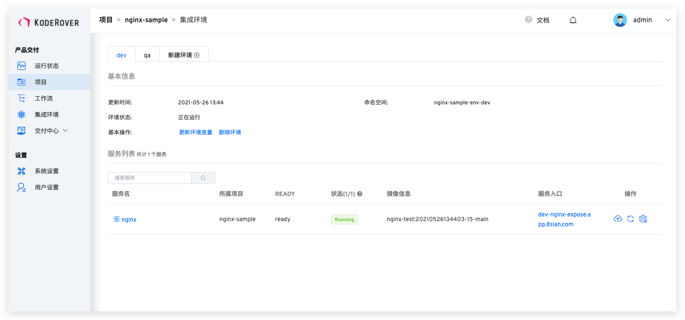
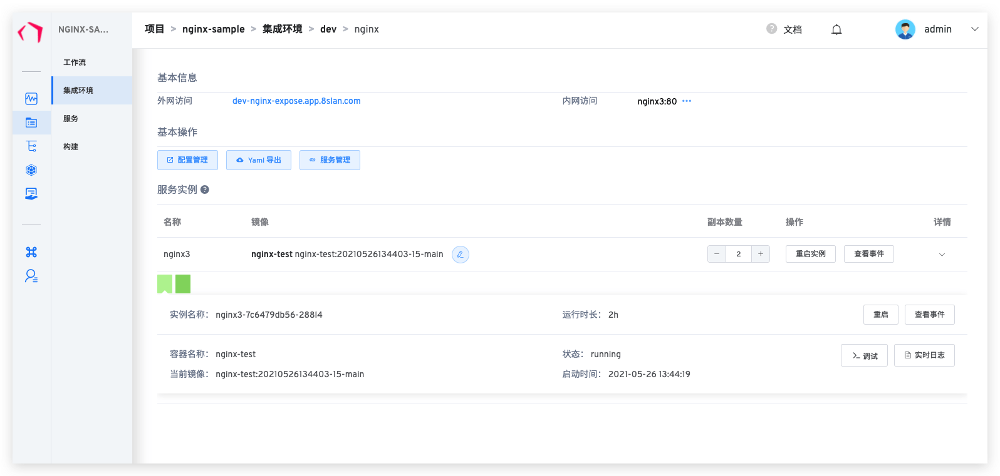
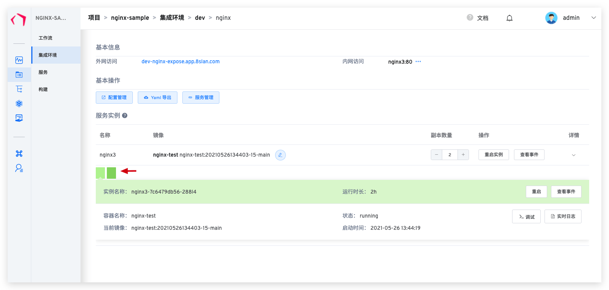

本文主要介绍 Zadig 集成环境中对服务查看与操作。
## 服务列表
服务列表展示了环境下所有的服务，如图所示：

参数说明：

- `所属项目`：服务隶属于那个项目，如果是共享服务，显示服务原始项目
- `状态`：服务的运行状态
- `镜像信息`： 当前服务运行的镜像，可点击服务名在服务详情页进行修改
- `服务入口`：如果该服务存在 Ingress 信息，则会展示
- `操作`：通过工作流更新该服务、重启服务、查看服务的配置

## 服务详情
服务详情页面展示了服务的详细信息，用户可以对服务进行服务重启、服务伸缩、配置管理、更新镜像等操作，通过服务列表点击服务名即可进入服务详情页面。

### 基本操作
- `配置管理`: 查看和编辑该服务的相关配置
- `YAML 导出`: 将服务信息导出为 K8s YAML 形式
- `服务管理`: 链接到该服务的模板详情

### 服务实例操作
- `镜像更新`：点击编辑按钮，可更新该服务使用的镜像，选择新的镜像后容器会自动拉取并更新镜像，同时进行重启
- `重启实例`：点击按钮重启该服务
- `查看事件`：查看 Pod Event
- `副本数量`：动态调整服务的副本数量
- `调试`：使用容器 Exec 进行调试

### 服务基本信息
服务基本信息展示了服务的外网访问信息，以及内网 Service 访问信息。

- `外网访问`：服务的 Ingress 配置信息
- `内网访问`：服务的 Service 配置信息

### 实例

服务实例列表显示了容器服务所有的实例，用户切换实例，可以查看每个服务实例（Pod）下的容器（Container）详细信息

用户可对单个服务实例进行操作：

- `重启实例`：点击重启单个实例
- `实时日志`：点击当前服务实例的实时日志
- `查看事件`：点击当前服务实例 Pod Event 事件
