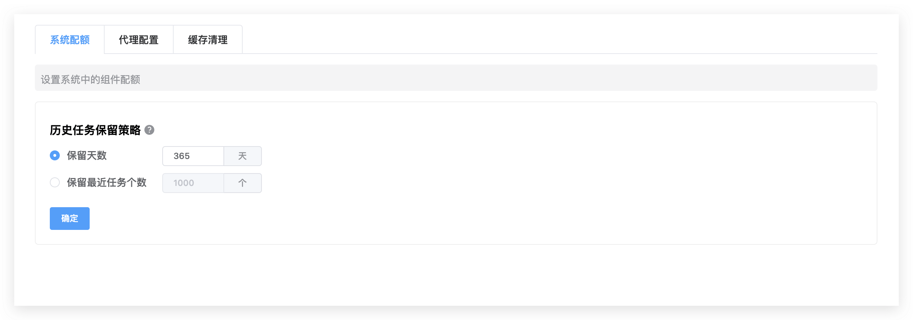
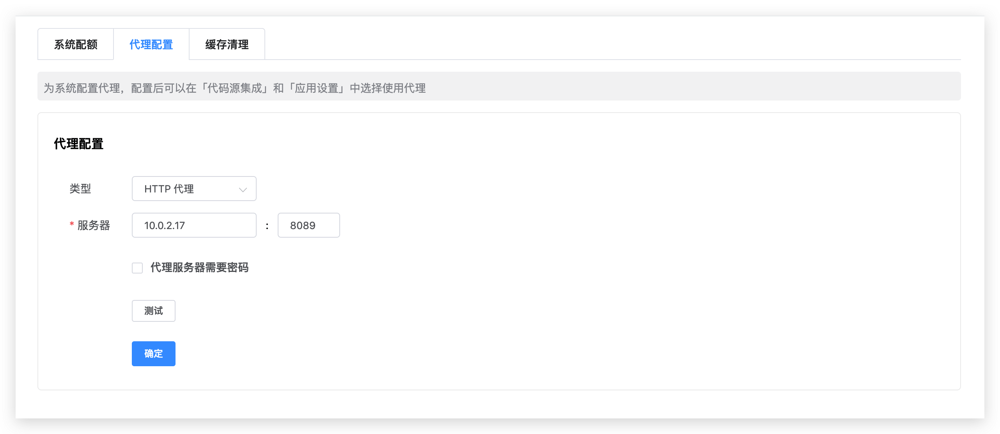
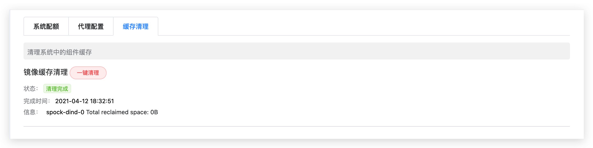
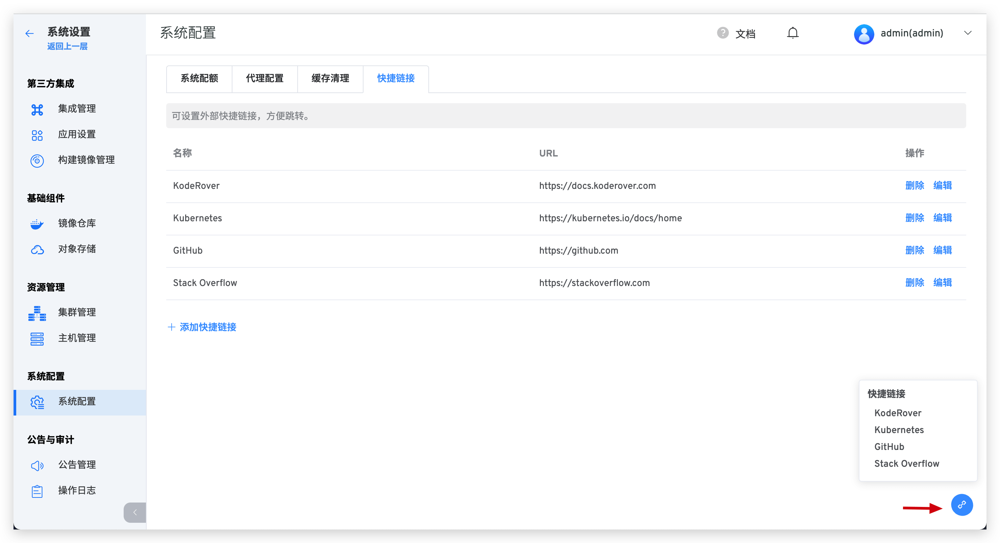

本文介绍 Zadig 系统配置的一些基本功能。包括：系统配额、代理配置、缓存清理、快捷链接。

## 系统配额

::: danger
谨慎操作，清除的数据不可恢复
:::
Zadig 支持用户设置工作流数据（包括工作流任务及其产生的构建日志、二进制文件、测试日志、测试报告）保存时长，默认保留 365 天，超过时限的数据将被永久清除。

## 代理配置

- Zadig 系统支持代理的使用，配置如下图所示。

::: warning
只配置代理，不在具体模块开启代理，代理不会生效
:::

- 目前，在执行构建任务时可以使用代理。具体设置如下：
1. 拉取代码时走代理，需要在`系统设置` -> `集成管理` -> `代码源集成` 中开启
2. 拉取安装应用走代理，需要在`系统设置` -> `应用设置` 中开启

## 缓存清理
清理系统中的组件缓存，包括停止的容器、所有未被容器使用的网络、无用的镜像和`构建缓存镜像`：

## 快捷链接
在系统配置中添加常用外部链接，方便用户快捷访问。

