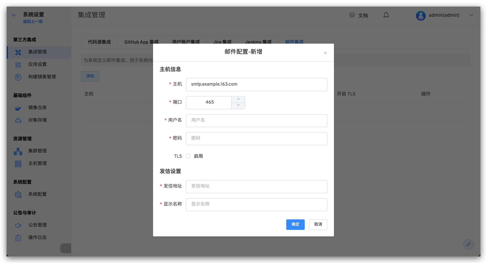

本文介绍在 Zadig 系统上集成邮件服务器，定义系统内部的发信设置。

## 邮件配置设置

系统管理员访问 `系统设置` -> `集成管理` -> `邮件集成`，点击`添加`定义邮件配置。

主机信息参数说明：
- `主机`：发送邮件服务器地址，比如：`smtp.example.163.com`
- `端口`：发送邮件服务器端口号，默认为 `465`
- `用户名`：邮箱客户端用户名，可咨询邮箱服务商
- `密码`：邮箱客户端密码，可咨询邮箱服务商
- `TLS`：是否开启 TLS 安全协议

发信设置参数说明：
- `发信地址`：发送邮件的邮箱地址，比如：`no-reply@koderover.com`
- `显示名称`：发送地址中的邮箱在邮件中显示的名称，比如：`no-reply`
