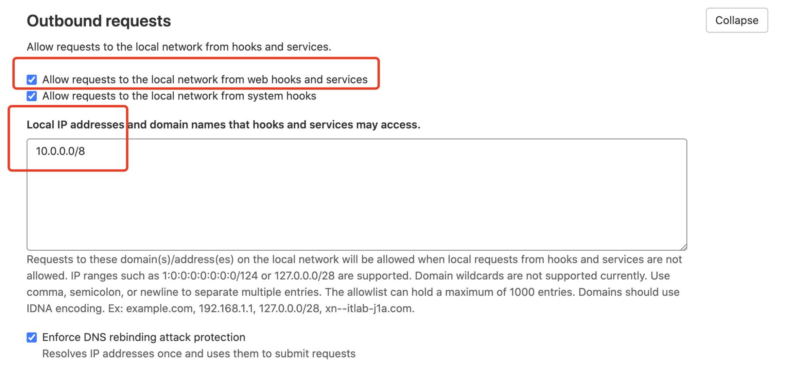
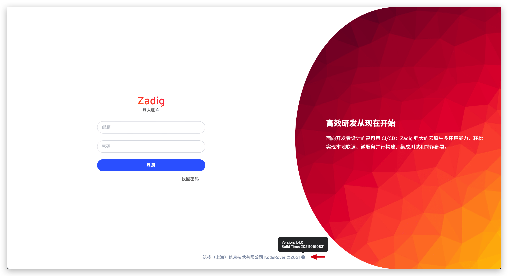
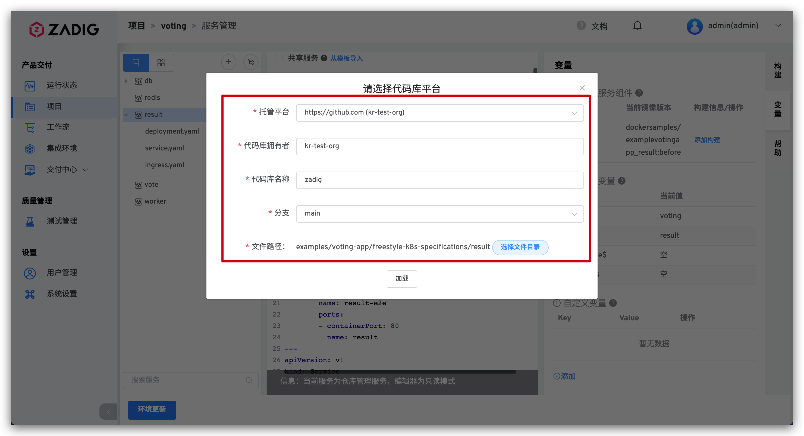
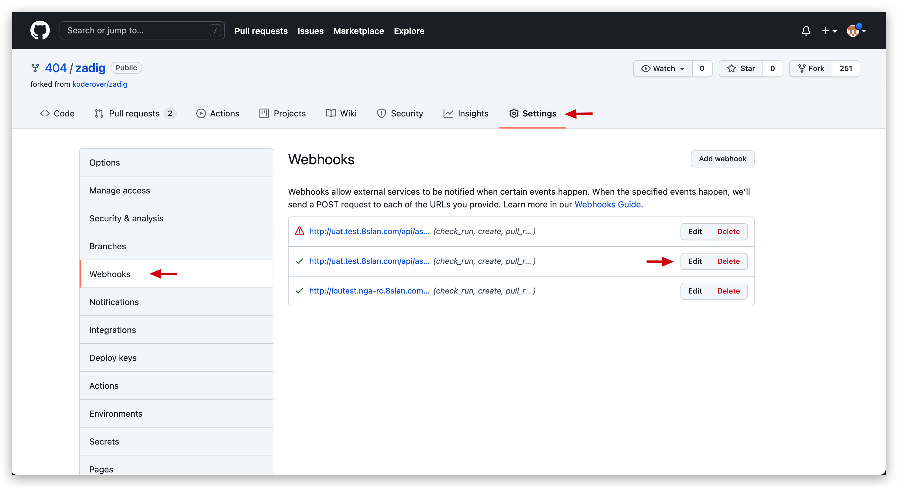
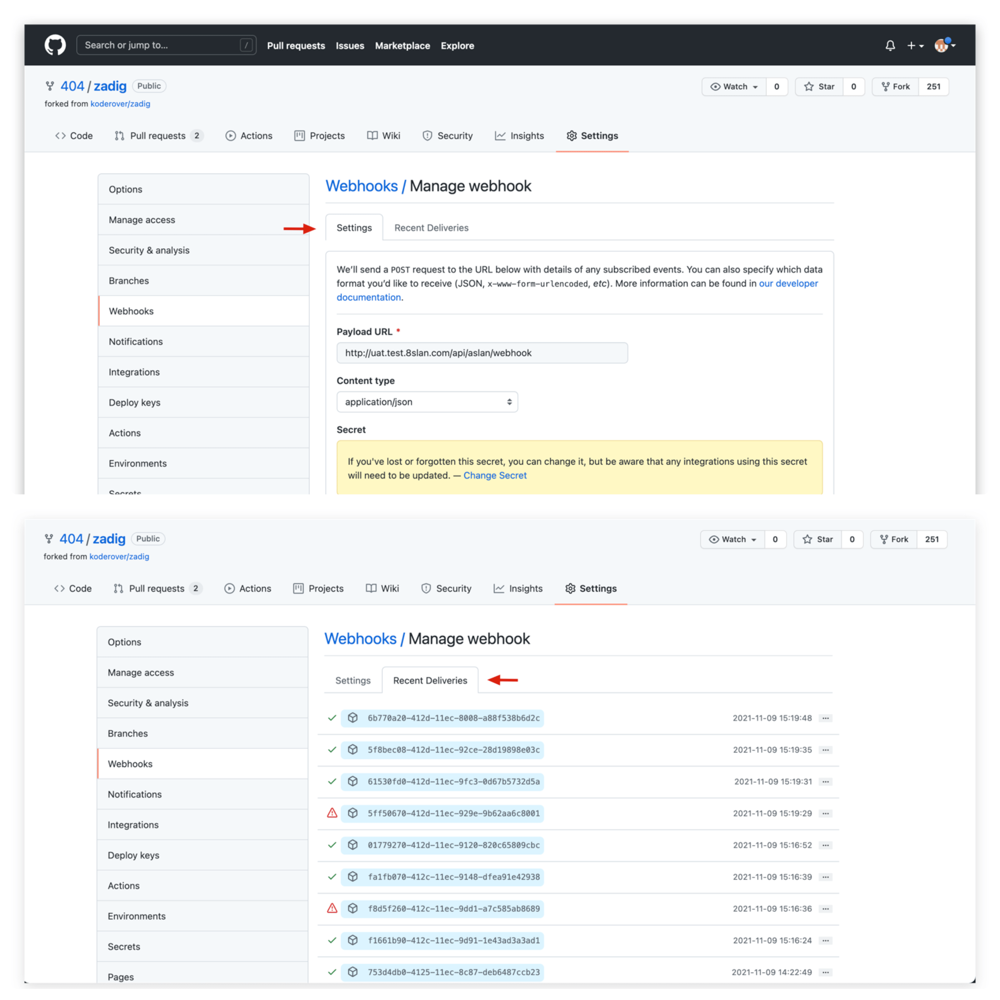
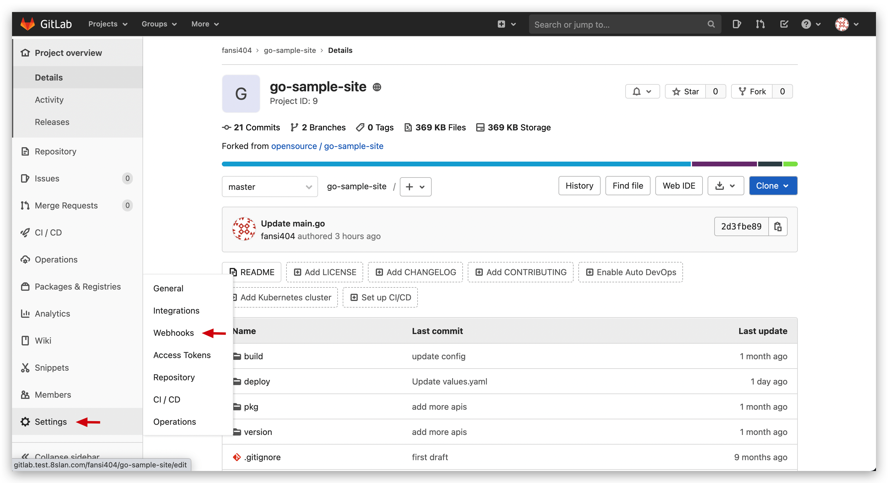
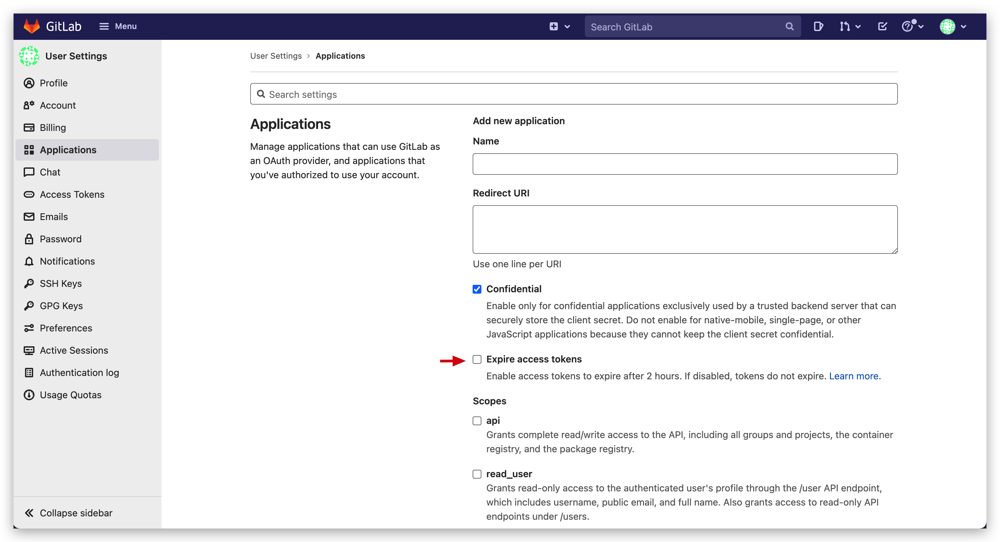
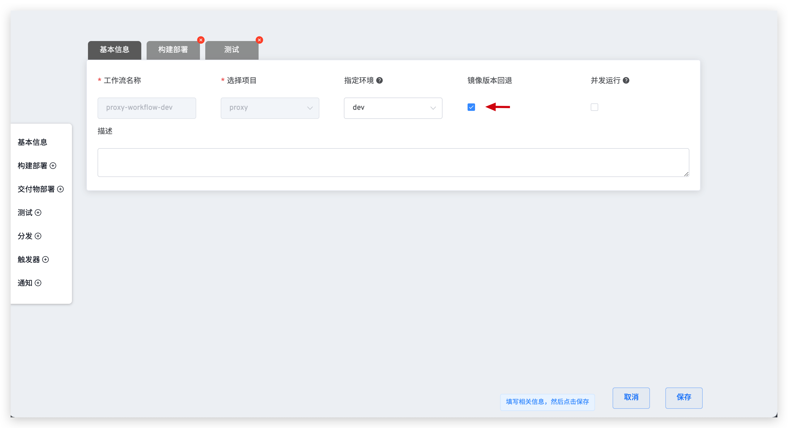

## 系统账号无法登录

如果集成了 AD/LDAP/SSO，请确认集群内的网络是否可以正常连接 AD/LDAP/SSO 系统。

## Go mod 构建时使用了代理，拉取 pkg 时直接报 Too many connection，如何解决？
代理服务器连接数太多导致的，可以请求运维人员协助排查，或者优化代理服务器配置，采用透明代理的方式减少连接数。

## 前端本地构建正常，线上构建 package.json 报错，无法拉取相关依赖，该如何解决？
按照如下流程去逐步排查：
1. 检查 package.json 是否存在私有依赖，存在则确定是否有相关读取权限
2. 确认构建脚本是否和本地相同
3. 检查构建中应用的版本是否与本地构建的相符，排除应用版本问题

## 工作流某次任务的构建时间过长或者卡住了，该如何解决？
场景和对应解决思路：
1. 代码库有使用 submodule 代码拉不下来，git submodule update 一直卡住不动：推荐系统配置里面使用 Proxy，参考：[Proxy 设置](/settings/system-settings/#代理配置)
2. 经常出现拉不下来 GitHub 代码：推荐系统配置里面使用 Proxy
3. 代码构建中存在外部依赖，拉不下来：推荐构建脚本使用 Proxy 或者通过配置国内的源来代替
4. 触发工作流任务后就卡住了，工作流实时构建日志没有输出：按照以下步骤排查

```bash
# 1. 查询状态异常的 Pod
kubectl get pod -n <namespace>

# 2. 查看异常状态 Pod 的详细信息
kubectl describe pod <podName> -n <namespace>
```

## 构建里面某个包一直无法上传到对象存储问题诊断
按照如下流程去逐步排查：
1. 检查本次构建是否构建选错了分支以及 pull request
2. 检查本次构建脚本中上传相关的业务工具的参数是否配置正常
3. 确认第三方存储服务一直处于正常可用状态
4. 请求运维人员协助确认当前集群所在的节点是否存在网络解析故障

## 镜像推送失败问题诊断
可以按照以下流程逐一排查：
1. 确认所使用的镜像仓库网络连通且功能可用
2. 确认所使用的镜像仓库是否设置了默认最大镜像数，可能镜像数达到了上限

## 工作流-构建报错诊断
### `no cotainer statuses : s-task=pipelineName-548,s-service=serviceName,s-type=buildv2,p-type=workflow`
可以查看一下具体的 Job 的状态以及 Job 的日志，具体操作如下：

```bash
kubectl get pod -n <namespace> |grep <pipelineName>
#找到对应的 Pod 后可以查看下具体的 Pod 的日志
kubectl logs -f <pod/podName> -n <namespace>
```
### `no space left on device`
这个是 Zadig 系统的 spock-dind 服务挂载的 pvc 的空间不足导致的，可以使用我们系统设置-系统配置-缓存清理功能一键清理这些数据，详见[缓存清理](/v1.8.0/settings/system-settings/)

### `Failed parsing or buffering the chunk-encoded client body`


执行构建任务出现以上错误时，需要确认 docker build 之前是否使用了科学上网代理，如果设置了代理，docker build 会走代理导致失败。处理方法：在 docker build 之前加上以下命令

```bash
unset http_proxy https_proxy
```
### `500:Internal Error:-148643:action not allow status code:403 ...`
执行构建任务出现以上错误，需要确认集成的默认对象存储是否放开`上传`、`下载`、`删除文件`、`列出文件列表`权限。

### `Error response from daemon: Get https://*****: x509: certificate signed by unknown authority`

执行构建任务出现以上错误，这是因为登录私有镜像仓库时，使用的证书是自签证书。该证书不是由受信任的证书颁发机构 CA 颁发，Docker 守护进程不信任该证书即会报出 x509 错误的自签名证书问题。

### `COPY failed: stat /var/lib/docker/tmp/docker-builder124714399/workspace/demo/exec.sh: no such file or directory`

执行 Dockerfile 中某句 COPY 命令时出现以上错误，请检查执行 Docker 构建的上下文和被 COPY 文件路径的关系，在构建上下文目录中可以用相对路径找到被 COPY 文件时，构建才会成功。举例说明如下：

**Dockerfile 的内容：**
``` Dockerfile
From ubuntu:18.04
WORKDIR /root/zadig
COPY ./demo/exec.sh /root/zadig/exec.sh
COPY /absolute/path/to/zadig/demo/exec.sh /root/zadig/exec.sh
```

**Docker 构建的命令：**
``` bash
cd /absolute/path/to/zadig
docker build -t demo:latest -f Dockerfile . # 构建上下文为当前目录（即 /absolute/path/to/zadig）
```

**结论：**

1. `COPY ./demo/exec.sh /root/zadig/exec.sh` 可成功。
2. `COPY /absolute/path/to/zadig/demo/exec.sh /root/zadig/exec.sh` 会失败。

> 更多知识点可参考 [Docker build | Extended description](https://docs.docker.com/engine/reference/commandline/build/)

## Webhook 触发器配置失败

### `POST http://gitlab....com/api/v4/projects/owner+repo/hooks: 422 {error: Invalid url given}`

在 Zadig v1.3+ 的版本中，使用 GitLab 14.0+ 在工作流中配置 Webhook 触发器的时候如果提示以下信息：
```
400 : 新建或更新wokflow失败 1 error occurred: * POST http://gitlab....com/api/v4/projects/owner+repo/hooks: 422 {error: Invalid url given}
```
这是 GitLab 的配置问题，使用如下配置即可解决问题。详见：[allow_local_requests_from_hooks_and_services](https://gitlab.com/gitlab-org/gitlab/-/issues/25867)


### `Hook executed successfully but returned HTTP 404 Invalid path: /api/gitlabhook`

在 GitLab 中手动添加 Webhook 时报错如下：

```
Hook executed successfully but returned HTTP 404 Invalid path: /api/gitlabhook
```

在 Zadig 1.3.0 及以上版本中该接口已下线，在[工作流里配置触发器](/v1.8.0/project/workflow/#git-webhook)后无需再在 GitLab 系统中手动添加 Webhook 设置。
在 Zadig 系统登录页面下方，可查询版本信息，见下图：



## 从代码库导入服务配置创建 K8s YAML 服务。代码库中服务配置变更后，Zadig 平台中项目下服务的配置未同步，如何排查？
- 查看服务的配置，确保代码库中配置改动所属的托管平台、代码库拥有者、代码库名称、代码分支以及文件路径和 Zadig 平台中的一致。



- 确保代码库中服务配置改动后的内容是合法的 YAML 内容。

- 使用以下命令查看 aslan 服务日志，定位 `SyncServiceTemplate` 关键字，并分析其上下文的信息。

```bash
kubectl -n <Zadig 所在的 Namespace> | grep aslan # 获得 aslan 的 Pod 名称
kubectl -n <Zadig 所在的 Namespace> logs <aslan 的 Pod 名称> -c aslan
```

## 工作流的 Webhook 触发器配置后不生效，有什么排查思路？

> 在工作流中配置 Webhook 触发器时没有明显报错，但有代码变更时触发器功能不生效。以下提供几种常见排查思路。

### 在 Zadig 平台检查 Webhook 配置

编辑具体的工作流，切换到顶栏的`触发器`查看 Webhook 配置细节，确保代码的变更及 Webhook 事件符合触发条件。配置中各参数说明可参考 [Webhook 配置](/v1.8.0/project/workflow/#git-webhook)。


### 在 GitHub 代码仓库检查 Webhook 配置

- 访问具体的 GitHub 代码仓库 - `Settings` - `Webhooks` 可查看当前项目的 Webhook 配置列表。



- 在 `Settings` 中查看 Webhook 的具体配置，在 `Recent Deliveries` 中可查看最近的 Webhook Event 及状态。



### 在 GitLab 代码仓库检查 Webhook 配置

- 访问具体的 GitLab 代码仓库 - `Settings` - `Webhooks` 可查看当前项目的 Webhook 配置列表。



- `Test` 操作可对 Webhook 设置进行测试，点击 `Edit` 可查看最近的 Webhook Event 及状态。


### 查看 aslan 服务的日志

- 提交新的代码变更请求，并同时使用以下命令查看 aslan 服务的实时日志，定位 `webhook` 关键字，并分析其上下文的信息。

```bash
kubectl -n <Zadig 所在的 Namespace> | grep aslan # 获得 aslan 的 Pod 名称
kubectl -n <Zadig 所在的 Namespace> logs -f <aslan 的 Pod 名称> -c aslan
```

## 集成 GitLab 代码库后使用时报 401 Unauthorized，需要在系统设置里再次授权 GitLab 代码源，才能正常使用

GitLab 14.3 及以上版本新引入 `Expire access tokens` 功能，Application 的 access token 默认有效时间为 2 小时。访问 GitLab 系统的 User Settings - Applications，取消 `Expire access tokens` 即可。



## 工作流任务执行完毕部署服务后，服务的镜像版本未被更新，如何解决？
编辑工作流查看其配置，是否开启了`镜像版本回退`开关。
> 更多信息可阅读 [工作流的镜像版本回退](/v1.8.0/workflow/image/rollback/)



## Helm 项目工作流部署遇到 `cannot re-use a name that is still in use` 或者 `another operation (install/upgrade/rollback) is in progress` 报错，如何解决
Helm release 可能因为一些异常情形处于不正确的状态，通过 `helm list -n <NameSpace> -a -f <ReleaseName>` 以及 `helm hisroty <ReleaseName> -n <NameSpace>` 命令来确认 release 状态以及版本记录，按照以下情况解决：
* 如果 release 存在状态为 deployed 的版本，手动将 release rollback 到最近的 deployed 版本。详见：[Helm Rollback](https://helm.sh/docs/helm/helm_rollback/)。
* 如果 release 当前状态处于 superseded 状态，并且 release 不存在状态为 deployed 的版本，手动执行 helm upgrade 命令，将 release 升级到新版本。详见：[Helm Upgrade](https://helm.sh/docs/helm/helm_upgrade/#helm-upgrade)。
* 如果 release 长时间处于 `pending-install/pending-upgrade/pending-rollback` 状态，并且 release 不存在状态为 deployed 的版本，手动将 release 当前版本对应的 secret 从所在集群 Namespace 中删除，secret 名称：`sh.helm.release.v1.<ReleaseName>.v<ReleaseRevison>` 。
