自定义工作流中提供了充分的开放性，支持自由编排工作流流程，自定义执行步骤，下面展开介绍相关概念和具体使用。

## 基本概念

- 自定义工作流：对工作流流程自由编排，由一系列阶段组成
- 阶段：对工作流执行阶段进行逻辑分组，比如构建阶段、部署阶段...多个阶段串行运行，一个阶段可包括多个任务
- 任务：一个完整的任务，比如构建、部署、测试、自定义任务...多个任务可串行执行或并发执行
<!-- - Step：组成任务的单元，比如克隆代码、执行 Shell 脚本、执行镜像构建、收集测试报告等... -->

## 新建
### 新建空白工作流

进入项目中点击新建工作流，选择`自定义工作流`，系统提供`界面化`和 `YAML` 两种方式来配置自定义工作流。

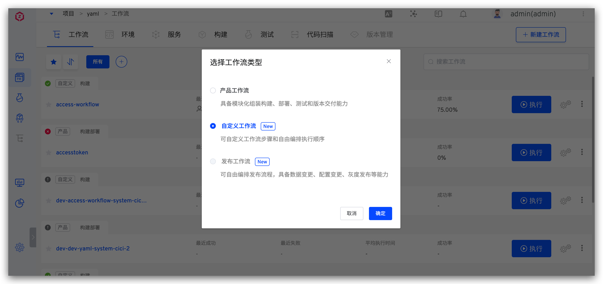
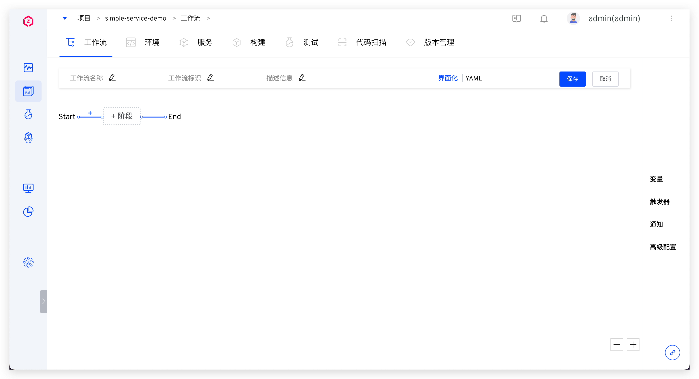

### 使用模板新建<Badge text="企业版" />

新建工作流 -> 选择使用`自定义工作流`，可以选择自定义模板或者系统内置的工作流模板来新建工作流，如下图所示。


## 界面化配置

### 基本信息

包括工作流名称、标识和描述信息：
- `工作流名称`：支持中文、大小写字母、数字及特殊字符，在所属项目中唯一，可修改。
- `工作流标识`：支持大小写字母、数字及中划线，全局唯一，不支持修改。
- `描述`：描述该工作流的详细信息，在工作留详情页展示。

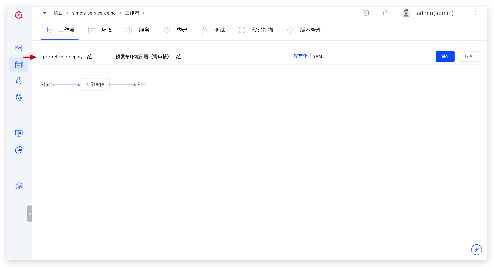

### 阶段

点击 `+阶段` 增加新的阶段配置。

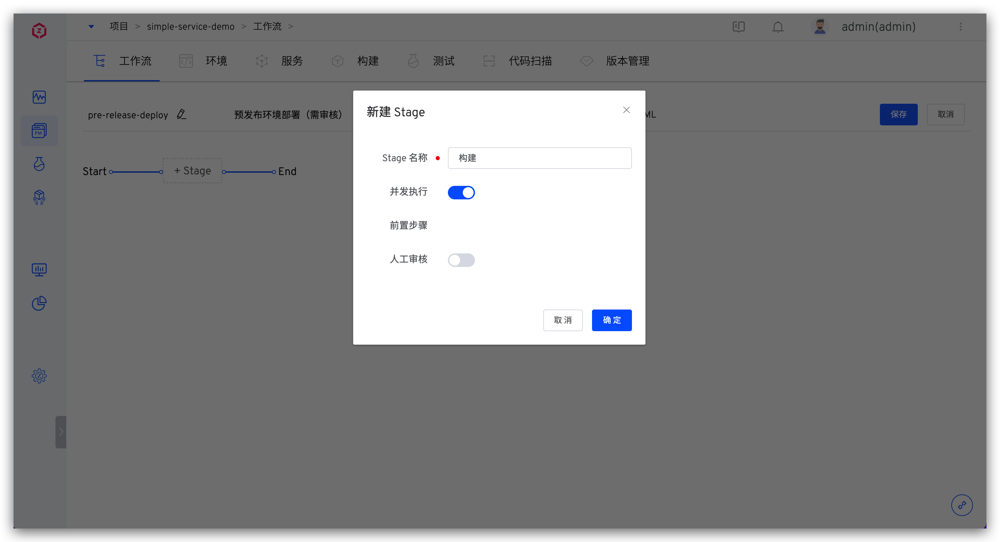

参数说明：
- `阶段名称`：在同一个自定义工作流中，阶段名称唯一
- `并发执行`：开启后，在该阶段下配置的多个任务将会并发执行
- `前置步骤`：可按需开启人工审批。开启后，需要审批通过，该阶段下的任务才会被执行

### 任务
点击阶段下方的 `+任务` 为阶段增加任务配置，系统目前支持`构建`、`部署`、`通用任务`、`Kubernetes 部署`、`测试`、`自定义任务` 等任务类型。点击[工作流任务](/dev/project/workflow-jobs/) 可查看目前 自定义工作流 和 发布工作流 所支持的任务类型。

### 人工审批
开启阶段配置中的`人工审批`，在该阶段执行之前会触发审批。支持 Zadig 审批和飞书审批。

#### Zadig 审批

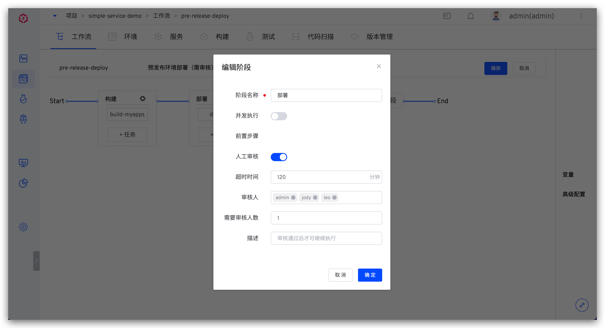

参数说明：
- `超时时间`：从触发审批的时间点开始算起，当超过超时时间后视为审批超时失败，后续阶段中的任务将不会被执行
- `审批人`：选择希望参与审批的人员
- `需要审批人数`：当审批通过的人数满足此处指定的值时，即视为整个审批通过

#### 飞书审批


参数说明：
- `审批应用`：选择使用的飞书审批应用，审批应用集成方式参考 [审批系统集成](/dev/settings/approval/)
- `审批人`： 可选择多个审批人，只要一个人审批通过，即视为整个审批通过。

## YAML 方式配置

### 配置说明

用 YAML 文件的方式定义工作流，YAML 内容的整体结构描述如下：

```
display_name:「工作流名称」        // 必填项，项目内唯一，支持中文、大小写字母、数字及特殊字符
name:「工作流标识」                // 必填项，项目内唯一，支持大小写字母、数字及中划线
stages:                          // 必填项，多个阶段将会按照先后顺序执行
  - 「阶段 1 的配置」
  - 「阶段 2 的配置」
  - 「更多阶段的配置...」
project: 「工作流所属项目名称」      // 必填项
description: 「工作流描述」
multi_run: 「可选值：true/false」  // 当同时触发多次工作流时，多条任务是否能并行执行，默认为 false
```

其中每一个阶段的具体配置如下：

```
name: 「阶段的名称」              // 必填项
parallel: 「可选值：true/false」  // 该阶段下的多个任务是否可以并发执行，默认为 false
approval: 「人工审批配置」         // 非必填，按需配置
jobs:                           // 必填项
  - 「任务 1 的配置」
  - 「任务 2 的配置」
  - 「更多任务的配置...」
```

人工审批的具体配置如下：

```
enabled: true
type: 「审批类型」                     // lark : 飞书审批 native：Zadig 审批
description: 「审批描述信息」
  native_approval:
    approve_users:                   // Zadig 审批人信息
      - user_id: 「审批人 ID」
        user_name: 「审批人昵称」
    needed_approvers: 「需要审批的人数」 // 整数类型
    timeout: 10                       // 整数类型，单位：分钟
  lark_approval:
    timeout: 10
    approval_id: 「审批应用 ID」
    approve_users:
      - id: 「审批人 ID」
        name: 「审批人昵称」
        avatar:  「审批人头像」
```

目前内置了构建和部署两种类型的任务，构建任务的具体配置如下：

> 在指定的构建中有相关构建变量配置时，在 YAML 中设置构建变量才有效。

```
name:「任务的名称」                    // 必填项
type: zadig-build                    // 必填项，指定为 zadig-build
spec:                                // 必填项
  docker_registry_id: 「镜像仓库 ID」
  service_and_builds:                // 服务组件的构建信息，可配置多个服务组件
    - service_module: 「服务组件名称」
      service_name: 「服务名称」
      build_name: 「构建名称」
      key_vals:                      // 构建变量信息，支持配置字符串和枚举类型的变量，分别见如下 string 和 choice 类型的变量示例
        - key: username              // 构建变量名称
          value: zadig               // 构建变量值
          is_credential: false       // 是否加密，默认为 false
          type: string
        - key: password
          value: v1
          is_credential: false
          type: choice
          choice_option:             // 枚举类型变量的可选值
            - v1
            - v2
    - service_module: 「服务组件名称」  // 更多服务组件的构建信息
      service_name: 「服务名称」
      build_name: 「构建名称」
      ...
```

内置部署任务的具体配置如下：

```
name: 「任务的名称」                    // 必填项
type: zadig-deploy                   // 指定为 zadig-deploy
spec:
  env: 「部署环境」                    // 必填项
  source: 「部署时使用的服务镜像的来源」  // 必填项，可选：runtime（运行时输入） / fromjob（其他任务输出）
  job_name: 「任务的名称」             // 当 source 为 fromjob 时需配置
```

### YAML 样例

使用以下工作流配置为例：

1. 第一个阶段：包含构建任务，并行构建 2 个服务（myapp-1 和 myapp-2）
2. 第二个阶段：包含部署任务并开启人工审批，使用上述构建任务中的镜像产物来部署 pre-release 环境

对应的完整 YAML 配置示例如下，供参考：

```
name: pre-release-deploy
display_name: pre-release-deploy
stages:
  - name: 构建
    parallel: true
    jobs:
      - name: build-myapps
        type: zadig-build
        spec:
          docker_registry_id: 6247eb0832a15f910118318c
          service_and_builds:
            - build_name: simple-service-build-nginx-1
              key_vals:
                - is_credential: false
                  key: username
                  type: string
                  value: admin
                - is_credential: false
                  choice_option:
                    - v1
                    - v2
                  key: password
                  type: choice
                  value: v1
              service_module: myapp-1
              service_name: a
            - build_name: simple-service-build-myapp-2
              service_module: myapp-2
              service_name: b
  - name: 部署
    approval:
      enabled: true
      type: native
      description: '预发布环境部署，需审批通过方可执行'
      native_approval:
        approve_users:
          - user_id: af14dfd2-b57d-11ec-9511-9e1ccf83f7b3
            user_name: admin
          - user_id: 2d59d2f4-c6a5-11ec-a89e-2e173601a9ce
            user_name: zadig
        timeout: 120
        needed_approvers: 1
    jobs:
      - name: deploy
        type: zadig-deploy
        spec:
          env: pre-release
          job_name: build-myapps
          source: fromjob
project: simple-service
description: 预发布环境部署
multi_run: false
```

## 变量

自定义工作流中提供丰富的变量能力，以支持参数化配置工作流，并且在阶段和任务之间传递信息。以下分不同的使用范围分别介绍。


### 项目
> 项目级别的变量，可用于当前项目的所有自定义工作流中。

支持的变量见下表：

| 变量                                               | 说明                                                |
|---------------------------------------------------|-----------------------------------------------------|
|  <span v-pre>`{{.project}}`</span>                | 项目的名称，下图例中即为 `simple-service-demo`          |


### 工作流

> 工作流级别的变量，可用于当前工作流的构建任务/部署任务/测试任务/通用任务/自定义任务中。

包括内置变量和自定义变量。

#### 内置变量

支持的内置变量见下表：

| 变量                                                | 说明                                                |
|----------------------------------------------------|-----------------------------------------------------|
|  <span v-pre>`{{.workflow.name}}`</span>           | 工作流的名称，下图例中即为 `pre-release-deploy`         |
|  <span v-pre>`{{.workflow.task.id}}`</span>        | 工作流任务的 ID 序号，下图例中即为 `1`                   |
|  <span v-pre>`{{.workflow.task.creator}}`</span>   | 工作流任务的执行人，下图例中即为 `admin`                 |
|  <span v-pre>`{{.workflow.task.timestamp}}`</span> | 工作流任务创建时的 Unix 时间戳，下图例中即为 `1660555623` |


#### 自定义变量

编辑工作流，点击页面右侧的 `变量` 进入自定义变量配置页面。


说明如下：

- `类型`：支持字符串/多行文本/枚举类型，其中字符串为单行文本
- `键`：自定义变量的 key，可以使用 <span v-pre>`{{.workflow.params.key}}`</span> 的形式为构建/部署/通用/自定义任务中的变量赋值
- `值`：自定义变量的值，支持以下两种配置方式：
  - `运行时输入`：执行工作流时，在`工作流变量`设置中指定该变量的值
  - `固定值`：指定变量的值，工作流执行时即使用该固定值，页面中该变量不可见

上图例中 `LOG_LEVEL` 和 `MYSQL_USER_DB` 的值为运行时输入，`ISSUER_URL` 的值为固定值，执行工作流时效果如下：


### 构建任务
> 内置构建任务中的变量。

变量的键和类型在此处不可更改，变量定义请阅读 [构建配置](/dev/project/build/#构建变量) 中的自定义构建变量部分。支持以下三种方式设置变量的值：

- `运行时输入`：执行工作流时再指定该变量的值
- `固定值`：指定变量的值，工作流执行时即使用该固定值，页面中该变量不可见
- `全局变量`：使用全局变量为构建任务中的变量赋值，工作流执行时会自动对全局变量进行渲染。全局变量包括 [项目变量](/dev/project/common-workflow/#项目) 和 [工作流变量](/dev/project/common-workflow/#工作流)


### 部署任务
> 部署任务中的环境信息和服务信息。

环境信息支持以下三种配置方式：
- `运行时输入`：执行工作流时再指定部署环境
- `固定值`：设置部署环境为固定值，执行工作流时不可再更改
- `全局变量`：使用全局变量为环境赋值，工作流执行时会自动对全局变量进行渲染替换。全局变量包括 [项目变量](/dev/project/common-workflow/#项目) 和 [工作流变量](/dev/project/common-workflow/#工作流)

服务信息支持以下两种配置方式：
- `其他任务输出`：可选择前置构建任务，使用任务中的 $IMAGE 变量来部署服务（如果前置构建任务中构建了多个服务，则部署任务中也会部署多个服务）
- `运行时输入`：执行工作流时手动指定服务的镜像


### Kubernetes 部署任务
> 内置 Kubernetes 部署任务中的容器信息。

容器信息支持以下两种配置方式：
- `运行时输入`：执行工作流时再指定要部署的容器
- `固定值`：设置待部署容器为固定值，执行工作流时不可再更改


### 测试任务
> 测试任务中的变量信息。

支持以下三种配置方式：
- `运行时输入`：执行工作流时再指定要测试配置中的变量值
- `固定值`：设置测试配置中的变量为固定值，执行工作流时不可再更改
- `全局变量`：使用全局变量为测试任务中的变量赋值，工作流执行时会自动对全局变量进行渲染。全局变量包括 [项目变量](/dev/project/common-workflow/#项目) 和 [工作流变量](/dev/project/common-workflow/#工作流)


### 镜像分发
> 镜像分发任务中的服务组件信息。

支持以下两种配置方式：
- `运行时输入`：执行工作流时再指定需要做镜像分发的服务组件
- `其他任务输出`：使用前置构建任务输出的服务组件及对应的镜像信息进行分发


### 通用任务
> 通用任务中的变量。

包括内置变量和自定义变量。


内置变量请参考 [构建变量](/dev/project/build/#构建变量) 中关于内置构建变量的描述，自定义变量说明如下：

- `类型`：支持创建字符串类型和枚举类型的自定义变量
- `键`：自定义变量的 key，可在 `添加步骤` 中通过 `$key` 的形式来使用
- `值`：自定义变量的值，支持以下三种配置方式：
  - `运行时输入`：执行工作流时再指定该变量的值
  - `固定值`：指定变量的值，工作流执行时即使用该固定值，页面中该变量不可见
  - `全局变量`：使用全局变量为通用任务中的自定义变量赋值，工作流执行时会自动对全局变量进行渲染。全局变量包括 [项目变量](/dev/project/common-workflow/#项目) 和 [工作流变量](/dev/project/common-workflow/#工作流)

### 自定义任务
> 自定义任务中的变量。

在自定义任务的 YAML 文件中定义，YAML 定义请参考 [工作流任务](/dev/settings/custom-task/)，变量值的配置支持以下三种方式：
- `运行时输入`：执行工作流时再指定该变量的值
- `固定值`：指定变量的值，工作流执行时即使用该固定值，页面中该变量不可见
- `全局变量`：使用全局变量为通用任务中的自定义变量赋值，工作流执行时会自动对全局变量进行渲染。全局变量包括 [项目变量](/dev/project/common-workflow/#项目) 和 [工作流变量](/dev/project/common-workflow/#工作流)

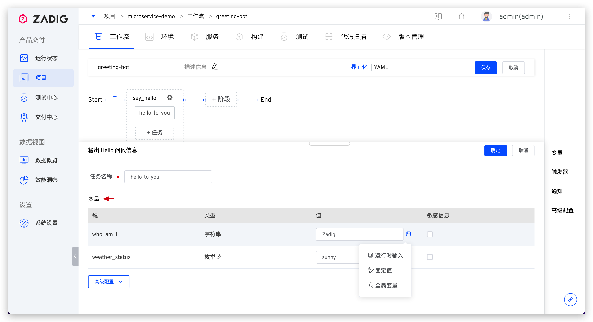

## 触发器配置

包括 Git 触发器和定时器。

### Git 触发器
> 为工作流配置 Webhook 触发器，当满足触发条件的事件发生时会自动触发工作流执行，暂不支持通过 SSH 协议或 AccessToken 方式接入的代码源。

点击右侧的 `触发器` -> 选择 `Git 触发器`即可配置，实现代码变更自动触发工作流。


参数说明：
- `工作流执行变量`：希望被 Webhook 触发执行的任务，以及任务中的具体配置
- 其他参数：请参考 [触发器基本配置](/dev/project/workflow/#gui-方式) 中的描述

### JIRA 触发器 <Badge text="企业版" />
点击右侧的 `触发器` -> 选择 `JIRA 触发器` 即可配置实现 JIRA 状态变更自动触发工作流。


参数说明：
- `工作流执行变量`：希望被 Webhook 触发执行的任务，以及任务中的具体配置
- 其他参数：请参考 [触发器基本配置](/dev/project/workflow/#gui-方式) 中的描述

在 JIRA 中完成 Webhook 配置

在右上角点击 `设置` 图标，点击 `System`


在左侧 `ADVANCED` 下找到 `Webhook`


点击 `+ Create a Webhook`
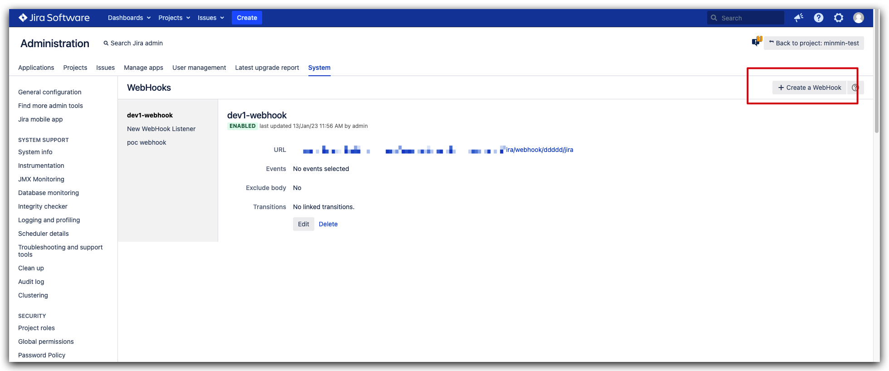

复制触发器的 Webhook 地址，将其填入 URL 输入框内


触发器执行成功后，将会添加 Comment 到对应的 Issue


::: 提示
配置 Webhook 的时不能同时配置 Issue updated 事件
:::

### 飞书触发器 <Badge text="企业版" />
点击右侧的 `触发器` -> 选择 `飞书触发器` 即可配置实现 飞书 状态变更自动触发工作流。


参数说明：
- `工作流执行变量`：希望被 Webhook 触发执行的任务，以及任务中的具体配置
- 其他参数：请参考 [触发器基本配置](/dev/project/workflow/#gui-方式) 中的描述

在飞书项目中完成 Webhook 配置

点击 `空间配置` -> `自动化` -> `新建规则`，进入规则创建。


根据需要选择规则，并在操作中将 `操作类型`，设为 Webhook 并复制触发器的 Webhook 地址，将其填入 URL 输入框内。


触发器执行成功后，将会添加 Comment 到对应的 Issue
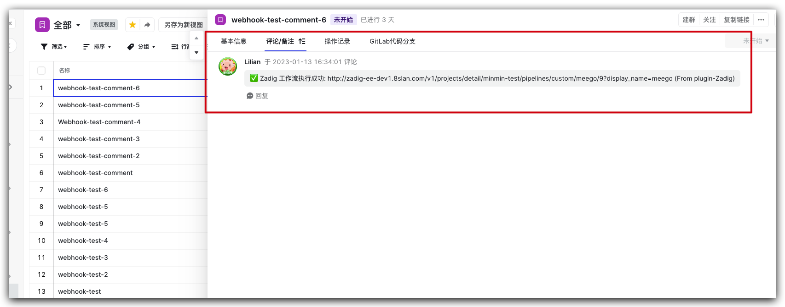


### 定时器
点击右侧的 `触发器` -> 选择 `定时器`。


触发方式以及时间配置可参考 [定时器配置](/dev/project/workflow/#定时器)，在工作流执行变量中可设置定时运行的任务以及任务中的变量配置。


## 通知配置
编辑工作流，点击右侧的 `通知` 进入通知配置页面。


目前支持配置工作流通知到飞书/企业微信/钉钉中，详细的配置参数说明可参考：[IM 状态通知](/dev/project/workflow/#im-状态通知)。


系统会分别通知每一个服务组件的构建/部署执行情况，通知内容中构建和部署的格式如下：

- 构建：服务名称-服务组件名称-构建任务名称
- 部署：服务名称-服务组件名称-部署任务名称

以飞书示例通知效果：


## 高级配置
在高级配置中开启并发运行策略后，多次触发工作流执行产生的多条工作流任务将会并发执行，提升工作流运行效率。


## 自定义工作流样例

可在自定义工作流中自由编排流程，下面简单举例几种场景。

**场景一：构建镜像到不同的仓库**

配置多个构建任务，每个任务中指定不同的镜像仓库。

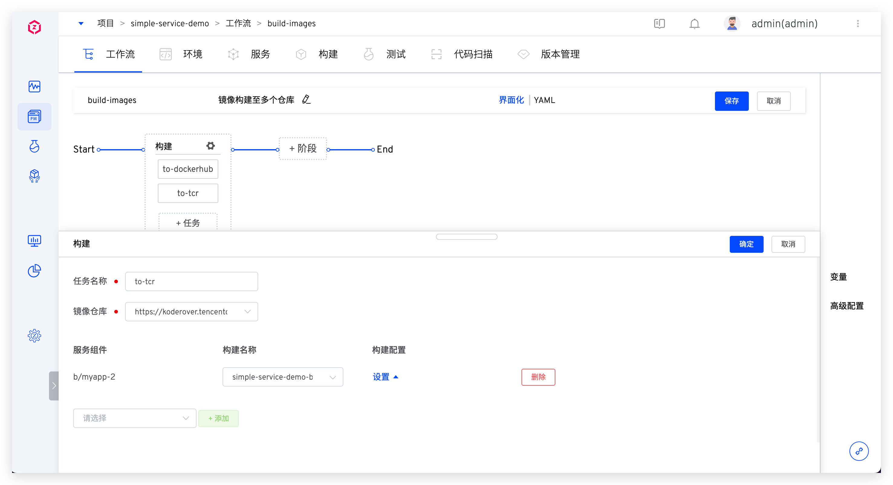

**场景二：同时部署多个环境**

配置多个部署任务，每个任务中指定不同的环境。


**场景三：使用不同的镜像仓库来部署不同的环境**

配置多个构建任务，每个构建任务中指定不同的镜像仓库；为每个环境配置部署任务，服务来源选择`其他任务输出`并指定对应任务。

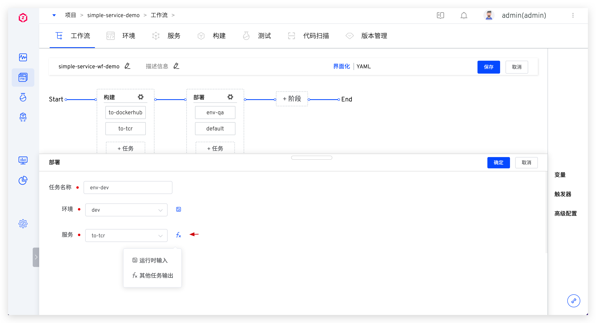

**场景四：审批通过后再部署环境**

部署阶段配置中增加人工审批。


在部署步骤执行之前会触发审批，审批通过后工作流才会继续执行。


## 执行
点击执行工作流，可修改工作流变量的值，按需选择被执行的任务：
> 若工作流变量的值被设置为固定值，则执行工作流时该变量在页面中不可见。

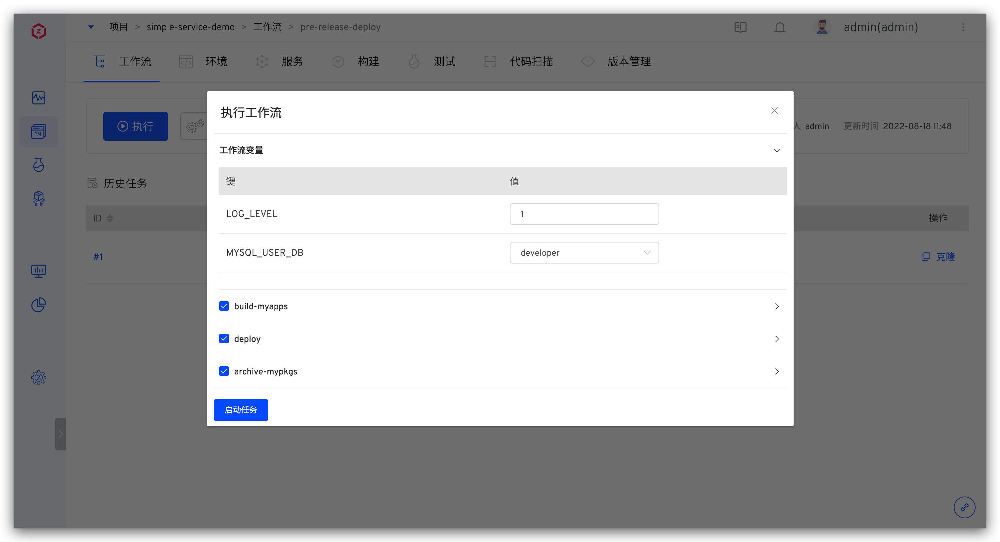

点击具体的构建任务可查看构建日志：
> 任务名称规则为：`服务名-服务组件名-任务名`


## 变量传递
变量传递流程：
1. 对应任务中声明需要输出的变量
2. 对应任务的 Shell 脚本中定义输出变量值
3. 自定义工作流中其他后置任务定义一个键用以接收输出的变量值

### 设置输出变量

#### 构建
在 `项目` -> `构建` 中，对需要增加输出变量的构建进行编辑。


在 `高级配置` 中可以看到输出变量模块，默认内置 IMAGE 和 PKG_FILE，也可根据需要自行添加变量。

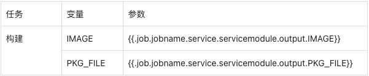


#### 测试
在 `项目` -> `测试` 中，对需要增加输出变量的测试进行编辑。


在 `高级配置` 中可以看到输出变量模块，可以根据需要自行添加变量。


#### 代码扫描
在 `项目` -> `代码扫描` 中，对需要增加输出变量的代码扫描进行编辑。


在 `高级配置` 中可以看到输出变量模块，可以根据需要自行添加变量。


#### 工作流-通用任务
在 `项目` -> `工作流` -> `任务` 中，选择 `通用任务` 进行编辑。


在 `高级配置` 中可以看到输出变量模块，可以根据需要自行添加变量。


### 使用输出变量
#### 构建
在 `项目` -> `工作流` -> `任务` -> `构建` 中，选择所需的服务组件，进行变量配置，可以选择 「全局变量/其他任务输出」。


#### 部署
在 `项目` -> `工作流` -> `任务` -> `部署` 中，配置服务，可以选择 「全局变量/其他任务输出」。


#### 通用任务
在 `项目` -> `工作流` -> `任务` -> `通用任务` 中，进行变量自定义，可以选择 「全局变量/其他任务输出」。


#### 测试
在 `项目` -> `工作流` -> `任务` -> `测试` 中，对测试进行变量配置，可以选择 「全局变量/其他任务输出」。


#### 自定义变量
在 `项目` -> `工作流` -> `自定义任务` 中，选择所需配置的变量，可以在值中选取 「全局变量/其他任务输出」。


## 共享存储
Zadig 现已支持在工作流任务中实现共享存储，具体操作步骤如下：
1. 对集群资源进行配置，定义共享的存储资源。
2. 对工作流进行配置，添加共享目录。
3. 在工作流的任务中中开启共享并应用，实现任务间的共享存储


### 集群资源配置
在 `系统设置` -> `集群管理` 中选择需要指定存储资源进行共享的集群，点击 `编辑` 。


在修改集群的弹窗中找到 `共享存储资源配置` ，点击 `+添加` 。
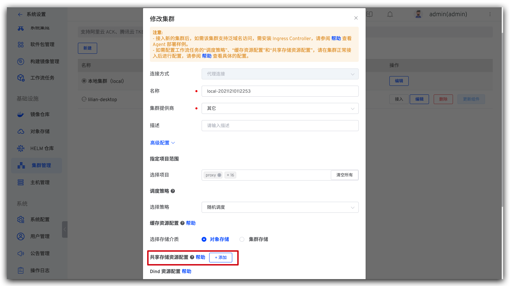

可以选择 `动态生成资源` 或 `使用现有存储资源` 。

`动态生成资源`:需要选择 Storage Class 并填入存储空间大小。

`使用现有存储资源`:指定 PVC即可。


### 工作流配置
选择需要使用共享存储的工作流，点击 `高级配置`。


点击共享存储旁的 `添加` ，并填写名称和共享的目录，完成后点击 `确定` 进行保存。


### 工作流任务配置
#### 构建/测试/代码扫描
在 构建/测试/代码扫描 中，点击 构建配置/测试配置/扫描配置中的 `共享存储配置` ，开启共享存储并完成共享目录配置。


#### 通用任务/自定义任务
在 通用任务/自定义任务 中，点击 `高级配置` -> `开启共享存储`，选择共享目录，完成配置。
