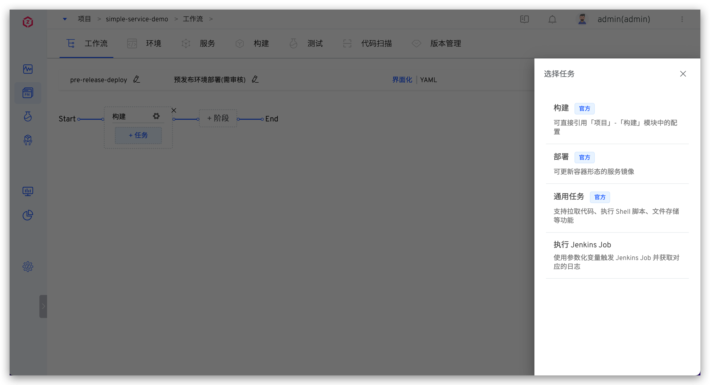
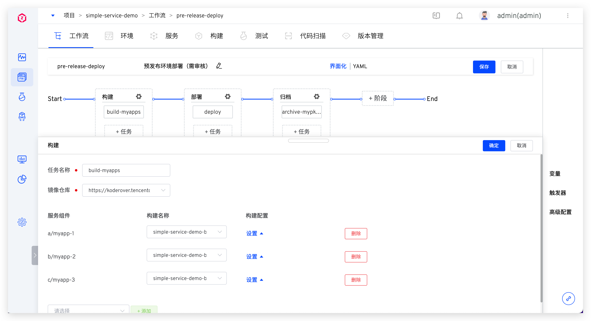
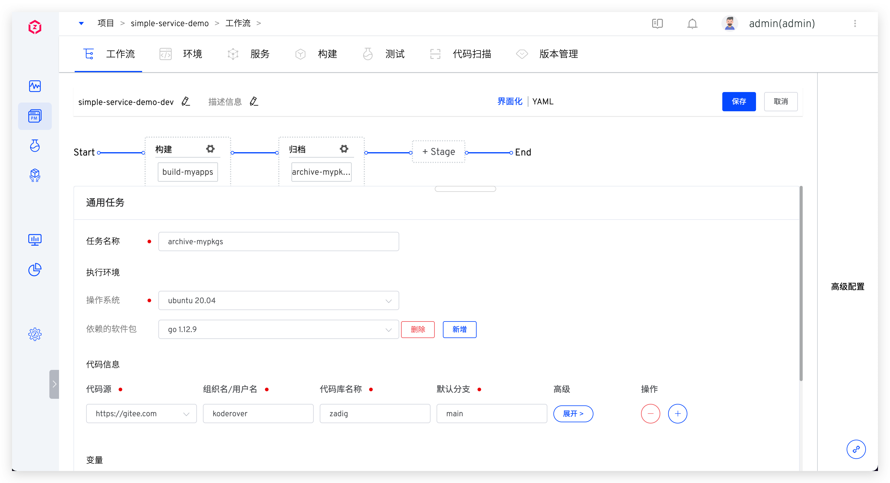

自定义工作流中提供了充分的开放性，支持自由编排工作流流程，自定义执行步骤，下面展开介绍相关概念和具体使用。

## 基本概念

- Workflow：工作流，可在工作流中编排多个阶段的执行过程
- 阶段：对工作流执行阶段进行逻辑分组，比如构建阶段、部署阶段...多个阶段串行运行，一个阶段可包括多个任务
- 任务：一个完整的任务，比如构建、部署、测试...多个任务可串行执行或并发执行
<!-- - Step：组成任务的单元，比如克隆代码、执行 Shell 脚本、执行镜像构建、收集测试报告等... -->

## 新建

进入项目中点击新建工作流，选择`自定义工作流`，系统提供`界面化`和 `YAML` 两种方式来配置自定义工作流。


## 界面化配置

### 基本信息

包括工作流名称和描述，同一项目下的工作流名称应唯一。


### 阶段

点击 `+阶段` 增加新的阶段配置。


参数说明：
- `阶段名称`：在同一个自定义工作流中，阶段名称唯一
- `并发执行`：开启后，在该阶段下配置的多个任务将会并发执行
- `前置步骤`：可按需开启人工审核。开启后，需要审核通过，该阶段下的任务才会被执行

### 任务
点击阶段下方的 `+任务` 为阶段增加任务配置，系统目前支持`构建`、`部署`、`通用任务`三种任务类型。



#### 构建任务


参数说明：
- `任务名称`：支持 32 位以内的小写英文字母、数字或者中划线，且以小写英文字母开头；在同一个自定义工作流中，Job 名称需唯一
- `镜像仓库`：选择镜像仓库，当构建 Job 执行完成功后，构建出的镜像（即内置 $IMAGE 变量）会被推送到所选仓库中
- `服务组件`：选择服务组件以及该服务组件使用的构建配置

点击展开构建配置的 `设置`，可设置该构建配置中的变量值以及代码库默认分支，变量的配置参考：[变量配置](#变量来源配置)


::: tip
1. 内置构建任务执行结束后会输出 $IMAGE 变量（页面中不可见，系统隐式逻辑），可用于内置部署任务中。
2. 内置构建任务中不再支持 `$ENV_NAME` 构建变量，需要确保构建脚本中未使用该变量。
3. 暂不支持使用 Jenkins 构建。
:::

#### 部署任务


参数说明：
- `任务名称`：支持 32 位以内的小写英文字母、数字或者中划线，且以小写英文字母开头；在同一个自定义工作流中，任务名称需唯一
- `环境`：选择要部署的环境，支持三种来源，参考 [环境配置](#变量来源配置)
- `服务来源`：包括其他任务输出或运行时输入
    - `其他任务输出`：可选择前置任务，使用任务中的 $IMAGE 变量来部署服务（目前只支持选择前置的构建任务）
    - `运行时输入`：运行工作流时手动指定

#### 通用任务

支持拉取代码、执行 Shell 脚本、文件存储等功能。

- `执行环境`：参考 [构建环境配置](/dev/project/build/#构建环境)
- `代码信息`：参考 [代码信息配置](/dev/project/build/#代码信息)
- `变量`：包括内置变量和自定义变量，分别参考 [变量配置](/dev/project/build/#构建变量)、[自定义变量配置](#变量来源配置)
- `添加步骤`：包括添加 Shell 脚本执行以及文件存储，可参考 [更多构建配置](/dev/project/build/#更多构建步骤)
- `高级配置`：参考 [高级配置](/dev/project/build/#高级配置)




### 人工审核
开启阶段配置中的`人工审核`，在该阶段执行之前会触发审核。


参数说明：
- `超时时间`：从触发审核的时间点开始算起，当超过超时时间后视为审核超时失败，后续阶段中的任务将不会被执行
- `审核人`：选择希望参与审核的人员
- `需要审核人数`：当审核通过的人数满足此处指定的值时，即视为整个审核通过，该阶段中的任务会正常执行

### 变量来源配置
变量的值包括以下三种来源：
- `运行时输入`：运行自定义工作流时再指定该变量的值
- `固定值`：指定为固定值，工作流执行时即使用该固定值，页面中该变量不可见
- `全局变量`：使用全局变量来赋值，在工作流执行时会自动渲染全局变量的值，支持的全局变量可参考 [自定义变量](/dev/project/common-workflow/#变量配置)

## YAML 方式配置

### 配置说明

用 YAML 文件的方式定义工作流，YAML 内容的整体结构描述如下：

```
name:「工作流名称」                // 必填项，全局唯一，匹配 ^[a-z0-9-]{1,32}$
stages:                          // 必填项，多个阶段将会按照先后顺序执行
  - 「阶段 1 的配置」
  - 「阶段 2 的配置」
  - 「更多阶段的配置...」
project: 「工作流所属项目名称」      // 必填项
description: 「工作流描述」
multi_run: 「可选值：true/false」  // 当同时触发多次工作流时，多条任务是否能并行执行，默认为 false
```

其中每一个阶段的具体配置如下：

```
name: 「阶段的名称」              // 必填项
parallel: 「可选值：true/false」  // 该阶段下的多个任务是否可以并发执行，默认为 false
approval: 「人工审核配置」         // 非必填，按需配置
jobs:                           // 必填项
  - 「任务 1 的配置」
  - 「任务 2 的配置」
  - 「更多任务的配置...」
```

人工审核的具体配置如下：

```
enabled: true
approve_users:                     // 审核人信息，可配置多个
  - user_id: 「审核人 ID」
    user_name: 「审核人昵称」
  - user_id: 「...」
    user_name: 「...」
timeout: 「审核超时时间」             // 整数类型，单位：分钟
needed_approvers: 「需要审核的人数」  // 整数类型
description: 「审核描述信息」         // 非必填
```

目前内置了构建和部署两种类型的任务，构建任务的具体配置如下：

> 在指定的构建中有相关构建变量配置时，在 YAML 中设置构建变量才有效。

```
name:「任务的名称」                    // 必填项
type: zadig-build                    // 必填项，指定为 zadig-build
spec:                                // 必填项
  docker_registry_id: 「镜像仓库 ID」
  service_and_builds:                // 服务组件的构建信息，可配置多个服务组件
    - service_module: 「服务组件名称」
      service_name: 「服务名称」
      build_name: 「构建名称」
      key_vals:                      // 构建变量信息，支持配置字符串和枚举类型的变量，分别见如下 string 和 choice 类型的变量示例
        - key: username              // 构建变量名称
          value: zadig               // 构建变量值
          is_credential: false       // 是否加密，默认为 false
          type: string
        - key: password
          value: v1
          is_credential: false
          type: choice
          choice_option:             // 枚举类型变量的可选值
            - v1
            - v2
    - service_module: 「服务组件名称」  // 更多服务组件的构建信息
      service_name: 「服务名称」
      build_name: 「构建名称」
      ...
```

内置部署任务的具体配置如下：

```
name: 「任务的名称」                    // 必填项
type: zadig-deploy                   // 指定为 zadig-deploy
spec:
  env: 「部署环境」                    // 必填项
  source: 「部署时使用的服务镜像的来源」  // 必填项，可选：runtime（运行时输入） / fromjob（其他任务输出）
  job_name: 「任务的名称」             // 当 source 为 fromjob 时需配置
```

### YAML 样例

使用以下工作流配置为例：

1. 第一个阶段：包含构建任务，并行构建 2 个服务（myapp-1 和 myapp-2）
2. 第二个阶段：包含部署任务并开启人工审核，使用上述构建任务中的镜像产物来部署 pre-release 环境

对应的完整 YAML 配置示例如下，供参考：

```
name: pre-release-deploy
stages:
  - name: 构建
    parallel: true
    jobs:
      - name: build-myapps
        type: zadig-build
        spec:
          docker_registry_id: 6247eb0832a15f910118318c
          service_and_builds:
            - build_name: simple-service-build-nginx-1
              key_vals:
                - is_credential: false
                  key: username
                  type: string
                  value: admin
                - is_credential: false
                  choice_option:
                    - v1
                    - v2
                  key: password
                  type: choice
                  value: v1
              service_module: myapp-1
              service_name: a
            - build_name: simple-service-build-myapp-2
              service_module: myapp-2
              service_name: b
  - name: 部署
    approval:
      enabled: true
      approve_users:
        - user_id: af14dfd2-b57d-11ec-9511-9e1ccf83f7b3
          user_name: admin
        - user_id: 2d59d2f4-c6a5-11ec-a89e-2e173601a9ce
          user_name: zadig
      timeout: 120
      needed_approvers: 1
      description: '预发布环境部署，需审核通过方可执行'
    jobs:
      - name: deploy
        type: zadig-deploy
        spec:
          env: pre-release
          job_name: build-myapps
          source: fromjob
project: simple-service
description: 预发布环境部署
multi_run: false
```

## 变量配置

包括内置变量和自定义变量。

### 内置变量

支持的内置变量见下表：

| 变量                      | 说明                       |
|--------------------------|---------------------------|
|  project                 | 项目的名称                  |
|  workflow.name           | 工作流的名称                |
|  workflow.task.id        | 工作流任务的 ID 序号         |
|  workflow.task.id        | 工作流任务的创建者            |
|  workflow.task.timestamp | 工作流任务创建时的 Unix 时间戳 |

### 自定义变量

点击右侧的 `变量` 进入自定义变量配置页面。


说明如下：

- `类型`：支持字符串/多行文本/枚举类型，其中字符串为单行文本
- `键`：自定义变量的 key
- `值`：自定义变量的值，支持以下两种配置方式：
  - `运行时输入`：执行工作流时，在`工作流变量`设置中指定该变量的值
  - `固定值`：指定变量的值，工作流执行时即使用该固定值，页面中该变量不可见


上图例中 `LOG_LEVEL` 和 `MYSQL_USER_DB` 的值为运行时输入，`ISSUER_URL` 的值为固定值，执行工作流时效果如下：


## 触发器配置
> 为工作流配置 Webhook 触发器，当满足触发条件的事件发生时会自动触发工作流执行，暂不支持通过 SSH 协议或 AccessToken 方式接入的代码源。

点击右侧的 `触发器` 进入触发器配置页面。


参数说明：
- `工作流执行变量`：希望被 Webhook 触发执行的任务，以及任务中的具体配置
- 其他参数：请参考 [触发器基本配置](/dev/project/workflow/#gui-方式) 中的描述

## 高级配置
在高级配置中开启并发运行策略后，多次触发工作流执行产生的多条工作流任务将会并发执行，提升工作流运行效率。


## 自定义工作流样例

可在自定义工作流中自由编排流程，下面简单举例几种场景。

**场景一：构建镜像到不同的仓库**

配置多个构建任务，每个任务中指定不同的镜像仓库。


**场景二：同时部署多个环境**

配置多个部署任务，每个任务中指定不同的环境。


**场景三：使用不同的镜像仓库来部署不同的环境**

配置多个构建任务，每个构建任务中指定不同的镜像仓库；为每个环境配置部署任务，服务来源选择`其他任务输出`并指定对应任务。


**场景四：审核通过后再部署环境**

部署阶段配置中增加人工审核。


在部署步骤执行之前会触发审核，审核通过后工作流才会继续执行。


## 执行
点击执行工作流，可修改工作流变量的值，按需选择被执行的任务：
> 若工作流变量的值被设置为固定值，则执行工作流时该变量在页面中不可见。


点击具体的构建任务可查看构建日志：
> 任务名称规则为：`服务名-服务组件名-任务名`

