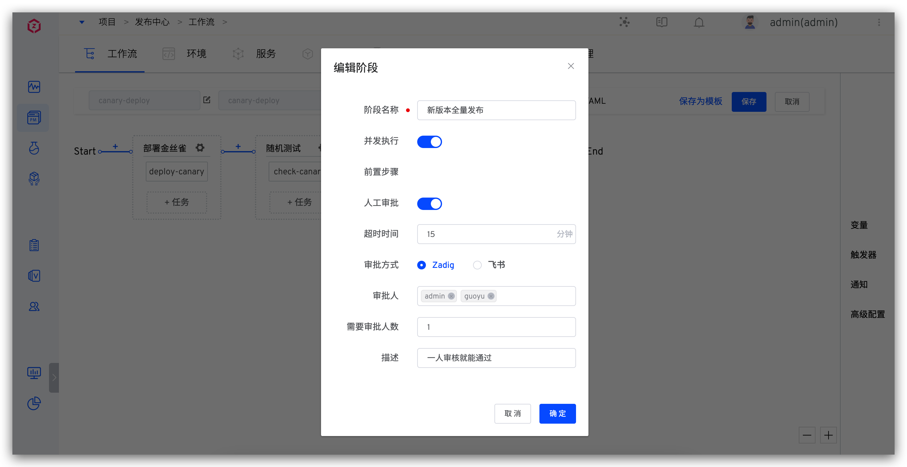
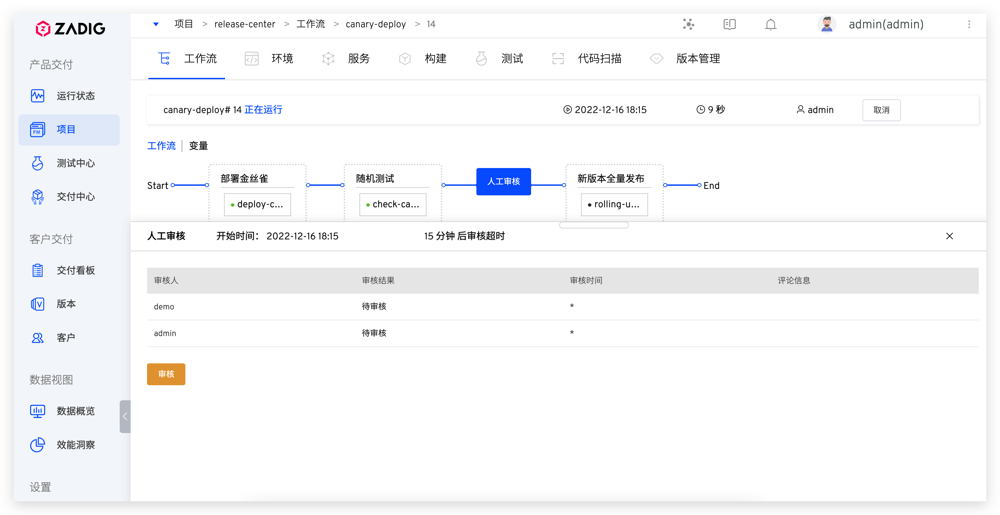
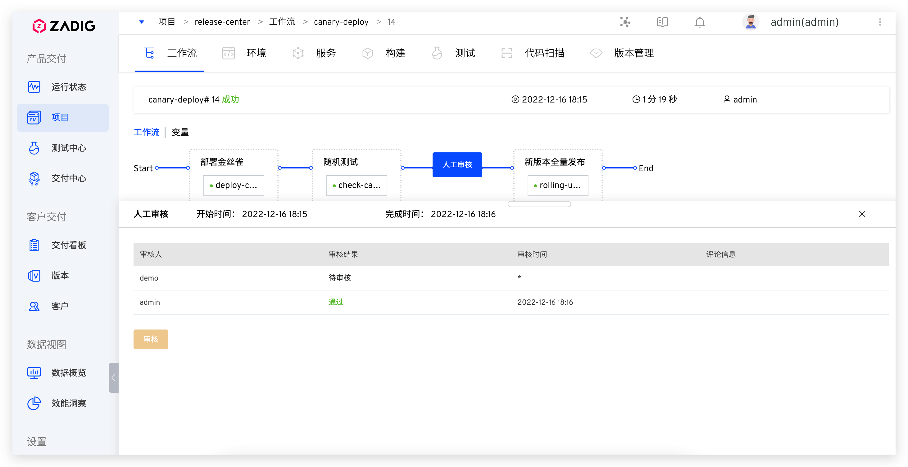
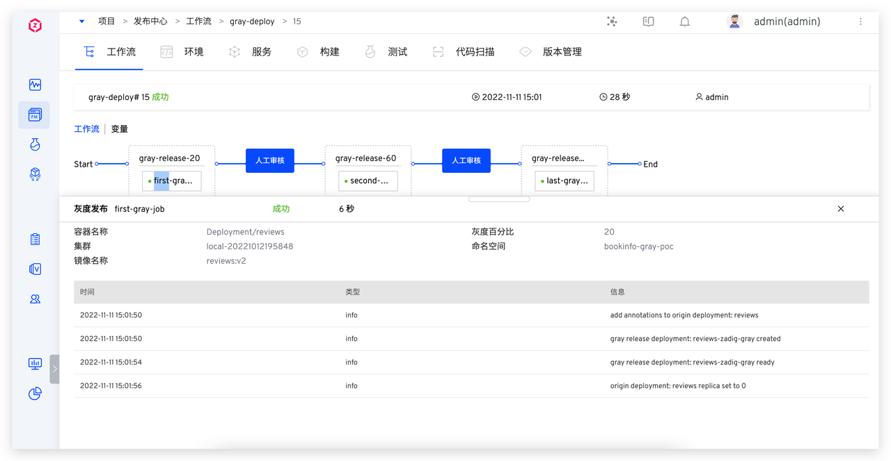
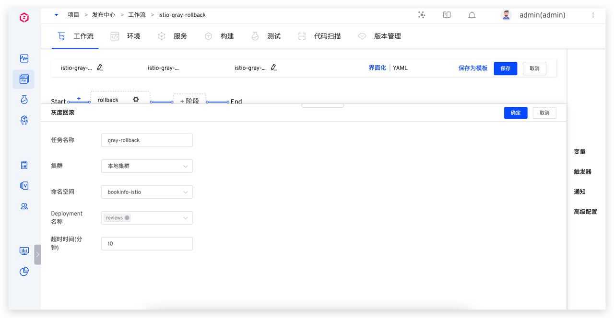

<Badge text="企业版" />

Zadig 发布工作流支持蓝绿发布、金丝雀发布、分批次灰度发布、Istio 发布、更新 K8s YAML等任务，下面展开介绍相关概念和具体使用。

## 蓝绿发布
### 概念介绍
蓝绿发布是一种以最小的停机时间做服务升级的策略。 需要维护的两个版本的环境分别称为 “蓝环境” 和 “绿环境”。一般当前生产流量指向环境为绿环境，而在蓝环境上部署新版本，短时间内作为测试环境。

**优点**
- 简单、快速、易于理解且易于实施
- 流量瞬时切换
- 相对于其他部署策略，风险较小。

**注意点**
- 双倍资源，可能产生更多成本。
- 服务从一个版本到另一个版本，当前的事务和会话将丢失。
- 数据库兼容性（架构更改、向后兼容性）。

### 工作原理
1. 部署蓝环境，复制当前 workload，设置新的镜像，创建一个 blue service 指向它。
2. 蓝环境部署完成，执行用户的验证任务。
3. 开始执行蓝绿发布，删除 blue service。
4. 将 green service 指向新创建的 workload。
5. 删除旧的 workload。
6. 发布过程完成或者中断删除蓝环境

### 如何使用
#### 使用条件
所要更新服务的 workload 需要满足以下条件：
1. workload 需要有一个service 与之对应，并且 workload  的 labels 包含所有 service 的 selector labels。
2. workload 当前只支持 deployment 类型。

#### 配置蓝绿发布
1. 新建工作流。访问`工作流` -> `新建工作流`-> 选择`发布工作流`。

2. 添加部署蓝绿环境任务。点击「+ 任务」，选择「部署蓝绿环境」任务并配置。

参数说明：
- 镜像仓库：实例镜像存放的仓库
- 集群：集群信息
- 命名空间：实例所在的 K8s 命名空间
- 实例列表：该任务可以选择更新的实例列表

3. [可选]添加验证任务，验证蓝环境质量是否符合上线要求。点击「+ 任务」，选择「通用任务」任务并配置。

4. 添加蓝绿发布任务。点击「+ 任务」，选择「蓝绿发布」任务并配置。

参数说明：
- 选择「部署蓝绿环境」任务：选择前置的蓝绿环境部署任务

5. 点击工作流「保存」按钮，完成工作流配置。

#### 执行蓝绿发布
- 点击「执行」按钮，选择需要更新的实例及镜像。

- 工作流按照设置的任务完成执行，执行状态如下图所示。

- 发布效果如下。

## 金丝雀发布
### 概念介绍
在生产环境上引一部分实际流量对一个新版本进行测试，测试新版本的性能和表现，在保证系统整体稳定运行的前提下，尽早发现新版本在实际环境上的问题。

**优点**
- 相对于所有其他部署策略的风险最低（减少业务风险）。
- 使用真实用户和用例进行生产测试。
- 并排运行和比较两个服务版本。
- 比蓝绿发布节省资源，不需要有两个生产环境。

**注意点**
- 生产测试需要的监控和基础组件（APM、日志、基础设施、最终用户等）。
- 数据库兼容性（架构更改、向后兼容性）。

### 工作原理
1. 部署金丝雀，复制当前 workload，设置 replica，设置新的镜像，指向同一个 service 。
2. 部署金丝雀完成，执行用户验证任务。
3. 开始执行金丝雀发布，删除新创建的 workload。 
4. 滚动升级当前 workload 到新的镜像。
5. 发布过程完成或者中断均删除金丝雀

### 如何使用
#### 使用条件
所要更新服务的 workload 需要满足以下条件：
1. workload 需要有一个service 与之对应，并且 workload  的 labels 包含所有 service 的 selector labels。
2. workload 当前只支持 deployment 类型。

#### 配置金丝雀发布
1. 新建工作流。访问`工作流` -> `新建工作流`-> 选择`发布工作流`。

2. 添加部署金丝雀任务。点击「+ 任务」，选择「部署金丝雀」任务并配置。

参数说明：
- 镜像仓库：实例镜像存放的仓库
- 集群：集群信息
- 命名空间：实例所在的 K8s 命名空间
- 实例列表：该任务可以选择更新的实例列表
  - 实例数(%)：金丝雀副本数量，比如原副本数量为 100，配置实例数 10%，则将部署 10 个金丝雀，线上 10% 的流量到金丝雀版本。

3. [可选]添加验证任务，验证金丝雀版本是否符合上线要求。点击「+ 任务」，选择「通用任务」任务并配置。

4. 配置人工审批。点击「+阶段」，开启「人工审批」。

5. 添加金丝雀发布任务。点击「+任务」，选择「金丝雀发布」并配置。

参数说明：
- 选择「部署金丝雀」任务：选择前置的金丝雀部署任务

6. 点击工作流「保存」按钮，完成工作流配置。

#### 执行金丝雀发布
- 点击「执行」按钮，选择需要更新的实例及镜像。

- 工作流完成部署金丝雀和验证任务，等待人工审批。此时环境中已部署 1 个金丝雀实例，如下图所示。

- 人工审批通过并完成金丝雀发布。此时环境已更新为金丝雀版本，如下图所示。

## 分批次灰度发布
灰度发布有很多种实现方式，除了金丝雀发布，Zadig 还支持分批次灰度发布，按照实际情况，分多次升级线上服务，比如第一次灰度 20%，将生产 20% 流量打入新版本，通过监控观测线上流量情况，第二次灰度 40% ，观测流量，没问题后全量上线。

### 工作原理
**首个灰度任务**
1. 初始化原始 deployment，系统自动加上灰度过程需要的 annotation。
    - &lt;origin-deployment-name&gt;-gray-release-image：记录发布前的镜像名称
    - &lt;origin-deployment-name&gt;-gray-release-container：记录发布前的容器名称
    - &lt;origin-deployment-name&gt;-gray-release-replica：记录发布前副本数量
2. 创建灰度的 deployment &lt;origin-deployment-name&gt;-zadig-gray，设置副本数量为向上取整（原始副本数*灰度百分比），设置镜像为新镜像，等待 deployment ready。
3. 调整原始 deployment 副本数量: 原始副本数量-新 deployment 副本数量，等待 deployment ready。

**中间状态灰度任务**
1. 设置新版本 deployment 副本数量为 向上取整（原始副本数*灰度百分比），等待 deployment ready。
2. 设置灰度 deployment 副本数量为原始副本数量-新 deployment 副本数量，等待 deployment ready。

**100% 灰度任务**
1. 设置原始 deployment：镜像设置为新版本，副本数量为原始副本数量，等待 deployment ready。
2. 删除灰度 deployment

### 如何使用
#### 配置灰度发布
1. 新建工作流。访问`工作流` -> `新建工作流`-> 选择`发布工作流`。

2. 添加「灰度发布」任务。点击「+ 任务」，选择「灰度发布」任务并配置`首个灰度任务`。

参数说明：
- 灰度任务类型：选择`首个灰度任务`。
- 容器名称：可以灰度的容器，执行工作流时可以从配置的范围中选择其中几个容器进行灰度。
- 灰度百分比：控制实际灰度副本数量，原始副本数量 * 灰度百分比的值再向上取整。

3. 添加更多灰度阶段，配置`非首个灰度任务`任务。

参数说明：
- 灰度任务类型：选择`非首个灰度任务`。
- 选择首个灰度任务：在首个灰度任务的基础上继续执行灰度。
- 灰度百分比：控制实际灰度副本数量，原始副本数量 * 灰度百分比的值再向上取整。最后一个灰度阶段，灰度的百分比必须为 100%。

#### 执行灰度发布
- 点击「执行」按钮，选择需要灰度的容器及其镜像。

- 工作流按照设置的任务完成执行，执行状态如下图所示。

## 灰度回滚
如果在灰度过程中出现不预期的中断或者需要回滚到灰度之前的状态，可以使用「灰度回滚」任务。

### 工作原理
1. 调整 deployment，对应容器的镜像为灰度之前的镜像，副本数量调整为上个版本的副本数，并等待 deployment ready。
2. 清理灰度 deployment。

### 如何使用
#### 配置灰度回滚
1. 新建工作流。访问`工作流` ->`新建工作流`-> 选择`发布工作流`。

2. 添加「灰度回滚」任务。点击「+ 任务」，选择「灰度回滚」任务并配置。

参数说明：
- Deployment 名称：只可选择灰度发布过的 deployment
- 超时时间（分钟）：回滚任务超时时间

#### 执行灰度回滚
- 点击「执行」按钮，选择需要回滚的 Deployment。

- 工作流按照设置的任务完成执行，执行状态如下图所示。

## Istio 发布
Istio 发布是灰度发布的一种，使用 Istio 流量控制能力完成灰度过程。

### 工作原理

**首个 istio 发布任务**
- 创建名为 &lt;workload_name&gt;-zadig-copy 的 deployment
- 创建名为 &lt;workload_name&gt;-zadig 的 destination rule
- 如果提供了 virtual service， 则修改提供的 virtual service 中的 routing rules, 根据用户提供的比重设置 subset 权重
- 如果未提供 virtual service，则创建名为 &lt;workload_name&gt;-vs-zadig 的 virtual service

**中间状态 istio 发布任务**
- 修改上述规则中的 virtual service， 按照新的流量比重配置 subset 权重

**新版本流量 100% istio 发布任务**
- 修改目标 deployment 的镜像名称和副本数量，数值设置为新镜像和发布副本比例，并在 deployment 上打上对应的镜像名称和副本数量信息
- 根据是否提供 vs，回退 virtual service 成为最初版本/删除zadig创建的临时 virtual service
- 删除由 zadig 创建的临时 destination rule
- 删除由 zadig 创建的临时 deployment

### 如何使用
#### 使用条件

需要满足以下条件：
1. 集群中需要自行安装 istio
2. 更新的 workload 需事先打上 zadig-istio-release-version: original 的 pod label
3. workload 当前只支持 deployment 类型

#### 配置 Istio 发布
1. 新建工作流。访问`工作流` ->`新建工作流`-> 选择`发布工作流`。

2. 添加「Istio 发布」任务。点击「+ 任务」，选择「Istio 发布」任务并配置`首个 Istio 发布任务`。

参数说明：
- 任务类型：选择首个 Istio 发布任务
- 新版本副本百分比：控制新版本副本数量，新版本副本数量为原始副本数量 * 新版本副本百分比的值再向上取整
- 新版本流量百分比：控制新版本实际流量的百分比
- 实例列表
  - Workload 名称：需要更新的 workload
  - 容器名称：需要更新的容器名称
  - Virtural Service 名称：可选，使用的 Istio Virtual Service 名称，如果没有选择，Zadig 会自行创建
  - Virtual Service Host：用于访问的 Host 名称

3. 添加更多 istio 发布阶段，配置`非首个 Istio 发布任务`。

参数说明：
- 任务类型：选择`非首个 Istio 发布任务`
- 选择首个 Istio 发布任务：在首个 Istio 发布任务的基础上继续执行灰度
- 新版本副本百分比：控制新版本副本数量，新版本副本数量为原始副本数量 * 新版本副本百分比的值再向上取整
- 新版本流量百分比：控制新版本实际流量的百分比，最后一个 Istio 发布阶段，流量百分比必须为 100%

#### 执行 Istio 发布

- 点击「执行」按钮，选择需要灰度的容器及其镜像。

- 工作流按照设置的任务完成执行，执行状态如下图所示。

## Istio 发布回滚

如果在 Istio 发布过程中出现不预期的中断或者需要回滚到发布之前的状态，可以使用「Istio 发布回滚」任务。

### 工作原理

- 清理名为 &lt;workload_name&gt;-zadig 的 destination rule
- 如果指定的 workload 中，存在上次应用的镜像名称和副本数量，则回退目标 workload 的镜像名称和副本数量到 annotation 中的版本。
- 无论如何，尝试删除名为 &lt;workload_name&gt;-zadig-copy 的 deployment
### 如何使用
#### 配置灰度回滚
1. 新建工作流。访问`工作流` ->`新建工作流`-> 选择`发布工作流`。

2. 添加「Istio 发布回滚」任务。点击「+ 任务」，选择「Istio 发布回滚」任务并配置。

参数说明：
- 容器名称：只可选择 istio 发布过的容器
- 超时时间（分钟）：回滚任务超时时间

#### 执行灰度回滚

- 点击「执行」按钮，选择需要回滚的容器。

- 工作流按照设置的任务完成执行，执行状态如下图所示。

## 更新 K8s YAML
「更新 K8s YAML 任务」可以帮助解决自动化更新原生 K8s 资源的问题，比如更新容器 CPU 和 Mem、更新 istio 的 VirtualService 配置等等。

### 配置任务
1. 新建工作流。访问`工作流` ->`新建工作流`-> 选择`发布工作流`。

2. 添加「更新 K8s YAML」任务。点击「+ 任务」，选择「更新 K8s YAML」任务并配置。

参数说明：
- 集群：集群信息
- 命名空间：实例所在的 K8s 命名空间
- 资源名称：需要修改的资源名称，支持一次更新多个资源
- 更新内容：
  - 模版：配置对应的更新内容，支持 `{{.Key}}` 格式的变量，模板中设置变量后，变量区域自动解析，可配置变量类型和默认值，解析出来的变量
  - 策略：支持 strategic-merge/merge/json，具体使用方式参考[K8s 官方文档](https://kubernetes.io/docs/tasks/manage-kubernetes-objects/update-api-object-kubectl-patch/)

### 执行任务
- 点击「执行」按钮，填写更新内容的变量。

- 工作流按照设置的任务完成执行，执行状态如下图所示。

