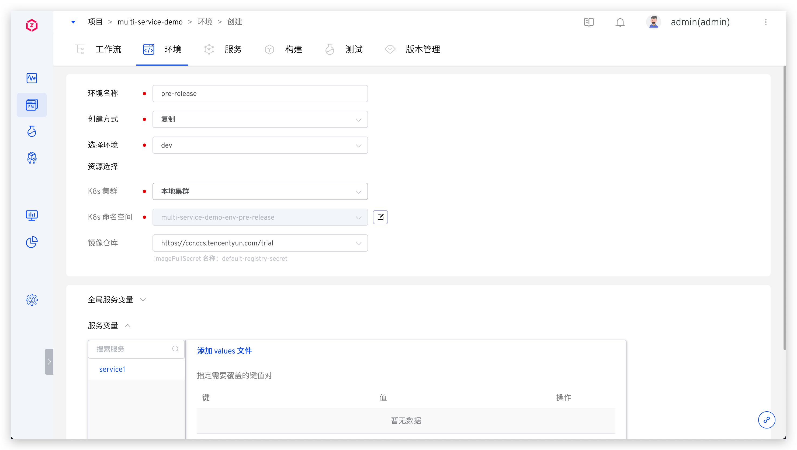

本文主要介绍 K8s Helm Chart 项目中的环境相关操作。

## 创建环境

在项目中，点击`创建环境`按钮进入创建环境页面。

### 基本信息
- `环境名称`：要创建的环境的名称，比如：`dev`、`pre-release`。
- `创建方式`：包括`新建`和`复制`。
	- `新建`：基于服务的 Chart 配置，创建全新的环境。
	- `复制`：基于在 Zadig 中已有的环境复制一份新的环境出来。
- `选择环境`：当创建方式是`复制`时需要配置该项，用于选择要复制的环境。
- `资源选择`：
	- `K8s 集群`：选择创建环境时所使用的集群资源，其中`本地集群`指 Zadig 系统所在的集群。关于集群的集成可参考[集群管理](/dev/pages/cluster_manage/)。
	- `K8s 命名空间`：不同的环境会使用独立的 Kubernetes 命名空间实现隔离。Zadig 系统创建命名空间的默认规则为 `项目名-env-环境名`，用户也可以自定义或者选择已有命名空间。
	- `镜像仓库`：指定环境创建后所使用的镜像仓库，使用工作流构建部署服务，以及修改服务镜像，均会使用此处指定的镜像仓库。关于镜像仓库的集成可参考[镜像仓库管理](/dev/settings/image-registry/#添加镜像仓库)。

### 全局服务变量
点击展开`全局服务变量`，可修改 values 文件内容设置环境级别的变量值，系统支持 2 种方式设置全局服务变量：

- 手动输入 YAML 格式文件的内容，内容详情即为要设置的变量信息。
- 从指定代码库同步 values。

### 服务变量

可选择修改指定服务的 values 文件内容配置服务级别的变量值，系统支持 3 种方式修改服务变量：
- 手动输入 values 文件内容。
- 从指定代码库同步 values 文件。
- 手动输入 key/value 键值对，覆盖在创建 Helm Chart 服务时导入的 values 文件内容。

::: tip 扩展知识
1. 服务变量的设置只对单一服务生效。
2. 全局服务变量的设置对当前环境的所有服务都生效。
2. 如果既设置了全局服务变量，又设置了服务变量时，服务变量的优先级高于全局服务变量。
:::

### 开始创建
输入环境名称，按需设置服务变量等信息后，点击`立即创建`按钮即可开始创建环境。

::: tip
服务数量以及启动服务所需的资源会影响环境的创建时间，请耐心等待。
:::

## 查看环境
环境创建完成后，点击不同的环境 Tab 即可切换到该环境的详情页面。

### 基本信息
基本信息包括 K8s 集群，K8s 命名空间，更新时间，环境状态，镜像仓库。

环境状态有以下几种情况：
- `创建中`：正在创建。
- `更新中`：正在更新。
- `删除中`：正在删除。
- `正在运行`：环境中所有服务都是正常的 Running 状态。
- `运行不稳定`：环境中一部分服务处于 Unstable 状态，可能的情况有两种：
	- 容器服务出现了问题。
	- 容器服务正在进行更新操作，例如更新镜像，会出现短时间的服务 Unstable，当更新过程完成之后，服务状态会恢复为 Running。
- `环境可更新`：当已创建的环境对应的环境模板有更新之后，环境处于可更新状态，有读写权限的用户可以看到`更新环境`按钮，点击按钮可对环境进行模板和配置的更新。

### 基本操作

环境操作包括：

- `更新环境变量`：包括更新全局服务变量和服务变量。
- `更新环境`：当前项目-服务中的 Helm Chart 有增/删/内容变更时，环境中会自动出现更新环境按钮。
- `删除环境`：删除当前创建的环境，环境删除后不可恢复。

### 服务详情

在服务列表中点击具体的服务可查看该服务的更多信息，可以对服务进行服务重启、服务伸缩、配置管理、更新镜像等操作。具体请阅读[服务详情](/dev/project/env/service/)。

## 更新环境
当环境可更新时，点击基本操作中的`更新环境`即可对环境进行更新。

## 删除环境
点击基本操作中的`删除环境`按钮并输入环境名即可删除环境。

- 如果环境是基于新的 Namespace 创建的，则删除环境操作会删除对应的 Namespace 及其中的资源。
- 如果环境是基于已有 Namespace 创建的，则删除环境操作会清理环境中的服务资源，但不会删除 Namespace。

