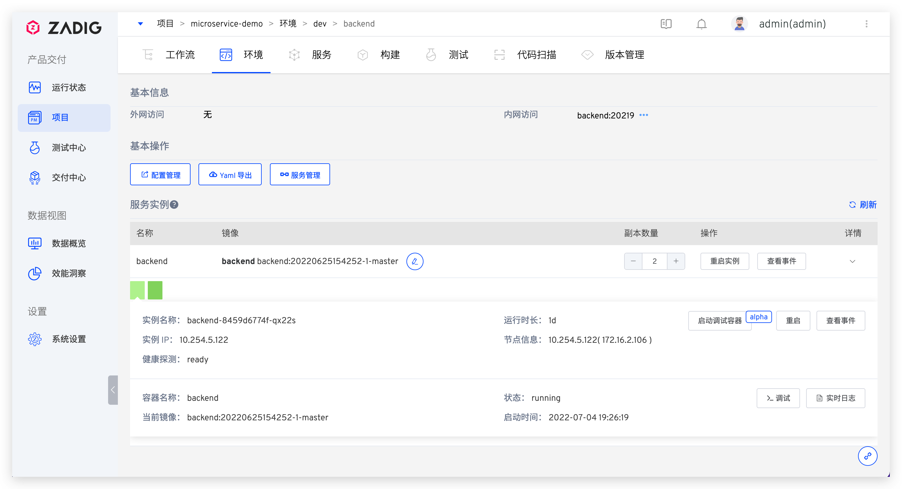
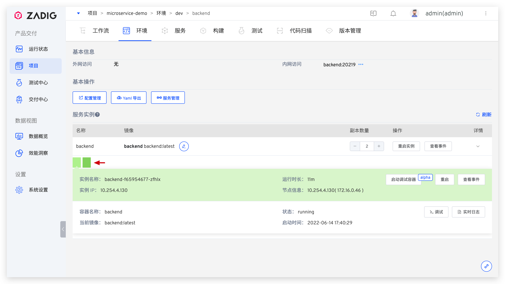
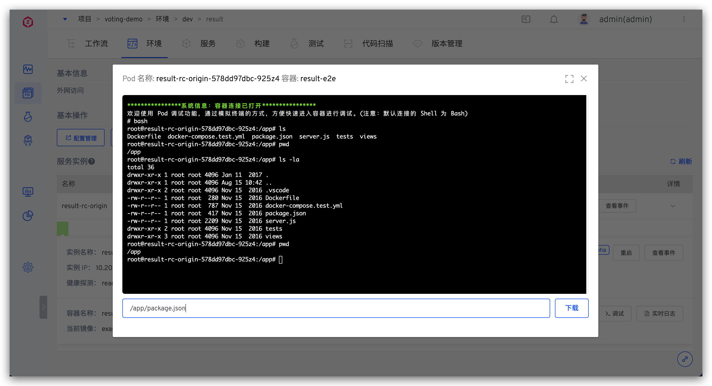

本文主要介绍基础设施使用 Kubernetes 的项目中（即：K8s YAML 项目/K8s Helm Chart 项目/K8s 托管项目)，环境里的服务相关操作。

在服务列表中点击服务名即可进入服务详情页面。服务详情页面展示了服务的详细信息，用户可以对服务进行服务重启、调试、服务伸缩、配置管理、更新镜像等操作。

	
## 基本信息
服务基本信息展示了服务的外网访问信息，以及内网 Service 访问信息。

- `外网访问`：服务的 Ingress 配置信息
- `内网访问`：服务的 Service 配置信息

## 基本操作
> K8s YAML 项目和 K8s Helm Chart 项目中有此功能。

- `配置管理`: 查看和编辑该服务的相关配置
- `YAML 导出`: 将服务信息导出为 K8s YAML 形式
- `服务管理`: 链接到该服务的模板详情

## 服务实例操作
- `镜像更新`：点击镜像右侧的编辑按钮，可更新该服务使用的镜像，选择新的镜像后容器会自动拉取并更新镜像，同时进行重启
- `重启实例`：点击按钮重启该服务
- `查看事件`：查看 Pod Event
- `副本数量`：动态调整服务的副本数量

### 服务实例详情

服务实例详情列表显示了容器服务所有的实例，切换实例后可查看每个服务实例（Pod）下的容器（Container）详细信息。

用户可对单个服务实例进行操作：

- `重启`：重启选中的实例
- `查看事件`：查看当前服务实例 Pod Event 事件

- `实时日志`：查看当前服务实例的实时日志

- `调试`：登录到服务实例 Pod 中，可在 Pod 中进行 debug 调试

- `启动调试容器`alpha：启动调试容器，可登录到调试容器中对服务进行 debug 调试，细节参考[启动调试容器](#启动调试容器)

### 启动调试容器 alpha

::: tip
该功能和被调试服务所在集群的配置有关，说明如下：

1. 集群版本在 v1.16 以下时，该功能不可使用
2. 集群版本在 v1.16~v1.22 时，需调整集群系统组件配置，使用 feature-gates 设置 EphemeralContainers=true
3. 集群版本在 v1.23 及以上时，无需额外操作即可使用该功能
:::

启动调试容器，可使用系统内置镜像，也可根据实际需求输入自定义镜像。
> 内置镜像中提供 `curl`/`wget`/`iputils-ping`/`telnet`/`dnsutils`/`tcpdump`/`net-tools`/`procps`/`sysstat` 工具可直接使用。

待调试容器 `zadig-debug` 正常启动后，点击`调试`登录进容器，可使用该容器中的工具对服务做 debug 调试。

