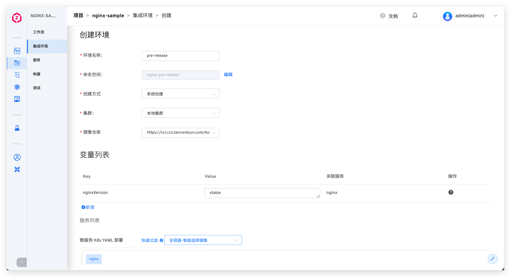

本文主要介绍生产环境的相关操作。

## 创建环境
在项 K8s YAML 项目或 K8s Helm Chart 项目中，点击`创建环境`按钮，选择生产环境。

### 基本信息

- `环境名称`：要创建的环境的名称，比如：`dev`、`pre-release`。
- `K8s 集群`：选择创建环境时所使用的集群资源，其中`本地集群`指 Zadig 系统所在的集群。关于集群的集成可参考[集群管理](/dev/pages/cluster_manage/)。
- `K8s 命名空间`：不同的环境会使用独立的 Kubernetes 命名空间实现隔离。Zadig 系统创建命名空间的默认规则为 `项目名-env-环境名`，用户也可以自定义或者选择已有命名空间。
- `别名`：非必填，用户可根据自身需要设置别名。

## 查看环境

环境创建完成后，点击不同的环境 Tab 即可切换到该环境的详情页面。

