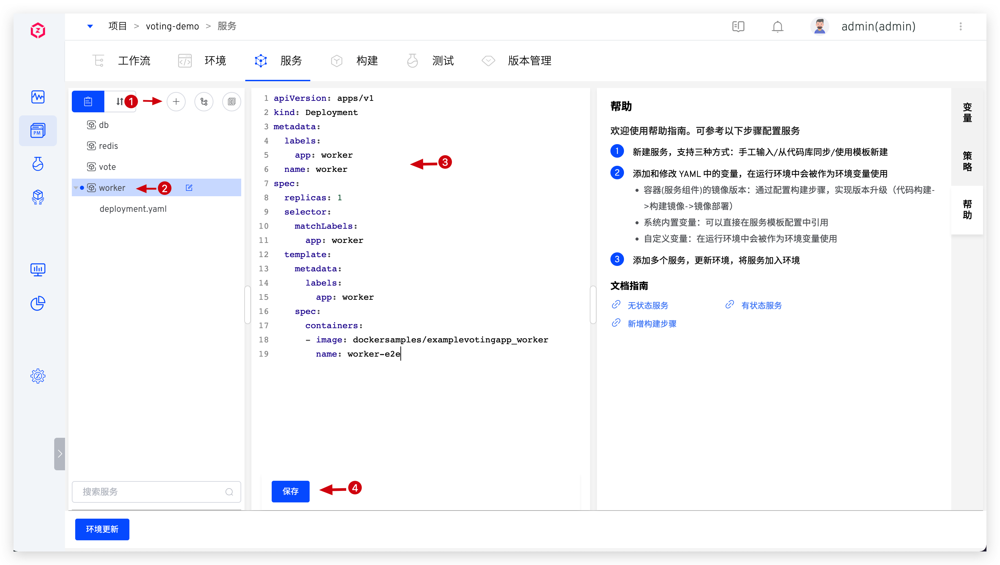
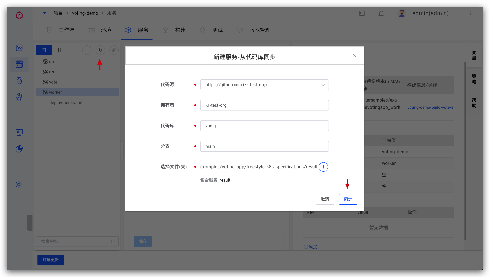
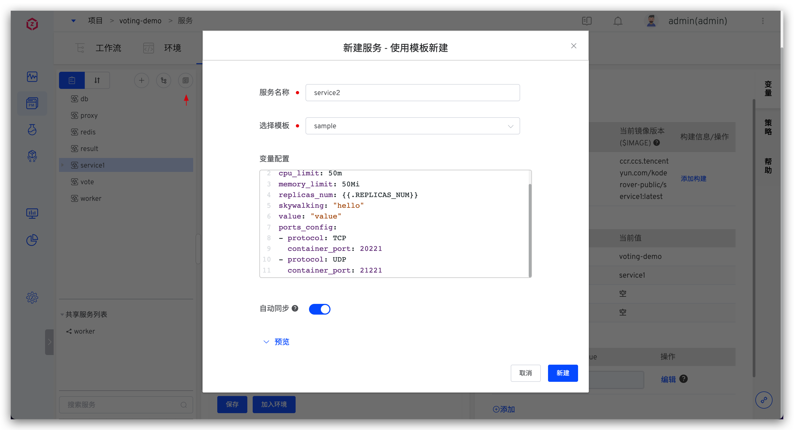
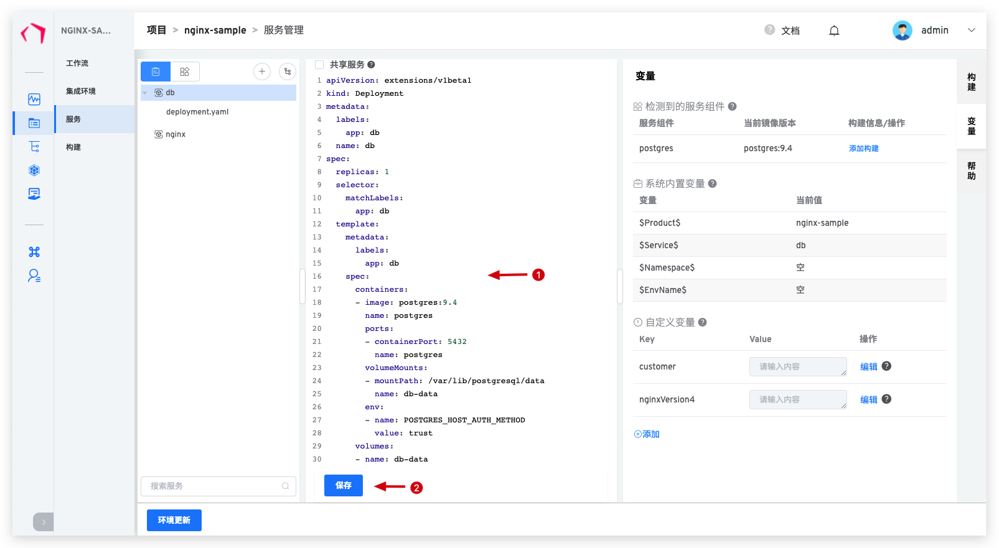
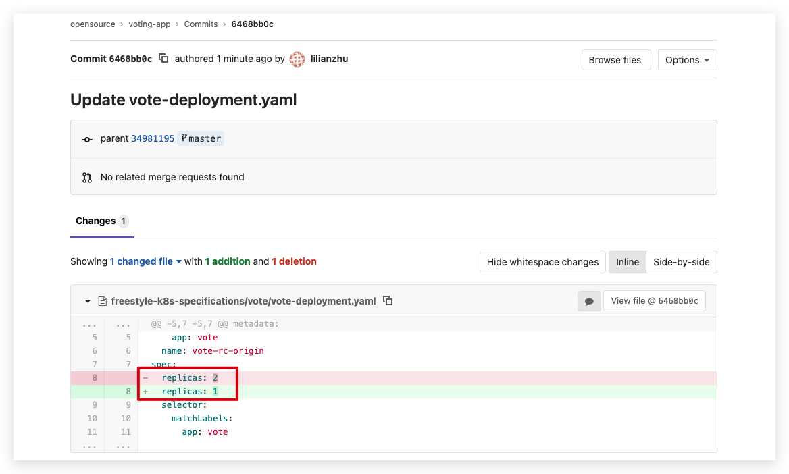
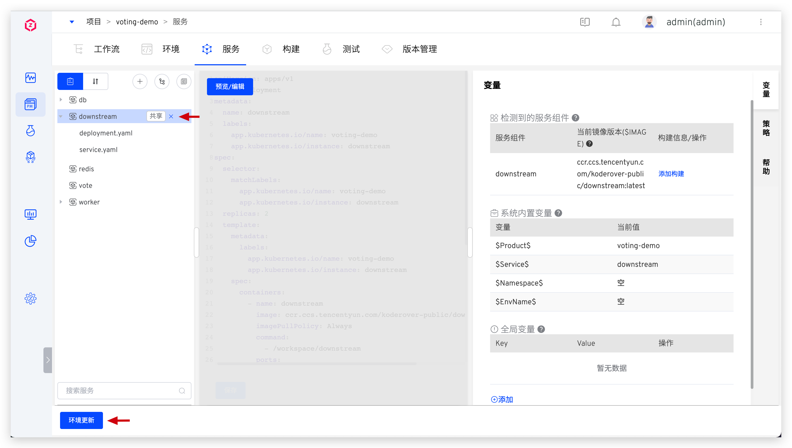
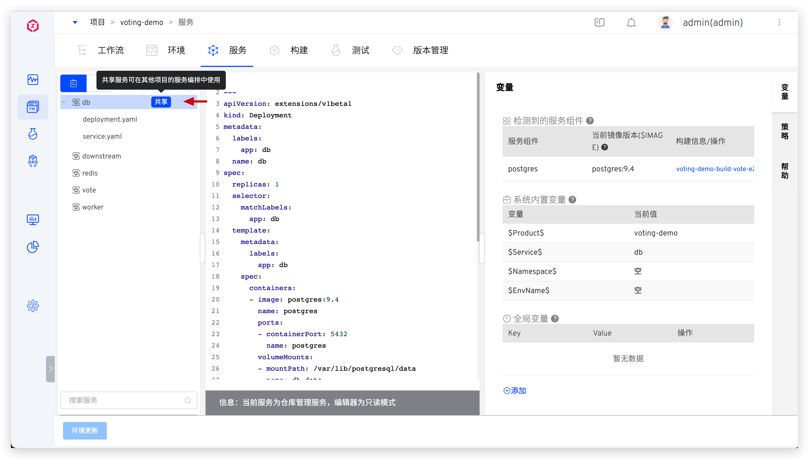
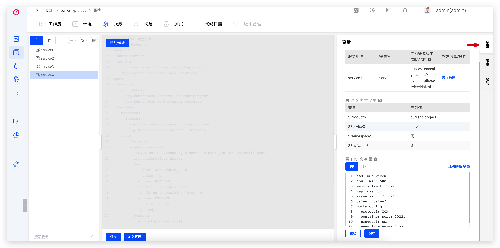
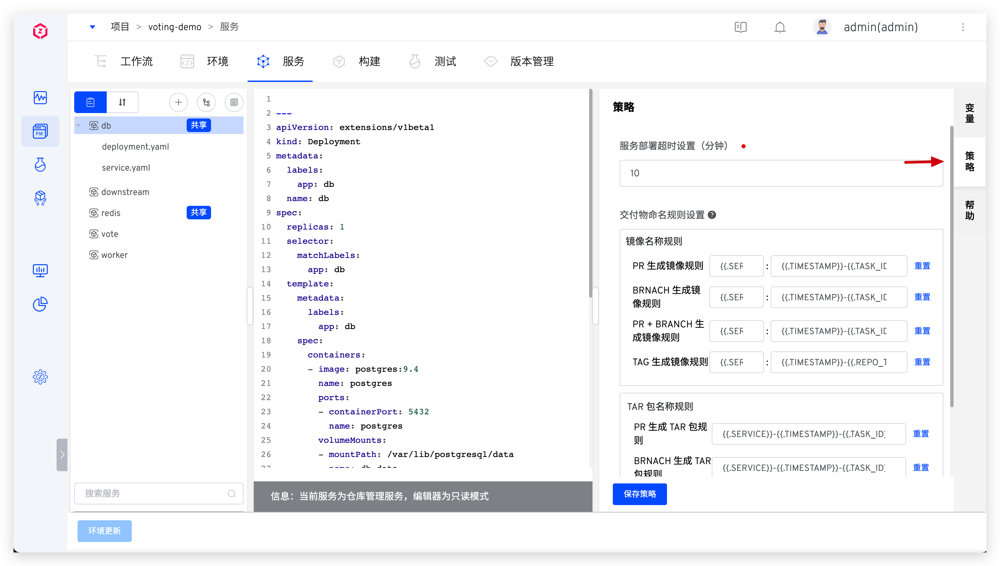

本文介绍 K8s YAML 项目中的服务相关操作。

## 新建服务

进入项目的服务管理页面。


系统支持以下三种方式创建 K8s YAML 服务：
- `手工输入`：在创建服务时手工输入服务的 K8s YAML 配置文件。
- `从代码库同步`：从代码库中同步服务的 K8s YAML 配置，一次同步可创建一个服务也可创建多个服务。当代码库中的服务配置有变更时，会通过 Webhook 自动更新 Zadig 平台中的服务配置。
- `使用模板新建`：使用 Zadig 平台中的服务 K8s YAML 模板来创建服务。

### 手工输入服务

点击手工输入按钮 -> 填写服务名称 -> 将服务 K8s YAML 填入编辑器 -> 点击保存按钮，即可新建服务。



添加服务成功后即可对环境进行更新：点击`环境更新`，选择要更新的环境，将服务加入到环境中。


### 从代码库同步单个服务

::: tip 前提
需要在系统中集成代码源，可参考：[代码源集成](/dev/settings/codehost/gitlab/)。
:::

服务的 YAML 配置组织在单独的文件夹中，点击从代码库同步按钮 -> 选择具体的代码库和服务配置文件所在的目录 -> 点击同步，即可从代码库同步新建服务。

以 [result](https://github.com/koderover/zadig/tree/main/examples/voting-app/freestyle-k8s-specifications/result) 服务为例：



同步后，效果如下：


### 从代码库同步多个服务

::: tip 前提
需要在系统中集成代码源，可参考：[代码源集成](/dev/settings/codehost/gitlab/)。
:::

多个服务的 YAML 配置分别组织在同一级目录的单独文件夹中，点击从代码库同步按钮 -> 选择具体的代码库和多个服务配置文件所在的目录 -> 点击同步，即可从代码库同步新建多个服务。

以 [voting](https://github.com/koderover/zadig/tree/main/examples/voting-app/freestyle-k8s-specifications/result)  项目中的 5 个服务为例说明，多个服务的配置文件组织：

```shell
├── 根目录(zadig/examples/voting-app/freestyle-k8s-specifications)
│   ├── db
│   │   ├── db-deployment.yaml
│   │   └── db-service.yaml
│   ├── redis
│   │   ├── redis-deployment.yaml
│   │   └── redis-service.yaml
│   ├── result
│   │   ├── result-deployment.yaml
│   │   └── result-service.yaml
│   ├── vote
│   │   ├── vote-deployment.yaml
│   │   └── vote-service.yaml
│   └── worker
│       └── worker-deployment.yaml
```

从代码库同步多个服务：


同步后，效果如下：


### 使用模板新建服务

::: tip 前提
需要先在系统模板库里创建 K8s YAML 模板，请参考 [K8s YAML 模板管理](/dev/template/k8s_yaml/)。
:::

点击使用模板新建按钮 -> 填写服务名称，选择模板，按需对模板中的变量进行赋值 -> 点击新建，即可使用此模板和赋值的变量新建服务。



## 更新服务
下面分别介绍如何更新使用不同方式新建的服务。

### 更新手工输入的服务

修改服务的 K8s YAML  内容并保存即可。



服务修改成功后即可对环境进行更新：点击环境更新，选择要更新的环境对环境中的服务进行更新。


### 更新从代码库同步的服务

* 提交服务配置变更到代码仓库。



* 变更合并后，会通过 Webhook 的能力自动同步最新配置到 Zadig 系统。也可以在界面上手动同步服务配置，如下图所示。


* 在环境中，查看服务配置变更，点击更新服务钮执行更新操作。


### 更新使用模板新建的服务
点击使用模板新建的服务 -> 点击预览/编辑，即可预览/编辑该服务的 K8s YAML 配置。


## 删除服务

点击服务右侧的删除按钮即可将服务删除。



## 服务组件

服务组件是 Zadig 中可被更新的最小单元，系统解析 YAML 配置文件中 container 的名称为服务组件，一个服务可包含多个服务组件。


- `服务组件`：container 的名称
- `镜像名`：系统会按照`仓库地址/命名空间/镜像名:标签名`规则来解析 YAML 配置文件中的 image，标签名前面的最后一段值即为镜像名称。
- `当前镜像版本`：YAML 配置文件中，container 的 `image` 信息
- `构建信息/操作`：可为服务组件配置构建操作，定义其构建过程，参考：[构建配置](/dev/project/build)

## 服务编排
> Zadig 系统支持对多个服务进行编排，重新组合定义多个服务的启动顺序，适用于多个服务的启动顺序有先后依赖关系的场景。

点击`服务编排`图标，按需对服务启动顺序进行拖拽组合。


## 共享服务
> 一个 K8s YAML 服务在某个项目中被设置为共享后，可被添加到使用 K8s YAML 部署的其他项目中去，参与该项目的服务编排。

- 设置共享服务：点击服务右侧的`共享`按钮即可设置该服务为共享服务。



- 使用共享服务：在共享服务列表中，点击服务右侧的`+`即可将该服务添加到当前项目中，且服务右侧会有`共享`字段标识。


::: tip 扩展阅读
- 使用共享服务只是复用服务的定义，并不是共享服务实例。在不同项目的环境中，相同的共享服务也是独立的服务实例。
- 使用其他项目中的共享服务时，构建过程会使用该共享服务对应的构建脚本。
:::

## 变量配置
> 包括系统内置变量和全局变量，可在服务 YAML 中进行引用，其中服务组件名和镜像信息中只能引用使用内置变量 `$Product$` 和 `$Service$`。



### 系统内置变量
包括 `$Namespace$`、`$Product$`、`$Service$`、`$EnvName$`，可直接在 YAML 中进行引用，具体说明如下：

  - `$Namespace$`：项目创建的环境所在的 K8s 空间名称，不可用于服务组件名称和镜像信息中
  - `$Product$`：项目名称
  - `$Service$`：服务名称
  - `$EnvName$`：创建的环境名称，不可用于服务组件名称和镜像信息中

### 全局变量

通过平台新增 `Key`，可输入默认 `Value`，通过关键字：<span v-pre>`{{.key}}`</span> 引用

例如：在 K8s YAML 中引用配置的变量
```yaml
apiVersion: extensions/v1beta1
kind: Ingress
metadata:
  name: $Product$-index  //引用系统内置变量 $Product$，环境创建时被渲染
spec:
  rules:
  - host: {{.portal_host}} //引用全局变量 portal_host，环境创建时被渲染
    http:
      paths:
      - backend:
          serviceName: $Product$-index
          servicePort: 80
        path: /
```
### 变量的使用

#### 创建集成环境时使用

在创建环境时，对项目中所有服务的 YAML 和服务配置文件进行渲染。


#### 环境变量更新时使用

在环境中，对于正常运行中的服务，可以自行更新变量值，基本操作中点击`更新环境变量`，即可更新对应环境中的环境变量。


## 策略配置
在策略中设置部署服务的超时时间以及交付物命名规则。



说明如下：
- 服务部署超时设置：将服务部署到环境中的超时时间，默认值为 10 分钟。若超出该阈值服务仍未处于 Running 状态，则视为部署超时。
- 交付物命名规则设置：自定义该项目中工作流构建产物的命名规则，对当前项目的所有服务都生效，可通过以下变量和常量组合的方式设置。

|变量名称|描述|
|-------|---|
|`TIMESTAMP`|工作流任务的执行时间戳，形如 `20211029113304`|
|`TASK_ID`|工作流任务的 ID|
|`REPO_BRANCH`|构建过程中指定代码仓库使用的分支信息|
|`REPO_PR`|构建过程中指定代码仓库使用的 Pull Request 信息|
|`REPO_TAG`|构建过程中指定代码仓库使用的 Tag 信息|
|`REPO_COMMIT_ID`|构建过程中指定代码仓库使用的 Commit ID 信息|
|`PROJECT`|构建所属的 Zadig 项目名称|
|`SERVICE`|构建编译的服务名称|
|`ENV_NAME`|构建部署的环境名称|
|`字符常量`|大小写字母、数字、中划线、下划线及点组合生成的 127 个字符以内的常量|

## 服务 YAML 样例
### 无状态服务

概念：服务运行的实例不会在本地存储需要持久化的数据，并且多个实例对于同一个请求响应的结果是完全一致的。可以参考[这篇文章](https://kubernetes.io/zh/docs/tasks/run-application/run-stateless-application-deployment/)了解无状态服务的更多细节。
::: details
```yaml
apiVersion: apps/v1
kind: Deployment
metadata:
  name: nginx-deployment
spec:
  selector:
    matchLabels:
      app: nginx
  replicas: 2 # 2 个 Pod 实例
  template:
    metadata:
      labels:
        app: nginx
    spec:
      containers:
      - name: nginx
        image: nginx:1.14.2
        ports:
        - containerPort: 80
```
:::

### 有状态服务

概念：服务的实例可以将一部分数据随时进行备份，并且在创建一个新的有状态服务时，可以通过备份恢复这些数据，以达到数据持久化的目的。可以参考[这篇文章](https://kubernetes.io/zh/docs/tasks/run-application/run-replicated-stateful-application/)了解有状态服务的更多细节。
::: details
```yaml
apiVersion: v1
kind: ConfigMap
metadata:
  name: mysql
  labels:
    app: mysql
data:
  master.cnf: |
    # Apply this config only on the master.
    [mysqld]
    log-bin
  slave.cnf: |
    # Apply this config only on slaves.
    [mysqld]
    super-read-only
---
# Headless service for stable DNS entries of StatefulSet members.
apiVersion: v1
kind: Service
metadata:
  name: mysql
  labels:
    app: mysql
spec:
  ports:
  - name: mysql
    port: 3306
  clusterIP: None
  selector:
    app: mysql
---
# Client service for connecting to any MySQL instance for reads.
# For writes, you must instead connect to the master: mysql-0.mysql.
apiVersion: v1
kind: Service
metadata:
  name: mysql-read
  labels:
    app: mysql
spec:
  ports:
  - name: mysql
    port: 3306
  selector:
    app: mysql
---
apiVersion: apps/v1beta1
kind: StatefulSet
metadata:
  name: mysql
spec:
  selector:
    matchLabels:
      app: mysql
  serviceName: mysql
  # 1 master and 2 slave
  replicas: 3
  template:
    metadata:
      labels:
        app: mysql
    spec:
      initContainers:
      - name: init-mysql
        image: mysql:5.7
        command:
        - bash
        - "-c"
        - |
          set -ex
          # Generate mysql server-id from pod ordinal index.
          [[ `hostname` =~ -([0-9]+)$ ]] || exit 1
          ordinal=${BASH_REMATCH[1]}
          echo [mysqld] > /mnt/conf.d/server-id.cnf
          # Add an offset to avoid reserved server-id=0 value.
          echo server-id=$((100 + $ordinal)) >> /mnt/conf.d/server-id.cnf
          # Copy appropriate conf.d files from config-map to emptyDir.
          if [[ $ordinal -eq 0 ]]; then
            cp /mnt/config-map/master.cnf /mnt/conf.d/
          else
            cp /mnt/config-map/slave.cnf /mnt/conf.d/
          fi
        volumeMounts:
        - name: conf
          mountPath: /mnt/conf.d
        - name: config-map
          mountPath: /mnt/config-map
      - name: clone-mysql
        image: gcr.azk8s.cn/google-samples/xtrabackup:1.0
        command:
        - bash
        - "-c"
        - |
          set -ex
          # Skip the clone if data already exists.
          [[ -d /var/lib/mysql/mysql ]] && exit 0
          # Skip the clone on master (ordinal index 0).
          [[ `hostname` =~ -([0-9]+)$ ]] || exit 1
          ordinal=${BASH_REMATCH[1]}
          [[ $ordinal -eq 0 ]] && exit 0
          # Clone data from previous peer.
          ncat --recv-only mysql-$(($ordinal-1)).mysql 3307 | xbstream -x -C /var/lib/mysql
          # Prepare the backup.
          xtrabackup --prepare --target-dir=/var/lib/mysql
        volumeMounts:
        - name: data
          mountPath: /var/lib/mysql
          subPath: mysql
        - name: conf
          mountPath: /etc/mysql/conf.d
      containers:
      - name: mysql
        image: mysql:5.7
        env:
        - name: MYSQL_ALLOW_EMPTY_PASSWORD
          value: "1"
        ports:
        - name: mysql
          containerPort: 3306
        volumeMounts:
        - name: data
          mountPath: /var/lib/mysql
          subPath: mysql
        - name: conf
          mountPath: /etc/mysql/conf.d
        resources:
          requests:
            cpu: 500m
            memory: 1Gi
          limits:
            cpu: 500m
            memory: 1Gi
        livenessProbe:
          exec:
            command: ["mysqladmin", "ping"]
          initialDelaySeconds: 30
          periodSeconds: 10
          timeoutSeconds: 5
        readinessProbe:
          exec:
            # Check we can execute queries over TCP (skip-networking is off).
            command: ["mysql", "-h", "127.0.0.1", "-e", "SELECT 1"]
          initialDelaySeconds: 5
          periodSeconds: 2
          timeoutSeconds: 1
      - name: xtrabackup
        image: gcr.azk8s.cn/google-samples/xtrabackup:1.0
        ports:
        - name: xtrabackup
          containerPort: 3307
        command:
        - bash
        - "-c"
        - |
          set -ex
          cd /var/lib/mysql

          # Determine binlog position of cloned data, if any.
          if [[ -f xtrabackup_slave_info && "x$(<xtrabackup_slave_info)" != "x" ]]; then
            # XtraBackup already generated a partial "CHANGE MASTER TO" query
            # because we're cloning from an existing slave. (Need to remove the tailing semicolon!)
            cat xtrabackup_slave_info | sed -E 's/;$//g' > change_master_to.sql.in
            # Ignore xtrabackup_binlog_info in this case (it's useless).
            rm -f xtrabackup_slave_info xtrabackup_binlog_info
          elif [[ -f xtrabackup_binlog_info ]]; then
            # We're cloning directly from master. Parse binlog position.
            [[ `cat xtrabackup_binlog_info` =~ ^(.*?)[[:space:]]+(.*?)$ ]] || exit 1
            rm -f xtrabackup_binlog_info xtrabackup_slave_info
            echo "CHANGE MASTER TO MASTER_LOG_FILE='${BASH_REMATCH[1]}',\
                  MASTER_LOG_POS=${BASH_REMATCH[2]}" > change_master_to.sql.in
          fi

          # Check if we need to complete a clone by starting replication.
          if [[ -f change_master_to.sql.in ]]; then
            echo "Waiting for mysqld to be ready (accepting connections)"
            until mysql -h 127.0.0.1 -e "SELECT 1"; do sleep 1; done

            echo "Initializing replication from clone position"
            mysql -h 127.0.0.1 \
                  -e "$(<change_master_to.sql.in), \
                          MASTER_HOST='mysql-0.mysql', \
                          MASTER_USER='root', \
                          MASTER_PASSWORD='', \
                          MASTER_CONNECT_RETRY=10; \
                        START SLAVE;" || exit 1
            # In case of container restart, attempt this at-most-once.
            mv change_master_to.sql.in change_master_to.sql.orig
          fi

          # Start a server to send backups when requested by peers.
          exec ncat --listen --keep-open --send-only --max-conns=1 3307 -c \
            "xtrabackup --backup --slave-info --stream=xbstream --host=127.0.0.1 --user=root"
        volumeMounts:
        - name: data
          mountPath: /var/lib/mysql
          subPath: mysql
        - name: conf
          mountPath: /etc/mysql/conf.d
        resources:
          requests:
            cpu: 100m
            memory: 100Mi
      volumes:
      - name: conf
        emptyDir: {}
      - name: config-map
        configMap:
          name: mysql
  volumeClaimTemplates:
  - metadata:
      name: data
    spec:
      accessModes: ["ReadWriteOnce"]
      resources:
        requests:
          storage: 10Gi
```
:::
