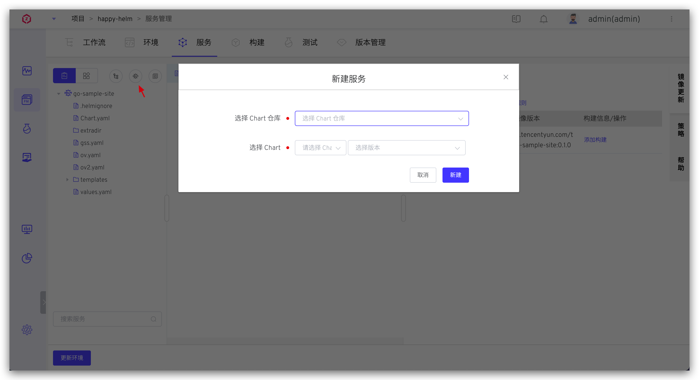
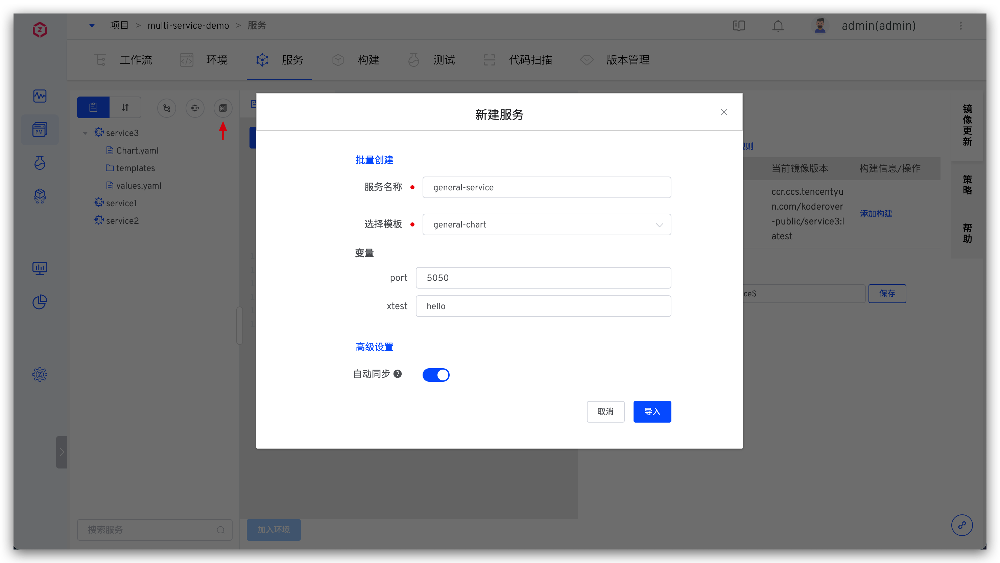
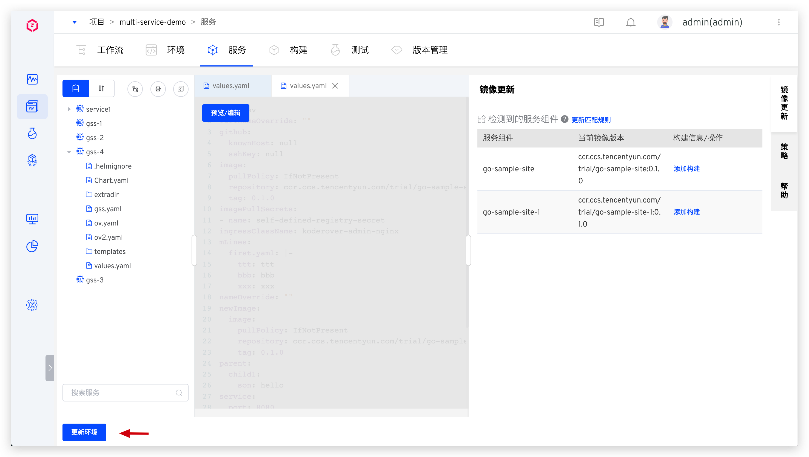
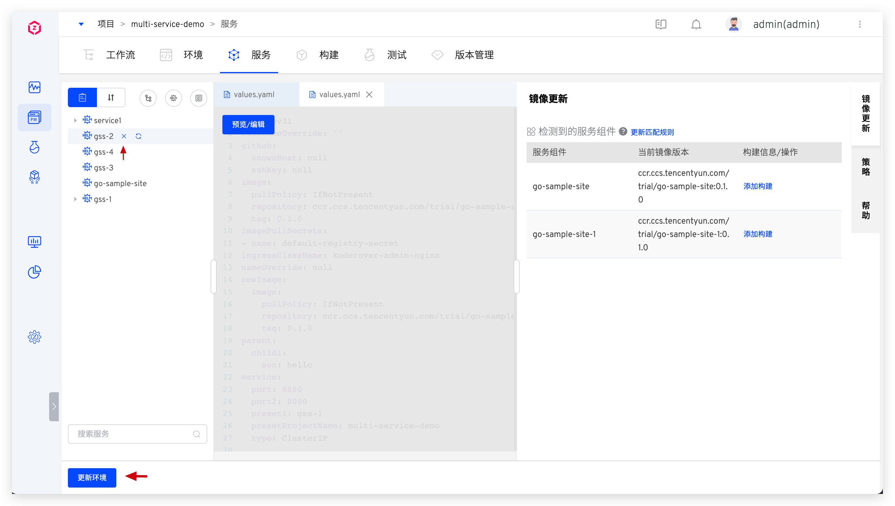

本文介绍 K8s Helm Chart 项目中的服务相关操作。[Helm](https://helm.sh/) 是 Kubernetes 应用的包管理工具，使用 Helm Chart 可定义、安装和升级复杂的 Kubernetes 应用。

## 新建服务

支持从代码库同步、从 Chart 仓库同步、使用模板新建三种方式创建 K8s Helm Chart 服务。

- `从代码库同步`：从代码库中同步服务的 Helm Chart 配置，支持 GitHub/GitLab/Gerrit 代码库。
- `从 Chart 仓库同步`：从 Chart 仓库中同步服务的 Helm Chart 配置。
- `使用模板新建`：使用 Zadig 平台中的服务 Helm Chart 模板来创建服务，支持一次创建一个服务，也支持批量创建服务。

### 从代码库同步服务
点击从代码库同步 -> 填写代码库及服务配置在代码库中的目录 -> 点击加载，即可从代码库同步服务。同步成功后，当代码库中对应目录的文件有变更时，会通过 Webhook 的方式自动更新此处的服务配置。

::: tip 前提
需要先集成代码源，参考 [GitLab](/dev/settings/codehost/gitlab/)/[GitHub](/dev/settings/codehost/github/)/[Gerrit](dev/settings/codehost/gerrit/) 集成。
:::

以 [service2](https://github.com/koderover/zadig/tree/main/examples/multi-service-demo/full-charts/service2) 服务为例，服务的 Helm Chart 配置目录结构为：

``` shell
├── zadig/examples/multi-service-demo/full-charts/service2
│   ├── Chart.yaml
│   ├── templates
│   │   ├── _helpers.tpl
│   │   ├── deployment.yaml
│   │   └── service.yaml
│   └── values.yaml
```

从代码库同步该服务：


同步后效果：


### 从 Chart 仓库同步服务
::: tip 前提
需要先集成 Helm Chart 仓库，参考：[集成 Helm Chart 仓库](/dev/settings/helm/)。
:::

点击从 Chart 仓库同步，选择 Chart 仓库及 Chart，新建即可。


### 使用模板新建单个服务
::: tip 前提
需要先在系统模板库里创建 Helm Chart 模板，请参考 [Helm Chart 模板管理](/dev/template/helm_chart/)
:::

- 点击使用模板新建 -> 填写服务名称并选择模板 -> 按需对模板中的变量进行覆盖赋值后，导入即可。



- 在`高级设置`中，系统还支持用新的 values.yaml 覆盖模板中的内容，包括手动输入和从指定 Git 仓库导入两种途径来覆盖。


### 使用模板批量新建服务

- 点击使用模板新建 -> 点击`批量创建` -> 选择 Helm Chart 模板 -> 选择要导入服务的 values 文件，导入即可。


- 一份 values 文件会被定义成一个服务，values 文件名即为服务名。服务批量创建完毕后，点击`更新环境`即可将服务快速应用于环境中。



## 服务组件

服务组件是 Zadig 中可被更新的最小单元。


- `服务组件`：同`镜像名`
- `镜像名`：按照`仓库地址/命名空间/镜像名:标签名`的规则来解读`当前镜像版本`，标签名前面的最后一段值即为镜像名称
- `当前镜像版本`：系统按照一定的规则对 values.yaml 文件做解析获得镜像信息，解析规则可阅读[服务组件镜像解析规则](#服务组件镜像解析规则)
- `构建信息/操作`：可为服务组件配置构建操作，定义其构建过程，参考：[构建配置](/dev/project/build)

### 服务组件镜像解析规则

包括内置规则和自定义规则，导入 Helm Chart 配置文件后，系统会按照内置规则解析 vaues.yaml 文件中的镜像内容。当内置规则不满足需求时，可点击服务组件右侧的`更新匹配规则`来自定义镜像解析规则。


**内置规则**
1. values.yaml 中有如下代码段结构，拼接 `image.repository:image.tag` 作为该组件的镜像版本，服务的部署版本和更新均围绕 `image.repository` 和 `image.tag`。该例中即为：`ccr.ccs.tencentyun.com/koderover-public/backend:latest`。

::: details
```yaml
# Helm Chart values.yaml Demo
key1: value1
key2: value2
key3:
  key4: value4
  key5:
    image:
      repository: "ccr.ccs.tencentyun.com/koderover-public/backend"
      tag: "latest"
  key6:
    ...
...
```
:::
2. values.yaml 中的 `image` 字段的值为镜像信息，服务的部署版本和更新均围绕 `image`。该例中即为 `ccr.ccs.tencentyun.com/koderover-public/backend:latest`。

::: details
```yaml
# Helm Chart values.yaml Demo
key1: value1
key2: value2
key3:
  key4: value4
  key5:
    image: "ccr.ccs.tencentyun.com/koderover-public/backend:latest"
  key6:
    ...
...
```
:::

**自定义规则**

1. 使用 key 的绝对路径来解析组件的镜像信息，下例中，自定义规则中填入 `deploy.image.repo`/`deploy.image.name`:`deploy.image.tag` 即可。
::: details
```yaml
key1: value1
key2: value2
...
deploy:
  image:
    repo: library
    name: ubuntu
    tag: 20.04
```
:::

2. 使用 key 的相对路径来解析服务组件的镜像信息，下例中，自定义规则中填入 `repo`/`name`:`tag` 即可。
::: details
```yaml
key1: value1
key2: value2
...
deploy:
  image:
    repo: library
    name: ubuntu
    tag: 20.04
```
:::

3. 支持使用一份解析规则来解析多个服务组件，下例中，自定义规则中填入 `repo`/`name`:`tag` 即可解析出 `service1` 和 `service2` 的镜像分别为 `library/service1:v1` 和 `library/service2:v2`。
::: details
```yaml
key1: value1
key2: value2
...
deploy:
  service1:
    repo: library
    name: service1
    tag: v1
  service2:
    repo: library
    name: service2
    tag: v2
```
:::

4. values.yaml 文件中可复用部分 key，下例中，自定义规则中填入 `public.repoInfo`/`name`:`tag` 即可解析出 `service1` 和 `service2` 的镜像分别为 `library/service1:v1` 和 `library/service2:v2`。
::: details
```yaml
key1: value1
key2: value2
...
public:
  repoInfo: library
deploy:
  service1:
    name: service1
    tag: v1
  service2:
    name: service2
    tag: v2
```
:::

5. 自定义规则中的 `仓库地址/命名空间` 和 `标签名` 非必填，下例中，在自定义规则的`镜像名`中填入 `deploy.image.name` 即可

::: details
```yaml
deploy:
  image:
    name: library/ubuntu:12.04
```
:::

## 更新服务

### 更新从代码库同步的服务

- 从代码库同步服务的 Chart 配置后，会自动创建 Webhook。当对应代码库中有变更时，会自动同步服务的 Chart 配置到 Zadig 中。也可以点击服务右侧的同步按钮，点击`加载`主动同步更新。


### 更新从 Chart 仓库同步的服务

- 点击服务右侧的同步按钮，按需修改 Chart 版本号，点击`更新`即可。


### 更新使用模板新建的服务

- 点击服务右侧的同步按钮，按需修改 Helm values 文件后点击`导入`即可。


## 删除服务

- 点击服务右侧的删除按钮即可将服务配置删除。若需要将服务从环境中也删除，点击`更新环境`并选择要更新的环境即可。



## 策略配置
在策略中设置部署服务的超时时间以及交付物命名规则。细节可阅读：[策略配置](/dev/project/k8s/service/#策略配置)。


## Helm Chart 样例

[koderover/zadig](https://github.com/koderover/zadig/tree/main) 库中提供了 Helm Chart 样例，点击[链接](https://github.com/koderover/zadig/tree/main/examples/multi-service-demo/full-charts/service1)查看详情。

