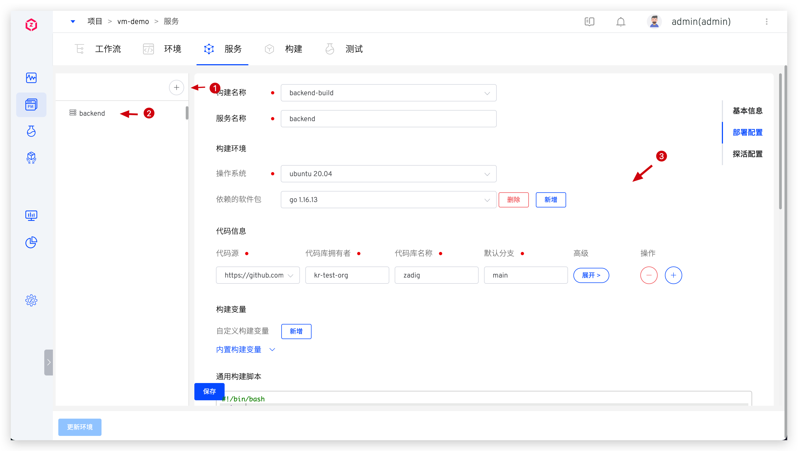
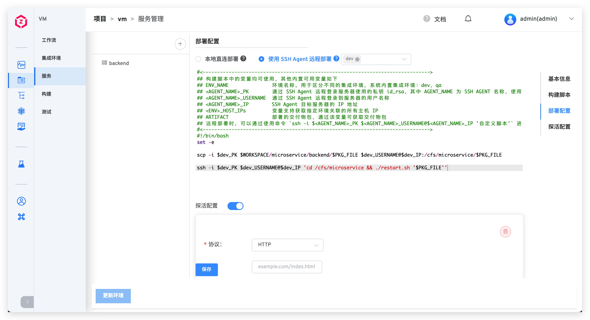
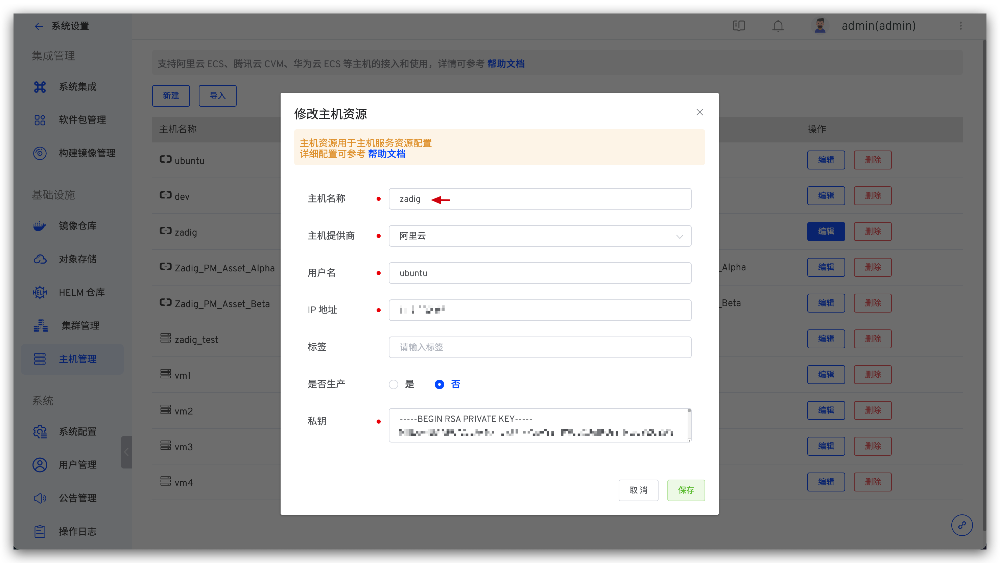
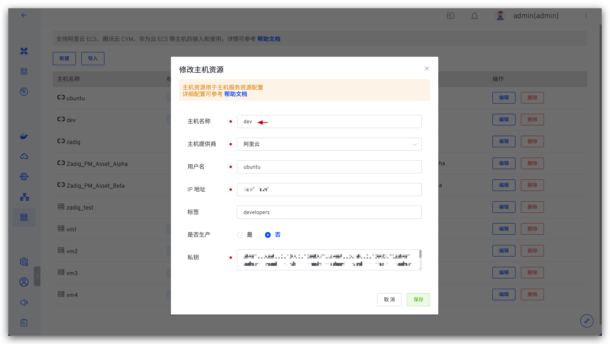
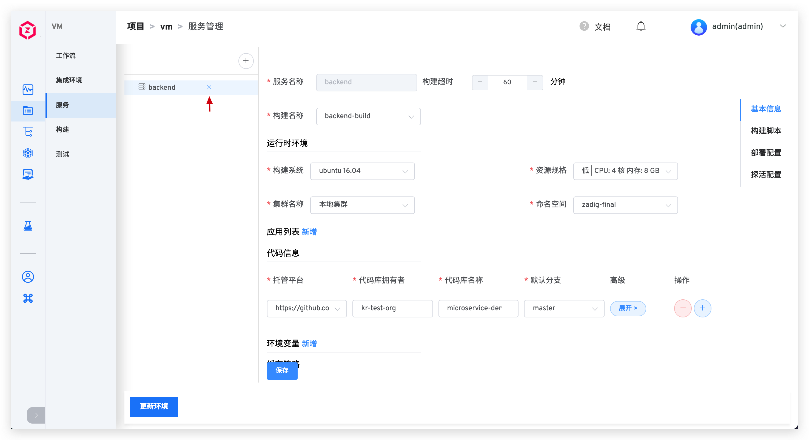

本文介绍主机项目中的服务相关操作。

点击添加服务按钮 -> 输入服务名称 -> 填写构建配置、部署配置及探活配置后，保存即可新建主机服务。

## 构建配置

配置服务构建所需的环境、代码等信息，定义服务的构建打包过程。

### 构建环境

配置构建过程运行时的环境，细节请阅读[构建环境](/dev/project/build/#构建环境)。

### 代码信息

配置服务构建时需要的相关代码库，细节可阅读[代码信息](/dev/project/build/#代码信息)。

### 构建变量

包括系统内置构建变量和用户自定义构建变量，可在构建脚本中直接使用，细节请阅读[构建变量](/dev/project/build/#构建变量)。

### 通用构建脚本

在通用构建脚本中声明代码的构建过程和实现，细节请阅读[通用构建脚本](/dev/project/build/#通用构建脚本)。

### 高级配置

包括构建超时配置、缓存配置和资源配置，细节请阅读[高级配置](/dev/project/build/#高级配置)。

### 更多构建步骤

包括镜像构建和二进制包存储，细节请阅读[更多构建步骤](/dev/project/build/#更多构建步骤)。

## 部署配置

配置部署方式及部署脚本，定义服务的部署过程。

### 本地直连部署

在 Zadig 中执行部署脚本，利用部署工具（比如：Ansible）将服务部署到目标主机上。需要确保部署工具就绪，Zadig 系统和目标部署主机的网络连通。

### SSH Agent 远程部署

安全登录到目标机器上执行部署操作。需要提前在系统中配置好主机资源，可参考[主机管理](/dev/settings/vm-management/)。

### 内置部署变量

除了可使用[构建变量](#构建变量)中的变量，还包括以下变量：

- `<AGENT_NAME>_PK`：通过 SSH Agent 远程登录主机使用的私钥信息，其中 AGENT_NAME 为 SSH Agent 名称。使用下图例中的主机作为 SSH Agent，则部署脚本中使用 $zadig_PK 即可获得该主机服务器的私钥信息。
- `<AGENT_NAME>_USERNAME`：通过 SSH Agent 远程登录到主机的用户名称，下图例中即为 $zadig_USERNAME。
- `<AGENT_NAME>_IP`：SSH Agent 目标服务器的 IP 地址，下图例中即为 $zadig_IP。

- `<ENV>_HOST_IPs`：获得指定环境所关联的所有主机 IP，下图例中，使用 $dev_HOST_IPs 即可获得 dev 环境所关联的所有主机 IP 信息。
- `<ENV>_HOST_NAMEs`：获取指定环境所关联的所有主机名称，下图例中即为 $dev_HOST_NAMEs。

- `<HOST_NAME>_PK`：HOST_NAME 为具体的主机名称，通过 `<HOST_NAME>_PK` 获得对应主机的私钥信息，下图例中即为 $dev_PK。
- `<HOST_NAME>_USERNAME`：HOST_NAME 为具体的主机名称，通过 `<HOST_NAME>_USERNAME` 获得对应主机的用户名信息，下图例中即为 $dev_USERNAME。
- `<HOST_NAME>_IP`：HOST_NAME 为具体的主机名称，通过 `<HOST_NAME>_IP` 获得对应主机的 IP 地址信息，下图例中即为 $dev_IP。

- `ARTIFACT`：部署的交付物包，通过该变量可获取交付物包。
    - 使用构建部署工作流部署服务时，交付物包的实体为[更多构建步骤](#更多构建步骤)中增加的二进制包存储，即 $PKG_FILE 文件。
    - 使用交付物部署工作流部署服务时，交付物包的实体为运行工作流时从对象存储中选择的资源。

### 部署脚本

部署脚本和[通用构建脚本](#通用构建脚本)共享存储卷，在构建脚本中生成的包可直接在部署脚本中使用。可在部署脚本中使用[构建变量](#构建变量)和[内置部署变量](#内置部署变量)。

## 探活配置

服务部署成功后，按照一定规则对服务进行探活检测。

字段说明：
- `协议`：支持 HTTP、HTTPS 和 TCP。
- `路径`：HTTP/HTTPS 请求的健康检查路径。
- `端口`：支持 1 - 65535 端口。
- `响应超时`：超出设定时间，判断为不健康。
- `高级设置`：
    - `探测间隔`：两次探活请求的间隔时间，默认 2s。
    - `健康阈值`：从不健康变为健康的连续探测次数。
    - `不健康阈值`：从健康变为不健康的连续探测次数。

## 更新服务

- 选择需要修改的服务，修改服务配置，点击`保存` -> 点击`更新环境` -> 在弹框中选择需要更新的环境。

## 删除服务

- 点击服务右侧的删除按钮将服务删除。删除服务后，若需将服务从环境中也删除，点击`更新环境`即可。

