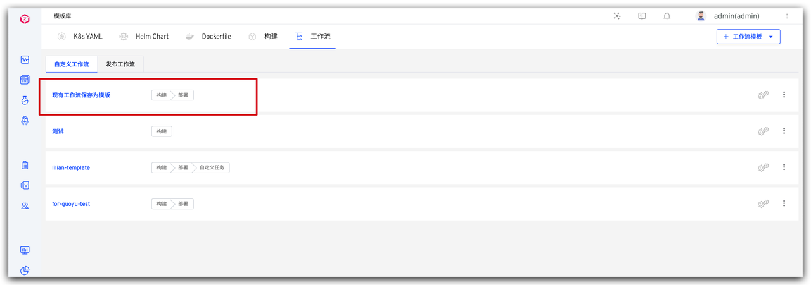
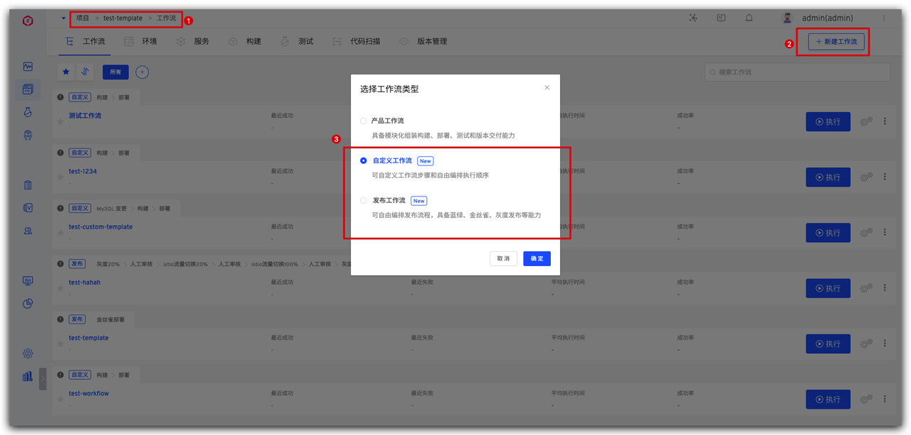
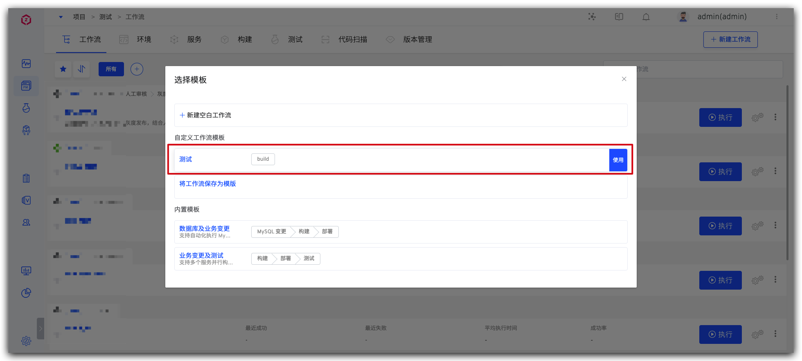
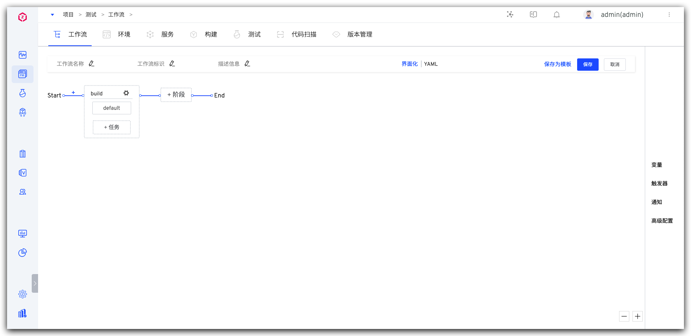
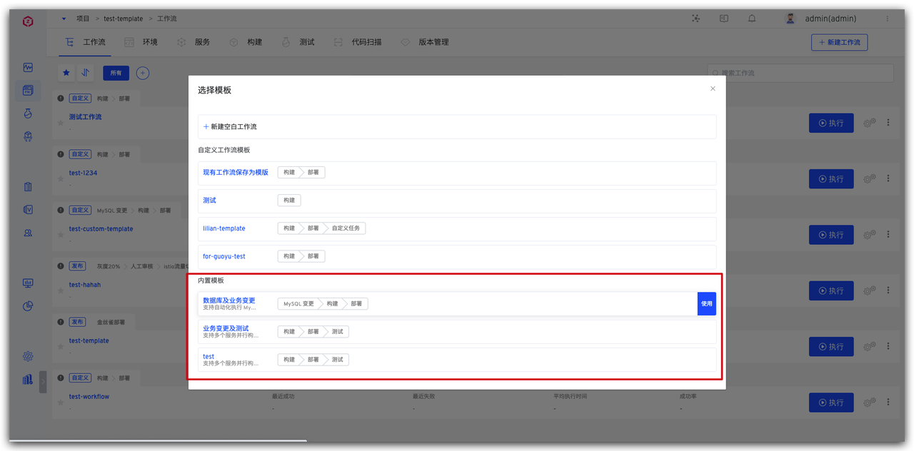

工作流模板支持于自定义工作流和发布工作流两种，帮助用户高效创建基于自身业务的工作流，完成编排。<Badge text="企业版" />

## 新建模板

### 模板库中新建

依次访问`项目`-> `模板库` -> `工作流` 进入到工作流模板库的管理页面。

- 点击 `+工作流模板`-> `选择模板类型` -> `填写模板名称` -> `填写模板内容` -> `保存`。
> 工作流模板包含自定义工作流和发布工作流。
> 
> 工作流模板的命名在各自类别中需保持唯一。

### 将现有工作流保存为模板
- 支持将已有的工作流保存为模板，并进行修改、使用。

- 点击 `保存为模板` 并在弹出的窗口中定义模板名称，确定后即可将工作流保存为模板。
> 在保存为模板时，需注意模板名称唯一性。

## 使用模板

- `项目` -> `工作流` 中，点击 `+新建工作流`，选择 `自定义工作流` 或者 `发布工作流`。

### 模板
- 这里以自定义工作流为例，可以看到刚刚创建的，名为 `测试` 的自定义工作流模板，点击使用，即可以该模板新建一个自定义工作流。

### 内置模板

Zadig 内置了部分自定义工作流和发布工作流的模板，用户可根据业务需要进行使用。
> 注意：内置模板在模板库内不可见且不支持修改和删除。

