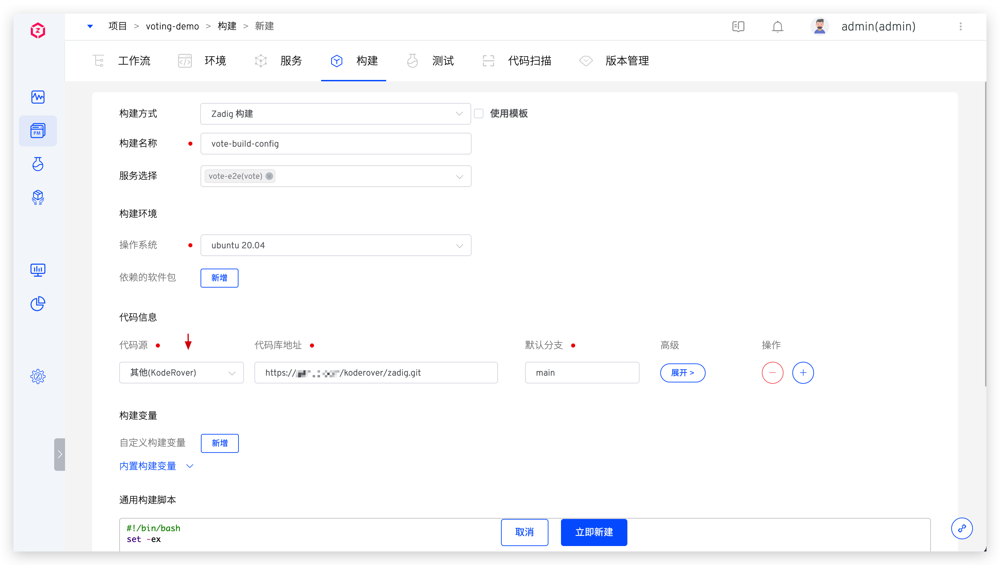

本文主要介绍如何集成支持标准 Git 协议的代码源。

## 如何集成

### 步骤 1：获取 SSH Key 或 Access Token

在对应的代码源中配置 SSH Key 或 Access Token。

::: tip
SSH Key/Access Token 配置因不同代码源而异，请参阅对应代码源的官方文档操作。
:::

### 步骤 2：将配置填入 Zadig 系统

管理员登录 Zadig 系统，依次访问`系统设置` -> `集成管理` -> `代码源集成` -> 点击添加按钮。

依次填入如下已知信息：

- `代码源`：选择`其他`
- `代码源标识`：自定义，方便在 Zadig 系统中快速识别出该代码源
- `鉴权方式`：支持 SSH 或 Access Token 方式
- `SSH Key`：鉴权方式选择 SSH 时需填写对应的 SSH 私钥信息，在 **步骤 1** 中获得

- `Access Token`：鉴权方式选择 Access Token 时需填写对应的 Token 信息，在 **步骤 1** 中获得

## 如何使用

集成成功后，可在构建配置和测试配置的`代码信息`中选择使用该代码源。

- 如果选择使用 SSH 协议授权的代码源，则填写 SSH 协议的代码仓库地址以及代码库分支

- 如果选择使用 Access Token 协议授权的代码源，则填写 HTTPS 协议的代码仓库地址以及代码库分支

