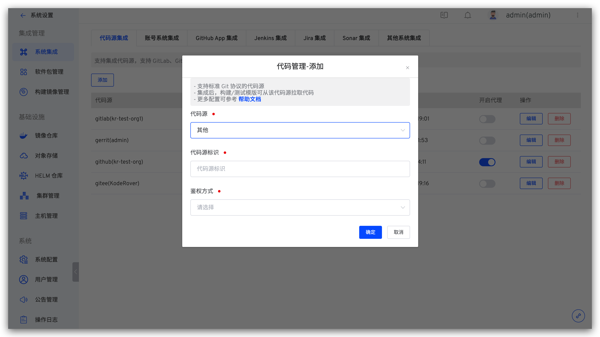
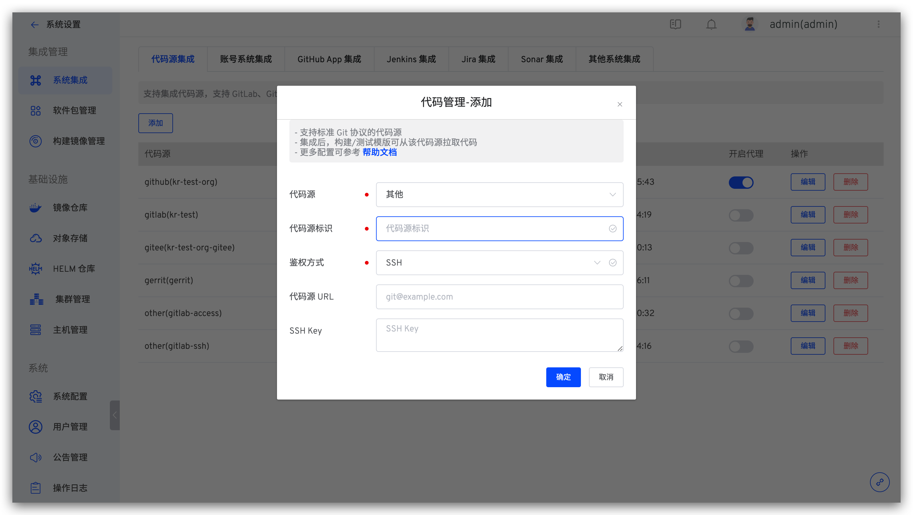
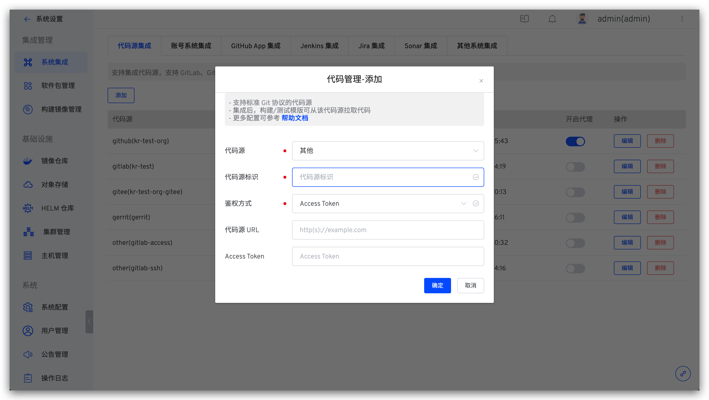

本文主要介绍如何集成支持标准 Git 协议的代码源。

## 如何集成

### 步骤 1：获取 SSH Key 或 Access Token

在对应的代码源中配置 SSH Key 或 Access Token，SSH Key/Access Token 配置因不同代码源而异，请参阅对应代码源的官方文档操作。下面以获取 GitLab 代码源的 Access Token 为例进行演示。

1. 登录 GitLab 后点击右上角头像 -> `Preferences` -> `Access Tokens`，填写 Token 名称后勾选 `api`、`read_user`、`read_repository` ，生成 Access Token。

2. 复制生成的 Access Token 信息即可。

### 步骤 2：将配置填入 Zadig 系统

管理员登录 Zadig 系统，依次访问`系统设置` -> `集成管理` -> `代码源集成` -> 点击添加按钮。

依次填入如下信息：

- `代码源`：选择`其他`
- `代码源标识`：自定义，方便在 Zadig 系统中快速识别出该代码源，该信息在整个系统内唯一
- `鉴权方式`：支持 SSH 或 Access Token 方式
- `代码源 URL`：根据鉴权方式填写对应协议的代码源地址，比如 `git@github.com`、`https://github.com`
- `SSH Key`：鉴权方式选择 SSH 时填写，在 **步骤 1** 中获得 SSH Key 信息，在结尾添加空行后填入此处即可

- `Access Token`：鉴权方式选择 Access Token 时填写，在 **步骤 1** 中获得

