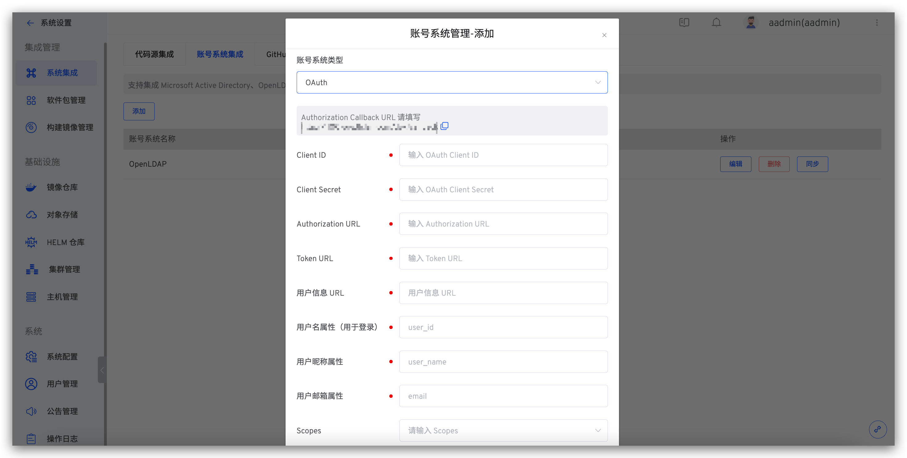

Zadig 支持用户通过 OAuth 2.0 账号授权进行登录。 点击`系统设置` -> `集成管理` -> `账号系统集成`-> 点击添加 -> 选择 `OAuth`。

**参数说明：**
| 参数名                 | 描述                                                 |
|------------------------|----------------------------------------------------|
| Client ID              | OAuth Client ID                                    |
| Client Secret          | OAuth Client Secret                                |
| Authorization URL      | 获取 Authorization Code 的地址                       |
| Token URL              | 获取 Access Token 的地址                             |
| 用户信息 URL            | 获取用户信息的地址                                     |
| 用户名属性（用于登录）     | 用于登录的用户名称属性                                 |
| 用户昵称属性             | 用户昵称属性，选填                                     |
| 用户邮箱属性             | 用户邮箱属性                                          |
| Scopes                 | 向账号系统请求的相关字段，可查阅账号系统相关文档            |
