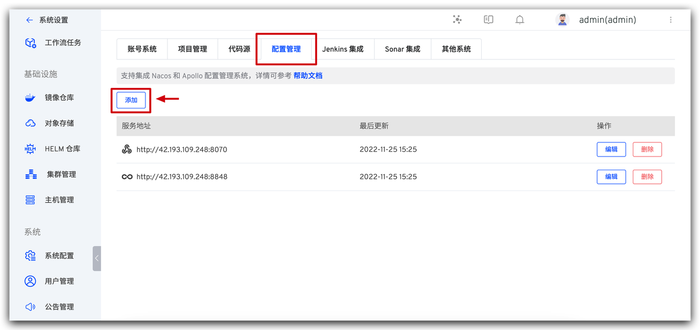
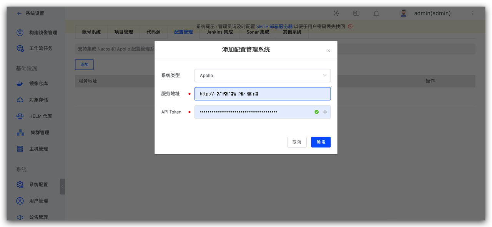

- 支持在 Zadig 配置管理中集成 Apollo，实现高效稳定的管理工具接入。<Badge text="企业版" />

## 添加配置
- 打开 Apollo，进入 `管理工具` ->`开放平台授权管理`，填写信息，完成第三方应用创建。

- 创建成功后复制下方的 Token

- 在 Zadig 中进入 `系统设置`-> `配置管理`

- 在 Zadig 配置管理页面，点击 `添加`，在下拉框中选择 `Apollo`，填入 `地址` 和 `Token`，系统会自动完成校验，点击确定即可完成添加。

