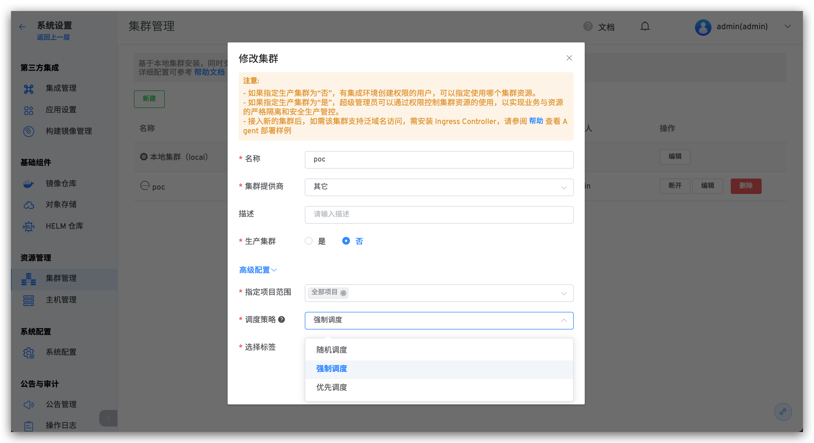
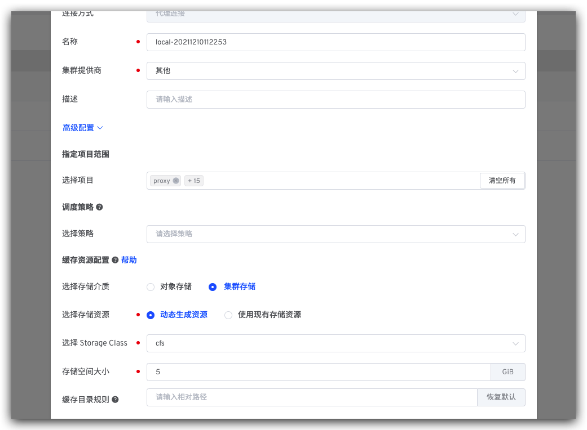
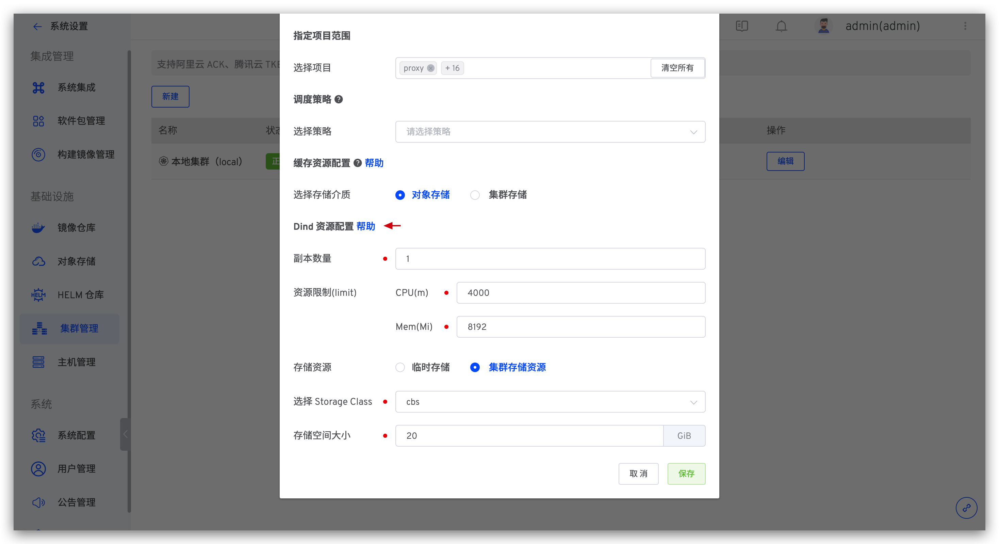

本文介绍如何在 Zadig 系统上进行多集群管理。Zadig 基于本地集群安装，同时支持外部多个 K8s 集群资源的接入和使用。其中，测试集群一般用于自测、开发、测试用途，生产集群一般用于预发布和生产发布用途。

## 添加集群

:::warning
需要保证添加的集群可以访问到 Zadig 所在的集群
:::

第 1 步：点击 `系统设置` -> `集群管理` -> `新建`：


参数说明：

- `名称`：集群名称只支持小写字母、数字和中划线。
- `集群提供商`：该集群的提供商信息。
- `描述`： 该集群的用途描述信息。
- `生产集群`：
  - 如果指定生产集群为「否」，有环境创建权限的用户，可以指定使用哪个集群资源。
  - 如果指定生产集群为「是」，超级管理员可以通过权限控制集群资源的使用，以实现业务与资源的严格隔离和安全生产管控。

创建集群时可设置高级配置，也可以在创建完成后再修改。高级配置说明：
- `指定项目范围`：指定该集群可被哪些项目使用，默认为创建集群时，系统当前全部项目。
- `Dind 资源配置`：设置 Dind 的资源规格，参考[Dind 资源配置](/dev/pages/cluster_manage/#dind-资源配置)。

第 2 步：执行 Agent 安装脚本，如图所示：


第 3 步：执行脚本完成部署，刷新查看集群状态。

## 基本操作
- `断开`：断开集群操作并不会删除已经在集群中创建的环境资源，如需清理，请手动删除。集群断开后，可通过再次执行 Agent 安装脚本接入。
- `编辑`：可修改集群的基本信息及高级配置。
- `删除`：删除集群操作并不会删除已经在集群中创建的环境资源，如需清理，请手动删除。
- `更新 Agent`：更新 Zadig 系统在该集群中安装的 Agent，即：koderover-agent 命名空间下的 dind、koderover-agent-node-agent 和 resource-server 资源。


## 设置调度策略
点击`编辑`，可设置该集群资源的调度策略。以执行工作流任务为例对不同的策略说明如下：

- `随机调度`：不需要指定标签，工作流任务将被随机调度在集群的任意节点上执行。
- `强制调度`：需要指定标签，工作流任务将被调度到符合标签的节点上执行。
- `优先调度`：需要指定标签，工作流任务将被优先调度到符合标签的节点上执行，若节点资源无法满足调度需求，则该任务会被分配给其他节点。



## 缓存资源配置

可按需对不同集群资源配置缓存策略。

### 使用对象存储


将会使用系统默认对象存储来缓存资源，可在[对象存储管理](/dev/settings/object-storage/)中设置默认对象存储。

### 使用集群存储



可使用集群中已有的存储资源或按需动态创建资源。

**选择存储资源**

- `动态生成资源`：选择文件存储类型的 StorageClass 并指定动态生成的存储空间大小。
- `使用现有存储资源`：选择已有存储资源，注意：创建该存储资源的 PVC 中，accessModes 需要是 ReadWriteMany。

**缓存目录规则**

可设置缓存资源在集群存储中的存储目录相对路径规则，实现共享缓存，或者根据不同的项目/工作流/服务组件独享缓存。支持以下变量：

    $PROJECT：项目名称
    $WORKFLOW：工作流名称
    $SERVICE_MODULE：服务组件名称 (测试工作流中无此参数，对于测试工作流的缓存，该变量将被忽略)

举例说明如下：
| 缓存目录规则 | 说明 |
|---------------------------------------|--------------------------------------------------------------------------|
| `$PROJECT/$WORKFLOW/$SERVICE_MODULE`  | 为同一项目同一工作流中的服务组件单独设置独享缓存，不同服务组件之间互不干扰            |
| `$PROJECT/$WORKFLOW`                  | 同一项目下的同一工作流共享缓存；不同工作流之间独享缓存互不干扰                      |
| `$PROJECT/$SERVICE_MODULE`            | 同一项目下的相同服务组件共享缓存                                               |
| `$PROJECT`                            | 同一项目共享缓存；不同项目的缓存资源将存储在集群 PVC 的不同目录中，彼此独享缓存互不干扰 |
| `cache`                               | 缓存资源将存储在集群 `/<PVC 根目录>/cache` 目录下，所有项目共享使用缓存            |
|  无                                   | 缓存资源将存储在集群 `/<PVC 根目录>` 下 ，所有项目共享使用缓存                     |

### 更多信息

若修改了集群的缓存资源配置（比如将`对象存储`修改为`集群存储`，或者`动态生成资源`修改为`使用现有存储资源`），则修改之前已缓存的资源在修改后将不再生效，会在新的存储资源下重新开始缓存。

## Dind 资源配置
支持为接入的集群配置 Dind 资源规格。
- `副本数量`：默认为 1，可按需调整。设置多副本后，同一个服务的构建任务会被尽可能调度到同一个 Dind 实例，不同服务的构建任务会被尽可能打散调度到不同的 Dind 实例，避免因单个 Dind 实例承载过多的构建任务而增加失败概率。
- `资源规格`：CPU 默认为 4000m，Memory 默认为 8192Mi。



对于本地集群（即 Zadig 安装所在的集群），可通过以下命令查看其 Dind 资源规格：
``` bash
kubectl -n koderover-agent get statefulset dind -o yaml
```

## 集群使用

外部集群接入 Zadig 系统后，使用 Zadig 系统可以在该集群上创建新环境，并可以使用工作流对新环境进行更新操作。

- `测试集群`：[创建环境](/dev/project/env/)
- `类生产（生产）集群`：[发布管理 -> 生产环境](/dev/project/env/) 「类生产（生产）集群，安全级别较高，可以单独控制权限」。
