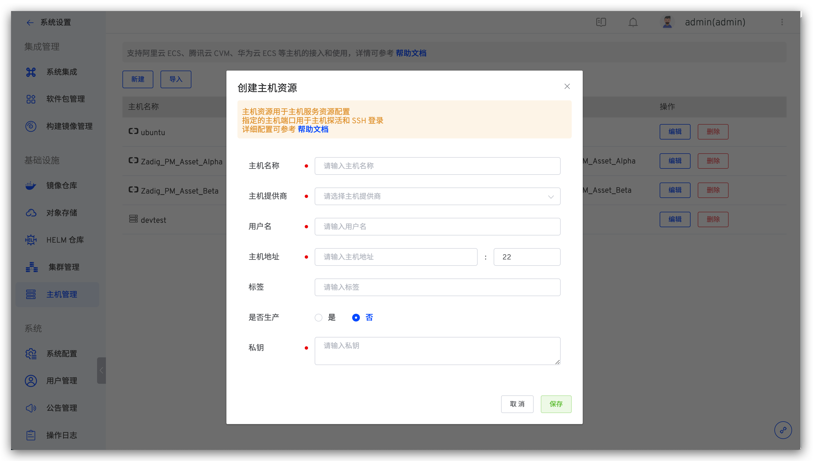

本文介绍如何在 Zadig 系统上进行主机管理。

## 查看主机

管理员登录 Zadig，在`系统设置` ->  `主机管理`中可查看所有主机资源，系统会基于配置中的端口，定时（每 10 秒）对主机进行 TCP 探活，检测主机在线状态。

## 添加主机

### 添加单个主机

管理员登录 Zadig, 进入 `系统设置` -> `主机管理`，点击`新建`

参数说明：
- `主机名称`：自定义，用于标识主机的名称
- `用户名`：主机的 username
- `主机地址`：主机的访问地址及端口，端口值默认为 22
- `标签`：自定义，主机标签
- `私钥`：SSH 访问私钥。通过 ssh-keygen -t rsa -C "your_email@example.com" 方式生成

### 批量导入主机

管理员登录，进入 `系统设置` -> `主机管理`，点击`新建`

参数说明：

- `下载模板`：导入的主机文件内容需符合 Zadig 给出的模板文件中定义结构。
- `上传文件`：根据模板文件修改，上传修改后的主机列表文件。
- `导入选项`：
    1. 增量：主机管理列表中已有条目不会重新导入，仅添加文件中新增的主机信息。
    2. 覆盖已有主机：主机管理列表中的已有条目重新导入且添加文件中新增的主机信息。

## 主机使用

主机服务添加资源配置，支持两种选择方式：“主机标签” 和 “主机名称”。

可通过 `环境`，点击服务，查看服务部署详情。

