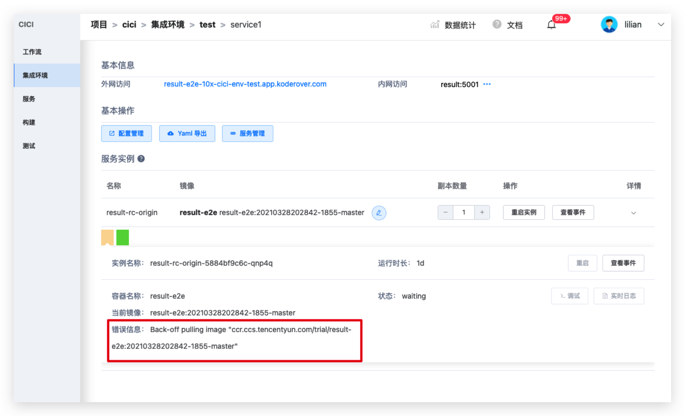
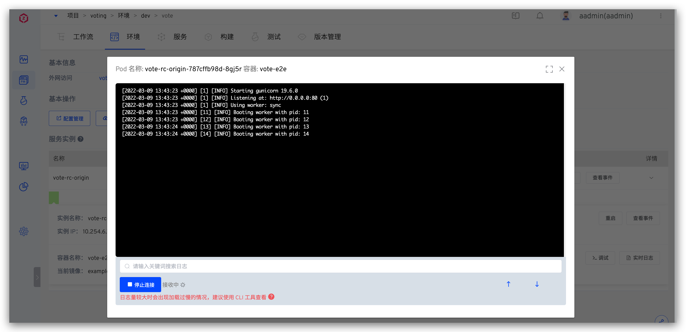
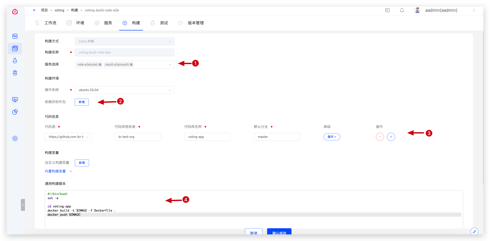

## 如何查询服务日志
目前，产品支持两种方式查询服务日志：页面查询和原生 kubectl 工具查询。
两种不同方式的主要适用场景如下：
- Zadig 页面查询：可以支持查询日志在标准输出 `Stdout`或重定向到 `日志文件` 中的情况。
- kubectl 工具：既可以通过命令查询 `Stdout` 中的输出，也可直接登入容器进行操作。

::: tip
Zadig 提供两种方式，用户可自行选择，对于高级用户，推荐使用 kubectl 工具
:::
### 页面查询


首先，检查服务是否处于 `running` 状态。如果服务容器非正常 `running`，那么可进入服务详情页面查看 `错误信息` 或者通过 `查看事件` 来排查服务未能正常启动的原因，如下图所示。



#### 查询实时日志

如果服务运行正常且服务的日志输出在 `Stdout` 中，那么可以在服务详情页面中，点击 `实时日志` 来查看服务的日志，如下所示。



#### 查询文件日志

如果服务运行正常且服务的日志输出在`日志文件`中，那么可以在服务详情页面中，点击 `调试` 登入容器查看日志存放的文件，如下所示。


### kubectl 工具查询 （[安装方式](https://kubernetes.io/zh/docs/tasks/tools/#kubectl)）
#### 获取 kubectl 配置

进入`用户设置` 页面，下载自己的私钥配置。将获得的 `config` 文件移动到 kubectl 的默认文件夹下。

```bash
mv ./config $HOME/.kube
```
配置完成后，即可使用 kubectl 访问集群。
#### kubectl 查询服务日志

##### 查看服务容器列表

执行以下命令，获得对应服务的pod信息

```bash
kubectl get po -n <命名空间>
```
命名空间可在下图位置找到：


命令执行结果如下所示


##### 查询标准输出日志

执行以下命令，获取标准输出日志

```bash
kubectl logs  <podname> -n <命名空间>
#查看历史 log，例：kubectl logs vote-rc-origin-f569f57d7-v445j -n voting-env-dev
kubectl logs -f <podname> -n <命名空间>
#类似 tail -f，例：kubectl logs  -f vote-rc-origin-f569f57d7-v445j -n voting-env-dev
```

> 更多 logs 用法，详见 kubectl logs -h

##### 登入服务容器，查看日志文件里的内容

```bash
kubectl exec -it <podname> bash -n <命名空间>
#登入容器，可对容器内的文件进行操作
```

> 更多 Kubectl 的命令行操作，详见 [kubectl 官方文档](https://kubernetes.io/docs/reference/generated/kubectl/kubectl-commands)

## 如何把 Pod 多个副本调度到不同区域的节点上

可以在写 YAML 的时候增加 Pod 的反亲和性调度策略利用 Kubernetes 本身的一些特性来解决。详见[Kubernetes 文档](https://kubernetes.io/zh/docs/concepts/scheduling-eviction/assign-pod-node/)

## 系统创建出来的 Ingress 可以正常工作，本地用 kubectl apply 为什么不可以？

因为 Zadig 创建的 Ingress 的时候会自动添加 kubernetes.io/ingress.class 描述使用的 Ingress class，所以手动 kubectl apply 使用的 YAML 也需要加上这项。

## 如何访问环境中的数据库服务

4 种方式：
  1. 给这个数据库服务单独配置一个 Ingress，通过 Ingress 方式访问数据库，不过可能存在安全问题，因为等于将您的数据库服务暴露在公网上。
  2. 数据库服务的 Service 改成  LoadBalancer 类型，集群自动分配公网 IP 给这个数据库服务，同样可能存在安全问题。
  3. 本地通过 kubectl port-forward 来转发。
  4. 使用 kubectl 或者系统「调试」功能进入容器访问。

## Jenkins 构建是否可以在不添加构建参数的情况下，直接使用构建出来的镜像版本替换服务镜像版本？

不可以。由于 Jenkins 对外接口的局限性，导致无法直接从 Jenkins Job 中获取镜像信息。所以目前必须在 Jenkins Build Parameters 中声明 "IMAGE" 变量，Zadig 工作流的部署步骤才可以识别使用哪个镜像去部署。

## 项目下有很多服务，为服务一个一个的添加构建配置太繁琐，如何优化？

可以在一个构建配置中支持多个服务的构建，举例说明如下：

1. 在`构建服务`中按需选择多个服务
2. 在`依赖的软件包`中为多个服务配置构建所需的软件包
3. 在`代码信息`中为多个服务配置构建所需的代码库
4. 在`构建脚本`中，巧用 `$SERVICE` 变量，自由组织不同服务的构建实现



## Webhook 在系统中有哪些使用场景？

1. 从代码库同步创建 K8s YAML 服务/K8s Helm Chart 服务，当代码库中服务配置变更后，通过 Webhook 可以实现在代码仓库中托管的服务配置变更实时同步到 Zadig 系统上。
2. 通过配置工作流 Webhook 可以实现代码 Push 到代码库以及提交 Pull Request(Merge Request) 时触发工作流的运行，实现从提交到构建自动化的流程，具体可以参考[代码变更触发工作流](/dev/workflow/trigger/#代码变更触发)。
