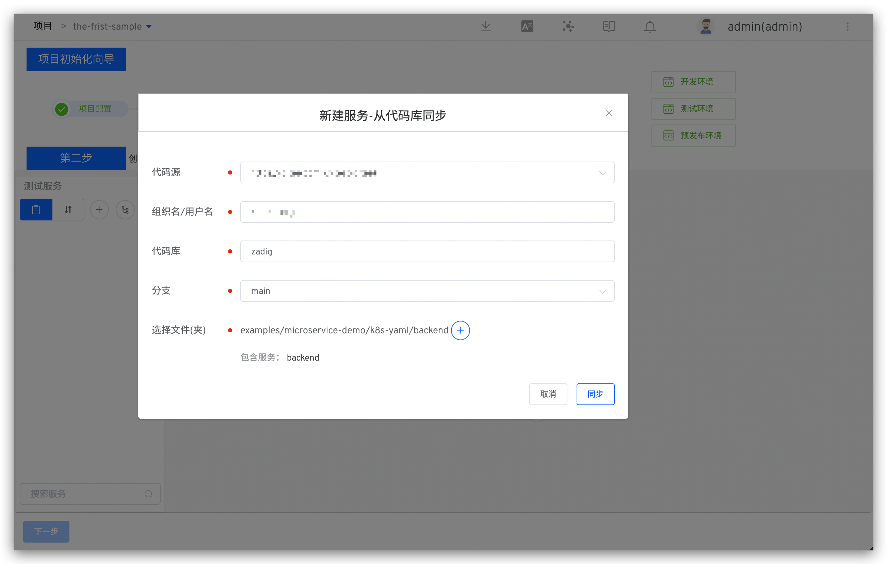
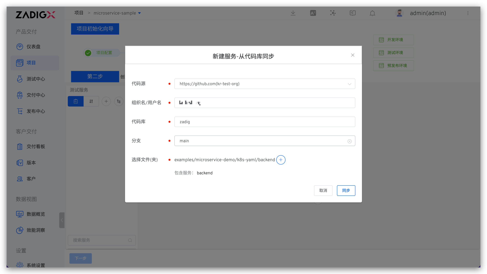
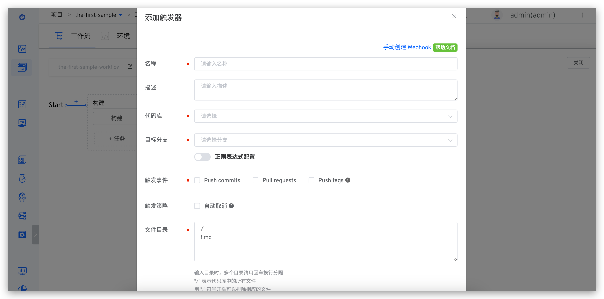
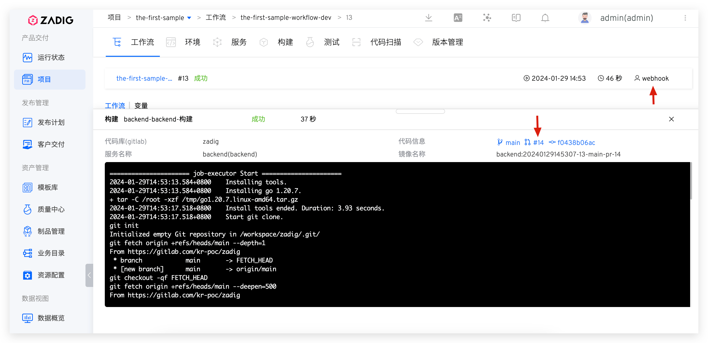
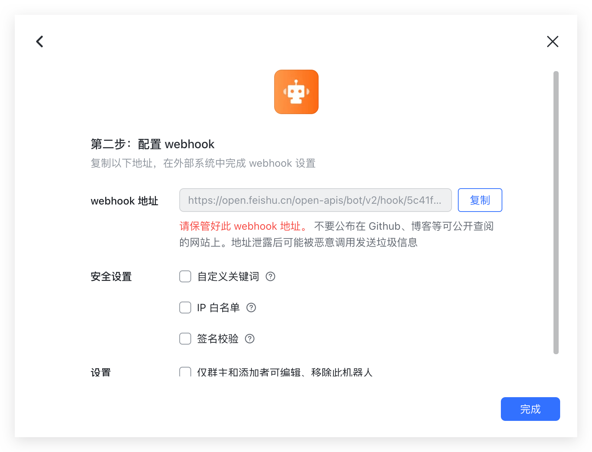
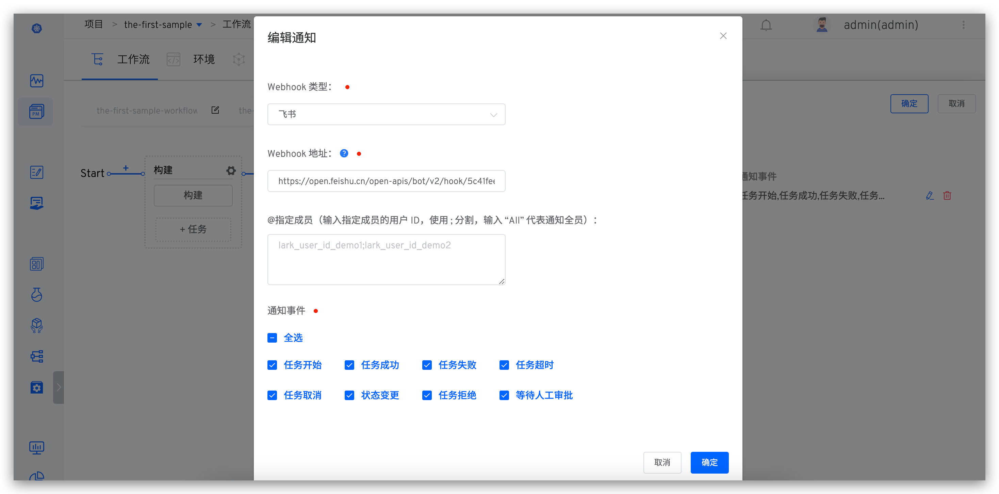

This article uses containerized microservices as an example to help new users quickly get started with the basic capabilities of the Zadig system, covering the entire process from Code to Ship.

## Preparation

- Install Zadig: [Installation Documentation](/en/Zadig%20v3.4/install/guide)
- Integrate GitHub as the code source and fork the [example source code](https://github.com/koderover/zadig/tree/main). For code source integration, refer to the documentation: [GitHub Integration](/en/Zadig%20v3.4/settings/codehost/github/)
- Integrate the image repository: [Image Repository Integration](/en/Zadig%20v3.4/settings/image-registry/)

::: tip
If you are not using GitHub as the code source, you can also download the code, upload it to your own code source, and then integrate it in Zadig. Refer to the documentation: [Code Source Integration](/en/Zadig%20v3.4/settings/codehost/overview/)
:::

## Step 1: Project Configuration

Access the Zadig system, click on Project -> New Project, create a project, and select K8s YAML Project. The specific content is shown in the figure below:


Click the "Create Now" button to enter the project initialization wizard, and click "Next" to start creating the service:


## Step 2: Create a New Service
This includes creating a new service and configuring the build for the service, which will be used for subsequent deployment and updates using workflows.

### Create a New Service
Steps to create a new service: Click "Sync from Code Repository" -> Select the code repository, branch, and directory where the service configuration is located -> Click "Sync" as shown in the figure below:

> In this example, select the `zadig` repository, `main` branch, and specify the folder as `examples/microservice-demo/k8s-yaml/backend`.




After creating a new service, the system will check the validity of the service's YAML format and automatically load the system variables, custom variables in the YAML (which can be added as needed), and the service components.


### Configure Build

Click `Add` to configure the build for the service. Install the required software packages according to the actual environment needed for the build. Select the code hosting platform, repository, and branch in sequence, fill in the general build script, and save the build.


In this example, the build configuration is as follows:

- `Packages`: `go 1.20.7`
- `Code Information`: Select the `zadig` repository and `main` branch, which were integrated in the preparation step
- `Common Build Script`: The content is as follows
``` bash
#!/bin/bash
set -ex

cd zadig/examples/microservice-demo/backend
make build-backend

docker build -t $IMAGE -f Dockerfile .
docker push $IMAGE
```

Continue to the next step and enter the environment preparation stage.

## Step 3: Add an Environment

Click `Create Environment`, and the system will automatically create 2 environments and 3 workflows. The 2 environments can be used for daily development and testing, while the 3 workflows will automatically bind to the corresponding environments to achieve continuous delivery for different environments. The details are shown in the figure below:
::: tip
The time required to create a new environment will vary depending on the configuration and number of services. Please wait patiently for the creation to complete.
:::


After the environment is created, click `Next` to proceed to workflow delivery.

## Step 4: Workflow Delivery

Click to run the `the-first-sample-workflow-dev` workflow to complete the continuous delivery for the dev environment. Select the service to be deployed and the corresponding build branch or pull request according to actual needs, and start the task:


After the workflow is completed, the service version in the environment will be automatically updated:


Service delivery in other environments is similar to that in the dev environment and is not detailed here.

At this point, the basic functions of Zadig have been demonstrated. The following section will show how to configure automatic workflow triggers.

### Configure Automatic Workflow Triggers (Optional)

Click to configure the `the-first-sample-workflow-dev` workflow:


Add a trigger, select the Git trigger, fill in the configuration, and click "Confirm". After saving the trigger configuration, save the changes to the workflow:



After submitting a pull request in GitLab, the corresponding workflow status will be displayed in the check list, as shown below:


Click the task link to view the workflow execution details in the Zadig system and track code changes in the workflow:



After the workflow is completed, you can see that the service image in the environment has been updated:


### Configure Workflow IM Status Notifications (Optional)

The workflow provides the capability to integrate with third-party webhooks and can configure status notifications for workflows to receive timely feedback on workflow task status. The currently supported IM systems are: DingTalk/FeiShu/Enterprise WeChat. The following example uses FeiShu:

> For DingTalk and Enterprise WeChat configurations, refer to the documentation: [Notification Configuration](/en/Zadig%20v3.4/workflow/im/)

Step 1: Add a bot in FeiShu and obtain the Webhook address:




Step 2: Click to configure the workflow, add a notification module, correctly fill in the FeiShu bot's Webhook address, and select the events you need to notify:



Notification effect diagram:


For more practical projects and scenario cases, please refer to the [Zadig Tutorial](https://www.koderover.com/tutorials).