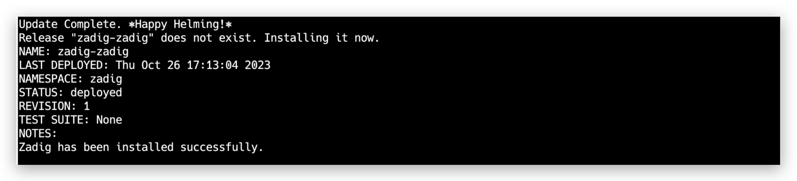
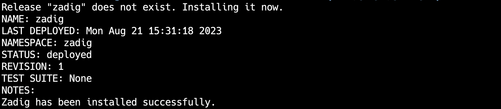

This article primarily focuses on how to install Zadig locally. It is suitable for users who are new to Kubernetes and Zadig and wish to quickly experience the system.

::: danger
Local installation does not support version upgrades or high availability configurations and is not recommended for production use
:::

## Install and Uninstall Using Shell Scripts

### Step 1: Prepare a Kubernetes Cluster

Use tools like minikube or KinD to set up a K8s cluster locally.

::: tip
- Local K8s cluster version: v1.16 to v1.30.
- Recommended configuration: 8 CPU cores and 16 GB RAM (Zadig itself consumes 4 CPU cores and 8 GB RAM, which can support the concurrent execution of two workflow tasks)
:::

For related tool installations, refer to the following:

- [Install minikube](https://minikube.sigs.k8s.io/docs/start/)
- [Install docker-desktop](https://www.docker.com/products/docker-desktop/)
- For more tools, please refer to their official installation documentation

### Step 2: Execute the Installation Script

Execute the following script in your local cluster:

> If you plan to integrate external systems after installing Zadig, ensure that the installed Zadig system has a public IP address to guarantee its accessibility.

``` bash
export IP=< Local IP Address >
export PORT=< Any port between 30000 and 32767 >
curl -SsL https://download.koderover.com/install?type=quickstart | bash
```


### Step 3: Access the System

::: tip
If you are using a cluster set up by KinD, due to its characteristics, you need to establish a connection from your local port to the K8s cluster NodePort service. The reference command is as follows:

``` bash
kubectl -n zadig port-forward svc/gateway-proxy 32000:80
```
:::

Access the system via IP:PORT. For the first login, you need to register a system administrator.


::: tip
Professional License Acquisition and Configuration Reference Document: [License](/en/Zadig%20v3.4/enterprise-mgr/#license)
:::

### Zadig Uninstallation

After setting the NAMESPACE environment variable, use a script to one-click uninstall the currently installed Zadig system. The command is as follows:

```bash
export NAMESPACE=zadig
curl -SsL https://github.com/koderover/zadig/releases/download/v3.4.1/uninstall.sh | bash
```

You can also execute the latest official uninstall script:
```bash
export NAMESPACE=zadig
curl -SsL https://download.koderover.com/install?type=uninstall | bash
```

<!-- ## 使用 Sealos 安装与卸载

### 步骤 1：准备 Linux 机器

::: warning
为了避免安装时产生冲突或者其他未知错误导致安装失败，建议你的操作系统保持干净的状态，不安装任何可能产生冲突的软件。
:::

#### 硬件要求

|  操作系统                                               |  最低要求                         |
| ------------------------------------------------------ | ---------------------------------|
| **Ubuntu** 18.04+                       | CPU: 4 核  内存: 8 GB  硬盘: 50 GB |

更详细的安装要求，请参考 [Sealos 安装先决条件](https://docs.sealos.io/zh-Hans/docs/lifecycle-management/quick-start/)

#### 网络要求
- 服务器可以访问外网

#### 其他要求
- 需要以 Root 用户安装，不建议用 `sudo`
- 确保服务器防火墙配置开放 30000 - 32767 的端口段，用于外部访问
::: tip
- 如果是以 SSH 方式登入机器，为防止脚本等待安装时间过长导致 SSH 连接断开，建议在客户端本地`~/.ssh/config`中添加一行 `ServerAliveInterval 60`
:::

### 步骤 2：安装 Sealos

::: tip Tips
若您已经安装 Sealos，可跳过此步骤，请确认使用 v4.3.0 或更高版本。
:::

```bash
wget https://github.com/labring/sealos/releases/download/v4.3.0/sealos_4.3.0_linux_amd64.tar.gz
tar -zxvf sealos_4.3.0_linux_amd64.tar.gz sealos && chmod +x sealos && mv sealos /usr/bin
```

### 步骤 3：安装 Kubernetes 以及 Zadig

```bash
# 服务器 IP 地址，用于访问 Zadig 系统
export IP=<node external ip>
export PORT=<30000~32767 任一端口>

sealos run labring/kubernetes:v1.24.0 labring/helm:v3.22.0 labring/calico:v3.24.1 labring/openebs:v3.4.0
sealos run --env IP=${IP} --env PORT=${PORT} labring/zadig:3.4.0
```



安装过程预计持续 20 分钟左右，受硬件配置和网络情况影响，不同环境下的时间可能不同，
当看到如图的输出时，说明安装已经完成。

### 步骤 4：验证安装结果

可以通过命令查看服务启动状态：

```bash
kubectl -n zadig get po
```
### 步骤 5：访问系统


在安装结果输出中，你可以获得系统的访问地址。

::: tip
许可证获取和配置参考文档：[许可证](/en/Zadig%20v3.4/enterprise-mgr/#许可证)
:::

### 卸载

支持一键卸载当前安装的 Kubernetes 以及 Zadig 系统，只需执行以下即可：

```bash
sealos reset
``` -->