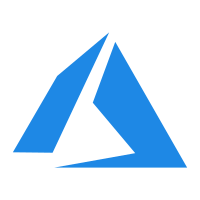
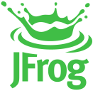

This article primarily introduces the compatibility list for Zadig.

## Kubernetes Clusters

Through the Zadig system, you can integrate Kubernetes clusters or self-built clusters provided by cloud vendors, including but not limited to:

> The Kubernetes cluster version must be between v1.16 and v1.30

- </img> Alibaba Cloud ACK
- </img> Tencent Cloud TKE
- </img> Tencent Cloud TKE Serverless
- </img> Huawei Cloud CCE
- </img> Volcengine VKE
- </img> Amazon EKS
- </img> Microsoft Azure AKS
- </img> Google Cloud GKE
- </img> Oracle OKE
- Standard Kubernetes Clusters

## Image Repositories
Through the Zadig system, you can integrate standard image repositories or self-built image repositories provided by cloud vendors, including but not limited to:
-  </img>Alibaba Cloud ACR (Personal Edition)
-  </img>Alibaba Cloud ACR (Enterprise Edition)
-  </img>Huawei Cloud SWR
-  </img>Tencent Cloud TCR (Personal Edition)
-  </img>Tencent Cloud TCR (Enterprise Edition)
-  </img>AWS ECR
-  </img>Microsoft Azure ACR
-  </img>Google Cloud AR
-  </img>[DockerHub](https://hub.docker.com/)
-  [Harbor](https://goharbor.io/)
-  [JFrog](https://jfrog.com/)
-  Nexus
-  Other self-built image repositories

## Helm Chart Repositories
Through the Zadig system, you can integrate standard Helm Chart repositories provided by cloud vendors or self-built Helm Chart repositories, including but not limited to:
-  </img>Alibaba Cloud ACR
-  </img>Microsoft Azure Container Registry
-  </img>Tencent Cloud TCR
-  [Harbor](https://goharbor.io/)
-  Other self-built Helm Chart repositories

## Object Storage
Through the Zadig system, you can connect to all object storage service providers that support the Amazon S3 (Amazon Simple Storage Service) protocol, including but not limited to:

-  Alibaba Cloud OSS
-  Tencent Cloud COS
-  Qiniu Cloud KODO
-  </img>Huawei Cloud OBS
- </img> Amazon S3
- </img>Google Cloud Storage
- </img>Volcanic Engine